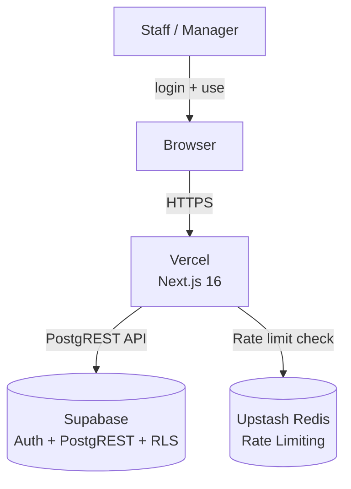
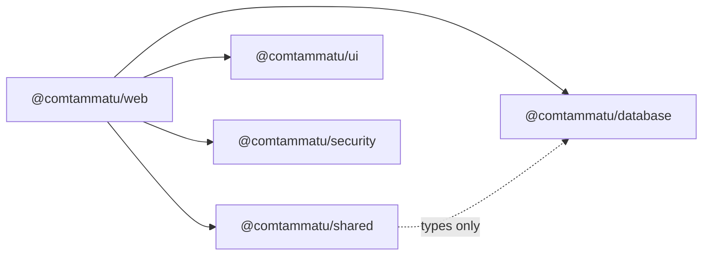
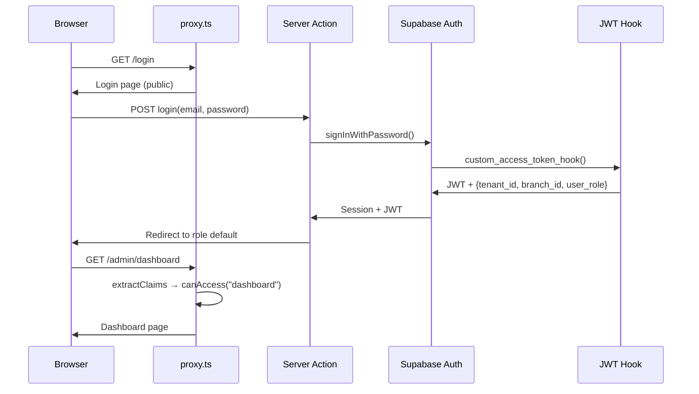

# Codebase Map — Cơm Tấm Má Tư

> **Audience:** New engineers onboarding, feature owners planning Sprint 1+
> **Primary tasks:** (1) Understand system structure and auth flow, (2) Know where to add new features, (3) Identify blast radius of changes
> **Decision horizon:** Sprint planning, onboarding, architecture review
> **Out of scope:** Business requirements (see `docs/ref/`), sprint details (see `docs/plan/`)

## Status

- **Current version:** v0.1.1 + Sprint 1 complete (S1–S6)
- **Next milestone:** Sprint 2a (POS + KDS + Payments)
- **Tech stack:** Next.js 16.2 | React 19.2 | TypeScript 6.0 | Tailwind 4.2 | Zod 4 | Supabase | Turborepo 2.9

## Module Index

| Module | Doc | Purpose | Risk Level |
|--------|-----|---------|------------|
| Auth & ACL | [auth.md](modules/auth.md) | JWT claims, role hierarchy, RLS, proxy routing | **High** — gates all access |
| Database | [database.md](modules/database.md) | Supabase clients, types, migrations, RLS policies | **High** — data integrity |
| Web App | [web-app.md](modules/web-app.md) | Next.js routes, layouts, server actions, admin shell | Medium |
| UI | [ui.md](modules/ui.md) | shadcn components, design tokens | Low |
| Security | [security.md](modules/security.md) | Rate limiting (Upstash Redis) | Medium |
| Infrastructure | [infrastructure.md](modules/infrastructure.md) | Monorepo, build, deploy, environment | Medium |

## Architecture Overview

```
Browser ──► proxy.ts (auth + ACL) ──► Next.js App Router ──► Supabase (PostgREST + Auth)
                                                         ──► Upstash Redis (rate limit)
```

### C4 Context Diagram



### Module Dependency Graph



### Data Flow — Login to Dashboard



## Hub Files (High Blast Radius)

These files have the most dependents. Changes here affect many parts of the system.

| File | Importers | Impact |
|------|-----------|--------|
| `packages/shared/src/auth/module-acl.ts` | proxy.ts, admin shell, all layouts | Adding/removing modules affects routing, nav, and ACL |
| `packages/shared/src/auth/types.ts` | Every auth-aware file | Changing roles or JWT shape breaks auth chain |
| `packages/shared/src/auth/scope.ts` | proxy.ts, layouts, server actions | Changing claim extraction breaks session |
| `packages/database/src/types/database.types.ts` | All server code | Auto-generated — regenerate with `pnpm db:types` |
| `apps/web/proxy.ts` | Next.js middleware entry | Single point of auth enforcement |

## Critical Unknowns

| # | Unknown | Verification Step | Impact |
|---|---------|-------------------|--------|
| 1 | area_manager has tenant-wide access (no area scoping table) | Check if business needs area boundaries before Sprint 2a | May need migration later |
| 2 | No integration tests exist yet | Sprint 2b S5 will add them | Regressions possible |
| 3 | Deployment pipeline not configured | Check Vercel project + GitHub Actions before pilot | Blocks production launch |

## Priority Recommendations

1. **Sprint 2a readiness:** Sprint 1 complete (S1–S6). Admin shell, branches, staff, menu, tables/zones shipped + security polish applied.
2. **Watch hub files:** Any change to `module-acl.ts` or `types.ts` requires proxy + layout + nav verification.
3. **RLS pattern:** Every new table must follow the tenant-scoped RLS pattern with explicit GRANTs. See [database.md](modules/database.md).

<!-- ORACLE-META
Written by codebase-oracle (manual) | 2026-04-02
Data: Direct source reading
Audience: new engineer, feature owner | Confidence: 90%
Unknowns: 3 items pending verification
-->
