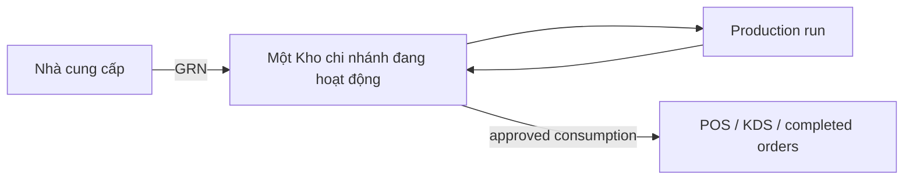

# Codebase Map — Cơm Tấm Má Tư

> **Đối tượng:** Kỹ sư mới onboard, người phụ trách feature, người lập kế hoạch sprint
> **Mục tiêu chính:** (1) Hiểu cấu trúc hệ thống và luồng auth, (2) biết nơi thêm tính năng mới, (3) ước lượng blast radius của thay đổi
> **Mốc quyết định:** Lập kế hoạch sprint, onboarding, rà soát kiến trúc
> **Ngoài phạm vi:** Yêu cầu nghiệp vụ (xem `docs/ref/`), task tracker chi tiết (xem `tasks/todo.md`)

## Trạng thái

- **Operating track:** production đang vận hành in-place trên repo `comtammatu`.
  Current work lives in `tasks/todo.md`; durable architecture choices live in
  active ADRs or the owning spec/ref/rule doc.
- **Current surface:** Auth, Owner, Master Data, Inventory, Orders, POS, KDS,
  Print, Payments (Cash + VietQR), Finance Basic, HR/payroll basics, and
  HĐĐT via Viettel S-invoice are the current production surface.
- **Tech stack:** Next.js, React, TypeScript, Tailwind, Zod, Supabase, and
  Turborepo. Package manifests own exact versions.

## Chỉ mục phân hệ

| Module         | Doc                                            | Purpose                                                 | Risk Level                  |
| -------------- | ---------------------------------------------- | ------------------------------------------------------- | --------------------------- |
| Auth & ACL     | [auth.md](modules/auth.md)                     | JWT claims, role hierarchy, RLS, proxy routing          | **High** — gates all access |
| Database       | [database.md](modules/database.md)             | Supabase clients, types, migrations, RLS policies       | **High** — data integrity   |
| Finance        | [finance.md](modules/finance.md)               | Finance Basic boundary, daily money, HĐĐT, payables     | **High** — cash/legal data  |
| Inventory      | [inventory.md](ref/inventory.md)               | One-warehouse Branch inventory and production contract  | **High** — stock integrity  |
| Web App        | [web-app.md](modules/web-app.md)               | Next.js routes, layouts, server actions, surface shells | Medium                      |
| UI             | [ui.md](modules/ui.md)                         | Custom Theme application, shared components, surfaces   | Low                         |
| Security       | [security.md](modules/security.md)             | Rate limiting (Upstash Redis)                           | Medium                      |
| Infrastructure | [infrastructure.md](modules/infrastructure.md) | Monorepo, build, deploy, environment                    | Medium                      |

## Documentation Index

Khi cần đi sâu hơn theo loại tài liệu:

- [docs/README.md](README.md) — cổng vào chung cho toàn bộ docs
- [agent/rules/skills.md](agent/rules/skills.md) — routing cho external skills, plugins, MCP/browser tools, và subagents
- [docs/ref/glossary.md](ref/glossary.md) — glossary chuẩn duy nhất cho toàn repo
- [docs/architecture/README.md](architecture/README.md) — kiến trúc hệ thống và cross-cutting docs
- [ref/README.md](ref/README.md) — canonical reference docs
- [runbooks/README.md](runbooks/README.md) — readiness và smoke gates
- [worklog/README.md](worklog/README.md) — worklog policy; no historical archive

## Authority And Change Routing

This file answers where code belongs and which files have high blast radius. It
does not restate agent workflow or architecture contracts:

- Authority and source selection: `docs/agent/rules/references.md` and
  `docs/agent/rules/skills.md`.
- Review depth, task lifecycle, and completion gates:
  `docs/agent/rules/workflow.md`.
- Detailed architecture: `docs/spec/architecture.md` and
  `docs/architecture/README.md`.
- Auth/route authority: `docs/modules/auth.md`, with ACL ownership in
  `packages/shared/src/auth/module-acl.ts` and route resolution in
  `packages/shared/src/auth/route-resolution.ts`.
- Database mutation authority: `docs/agent/rules/database.md` and
  `docs/modules/database.md`; multi-row correctness belongs in an RPC.
- UI authority: `docs/agent/rules/ui.md` and `docs/spec/design-system.md`.

### Project Placement Matrix

Use this matrix when adding or moving files. It is the practical replacement for "where should this live?"

| Change type                                  | Primary location                                                    | Must check                                                                                | Avoid                                                  |
| -------------------------------------------- | ------------------------------------------------------------------- | ----------------------------------------------------------------------------------------- | ------------------------------------------------------ |
| New protected route                          | `apps/web/app/(protected)/...`                                      | `proxy.ts`, `route-resolution.ts`, `module-acl.ts`, module doc                             | Duplicating ACL in layouts/pages                       |
| New Server Action                            | Adjacent `actions.ts` under route family                            | Zod schema, `withAction`/auth helper, RLS/RPC contract                                     | Returning raw Supabase error messages                  |
| New shared business rule                     | `packages/shared/src/<domain>/...`                                  | Existing package exports and tests                                                         | Importing app-only code into shared package            |
| New database mutation spanning multiple rows | `supabase/migrations/*.sql` RPC + typed caller                      | RLS, GRANTs, `corepack pnpm db:types` after apply                                          | Multi-query partial writes in Server Actions           |
| New Supabase client usage                    | Explicit `packages/database` subpath for the runtime                | Import boundary in `docs/agent/rules/engineering.md`                                       | Root runtime barrel imports                            |
| New reusable UI component                    | `packages/ui/src/components/*`                                      | `docs/spec/design-system.md`, Má Tư DS shared components, `scripts/check-ui-contract.mjs`  | Page-local one-off component clones                    |
| New route-specific UI composition            | `apps/web/app/**/_components` or route folder                       | `docs/spec/design-system.md`, Má Tư DS shared components, surface adapters                 | New visual language outside design system              |
| New print behavior                           | `apps/print-agent/src/*` plus branch settings route if configurable | Branch-scoped config, no deploy-only layout changes                                        | Hardcoded receipt/format changes per branch            |
| New skill/plugin/tool routing rule           | `docs/agent/rules/skills.md` plus relevant entrypoint docs          | `AGENTS.md`, `docs/agent/rules/references.md`, `docs/agent/rules/workflow.md`              | Divergent workspace-only rules, secrets, plugin caches |
| New operational rule/runbook                 | `docs/modules/*`, `docs/runbooks/*`, `tasks/*`                      | `docs/agent/rules/references.md`                                                           | Separate agent-only doc trees                          |

### Current Operating Model

## Landing Files (High Blast Radius)

Đây là các file có nhiều chỗ phụ thuộc nhất. Mọi thay đổi ở đây sẽ tác động rộng trong hệ thống.

| File                                            | Importers                          | Impact                                                    |
| ----------------------------------------------- | ---------------------------------- | --------------------------------------------------------- |
| `packages/shared/src/auth/module-acl.ts`        | proxy.ts, admin shell, all layouts | Adding/removing modules affects routing, nav, and ACL     |
| `packages/shared/src/auth/types.ts`             | Every auth-aware file              | Changing roles or JWT shape breaks auth chain             |
| `packages/shared/src/auth/scope.ts`             | proxy.ts, layouts, server actions  | Changing claim extraction breaks session                  |
| `packages/database/src/types/database.types.ts` | All server code                    | Auto-generated — regenerate with `corepack pnpm db:types` |
| `apps/web/proxy.ts`                             | Next.js middleware entry           | Single point of auth enforcement                          |
