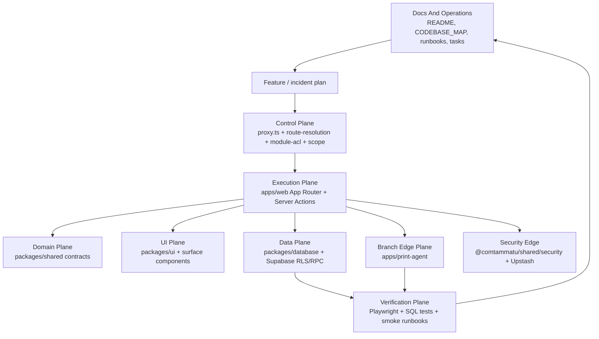
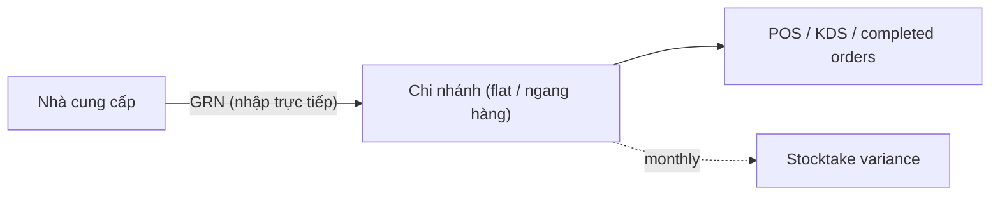
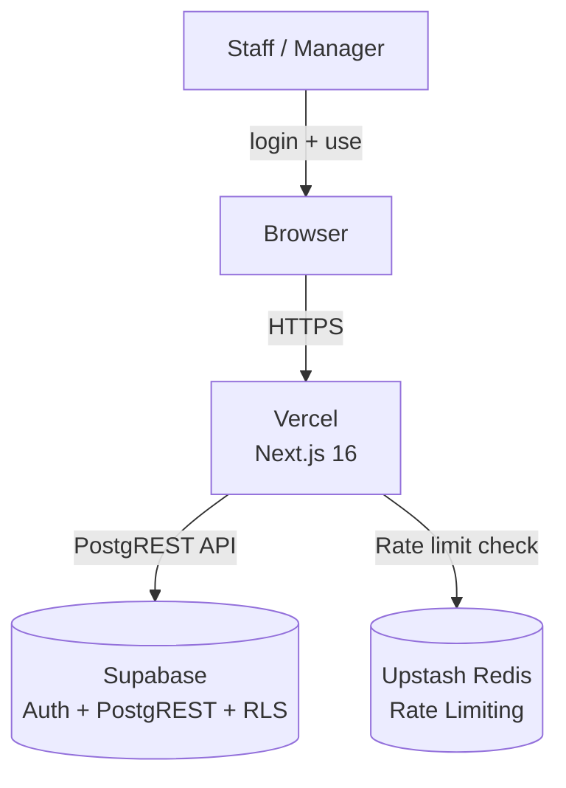
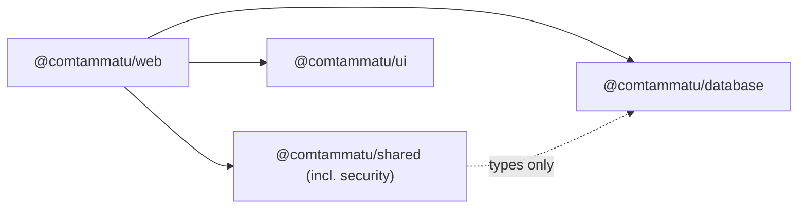
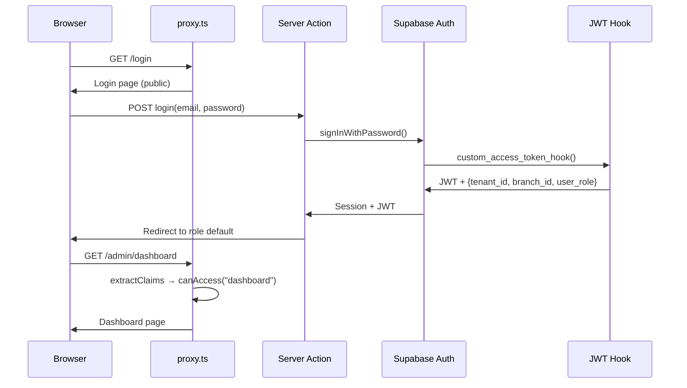

# Codebase Map — Cơm Tấm Má Tư

> **Lean HKD baseline (2026-06):** Hộ Kinh Doanh, single-tenant (`tenant_id` kept as scope key), **flat peer branches** (no Kho Tổng / Bếp Trung Tâm / inter-site transfers), 1 app (`apps/web`) + `apps/print-agent`, 3 packages (`database`, `shared`, `ui` — `security` merged into `shared` in V9), **4 roles** (`owner`, `manager`, `staff`, `chef`). DB: **59 tables · 9 views · 213 functions**. CUT vs the pre-lean model: GL/VAS/BCTC, payroll engine, heavy inventory (transfers/issues/waste/production/PO/recipes/QC/ABC), perpetual sale-deduction, feedback/CRM/telegram/AI, area. KEEP (deliberate): item discount, lean scheduling (`shift_assignments`), supplier debt, HĐĐT Viettel. Older multi-site / 10-role passages below are retained reference for how the mechanisms work.

> **Đối tượng:** Kỹ sư mới onboard, người phụ trách feature, người lập kế hoạch sprint
> **Mục tiêu chính:** (1) Hiểu cấu trúc hệ thống và luồng auth, (2) biết nơi thêm tính năng mới, (3) ước lượng blast radius của thay đổi
> **Mốc quyết định:** Lập kế hoạch sprint, onboarding, rà soát kiến trúc
> **Ngoài phạm vi:** Yêu cầu nghiệp vụ (xem `docs/ref/`), task tracker chi tiết (xem `tasks/todo.md`)

## Trạng thái

- **Active delivery track:** production đang vận hành in-place trên repo `comtammatu`; ongoing work tập trung vào hardening + bổ sung tính năng theo phản hồi vận hành. Retired rebuild packs are no longer retained in `docs/`; current decisions live in `tasks/todo.md`, `docs/plan/decisions.md`, and active ADRs.
- **Phiên bản hiện tại:** v1.0.0 — Auth, Admin, Master Data, Inventory, Orders, POS, KDS, Print, Payments (Cash + VietQR + Momo) SHIPPED và đang vận hành thực tế. HĐĐT active qua Viettel S-invoice. Finance/HR/Notifications/Reporting vẫn còn phần PARTIAL (xem `tasks/todo.md`).
- **Mốc tiếp theo:** tiếp tục hardening trên mô hình **flat-branch (chi nhánh ngang hàng)** của lean HKD baseline; mỗi chi nhánh tự nhập hàng (GRN) + tự kiểm kê (stocktake), không luân chuyển nội bộ. Backlog ưu tiên ở `tasks/todo.md`.
- **Tech stack:** Next.js 16.2 | React 19.2 | TypeScript 6.0 | Tailwind 4.2 | Zod 4 | Supabase | Turborepo 2.9

## Chỉ mục phân hệ

| Module         | Doc                                            | Purpose                                                 | Risk Level                  |
| -------------- | ---------------------------------------------- | ------------------------------------------------------- | --------------------------- |
| Auth & ACL     | [auth.md](modules/auth.md)                     | JWT claims, role hierarchy, RLS, proxy routing          | **High** — gates all access |
| Database       | [database.md](modules/database.md)             | Supabase clients, types, migrations, RLS policies       | **High** — data integrity   |
| Finance        | [finance.md](modules/finance.md)               | Finance Basic boundary, daily money, HĐĐT, payables     | **High** — cash/legal data  |
| Web App        | [web-app.md](modules/web-app.md)               | Next.js routes, layouts, server actions, surface shells | Medium                      |
| UI             | [ui.md](modules/ui.md)                         | shadcn components, design tokens                        | Low                         |
| Security       | [security.md](modules/security.md)             | Rate limiting (Upstash Redis)                           | Medium                      |
| Infrastructure | [infrastructure.md](modules/infrastructure.md) | Monorepo, build, deploy, environment                    | Medium                      |

## Documentation Index

Khi cần đi sâu hơn theo loại tài liệu:

- [docs/README.md](README.md) — cổng vào chung cho toàn bộ docs
- [docs/ref/glossary.md](ref/glossary.md) — glossary chuẩn duy nhất cho toàn repo
- [docs/architecture/README.md](architecture/README.md) — kiến trúc hệ thống và cross-cutting docs
- [ref/README.md](ref/README.md) — canonical reference docs
- [runbooks/README.md](runbooks/README.md) — readiness và smoke gates
- [worklog/README.md](worklog/README.md) — adoption/progress tracking

## Tổng quan kiến trúc

```
Browser ──► proxy.ts (auth + ACL) ──► Next.js App Router ──► Supabase (PostgREST + Auth)
                                                         ──► Upstash Redis (rate limit)
```

### Operating Planes

Use this map as an orientation layer. Regenerate numeric counts with
`node scripts/project-snapshot.mjs`; do not treat local analysis artifacts as
source-of-truth inputs.

| Layer               | Operational role                                                                      |
| ------------------- | ------------------------------------------------------------------------------------- |
| Web App             | Route surfaces, Server Actions, realtime hooks, POS/KDS/Admin/Inventory/Finance/HR UI |
| Data Platform       | Supabase migrations, generated types, RLS, RPCs, database clients                     |
| Docs And Operations | Source-of-truth docs, runbooks, task tracker, agent rules                             |
| Shared Domain       | Business rules, auth helpers, provider contracts, formatting, labels                  |
| UI System           | shadcn/Radix primitives, app surface components, design tokens                        |
| Tooling And Config  | Turborepo, lint/build/test config, deployment config, scripts                         |
| Print Agent         | ESC-POS print daemon, LAN bridge, receipt/QR rendering                                |
| Auth And Routing    | `proxy.ts`, route resolution, ACL, branch scope, auth tests                           |
| Tests               | Playwright route coverage and shared unit tests                                       |
| Core                | Repository metadata, E2E helpers, cross-cutting supporting files                      |

Lean HKD baseline snapshot (regenerate exact counts with `node scripts/project-snapshot.mjs`):

| Area                                                         |             Count |
| ------------------------------------------------------------ | ----------------: |
| API route handlers                                           |                13 |
| DB tables / views / functions / enums (baseline.sql)         | 59 / 9 / 213 / 0  |
| Active SQL migrations (lean baseline + forward)              |                 2 |

> Migrations are **baseline-first**: `supabase/migrations/00000000000000_baseline.sql` (lean HKD public-schema install, 59 tables) + forward migrations, with managed surfaces in `supabase/managed-surfaces.install.sql`. See `docs/spec/database-schema.md`.

The repo is not a flat "apps/packages" map. The operational shape is:



### Optimized Operating Flow

Use this flow before broad implementation work. It reduces route drift, UI drift, and database drift by forcing each change through its correct authority.

```mermaid
flowchart LR
    request["New feature / bug / refactor"] --> classify["Classify surface<br/>public, protected, branch, admin, finance, inventory, POS/KDS"]
    classify --> docs["Read source docs<br/>module doc + runbook + tasks/regressions"]
    docs --> auth["Check control plane<br/>proxy.ts, route-resolution.ts, module-acl.ts, scope.ts"]
    auth --> data{"Touches database?"}
    data -->|yes| rpc["Design RLS/RPC/migration first<br/>atomic multi-item writes via RPC"]
    data -->|no| route["Route/server-action boundary"]
    rpc --> route
    route --> ui{"Touches UI?"}
    ui -->|yes| design["Use design-system primitives<br/>docs/spec/design-system.md + shadcn/ui"]
    ui -->|no| verify
    design --> verify["Verify narrow path<br/>typecheck/lint/build or docs-only validation"]
    verify --> update["Update source-of-truth docs/tasks with real state"]
```



Decision rules:

- Route behavior starts at `apps/web/proxy.ts` and `packages/shared/src/auth/route-resolution.ts`. Do not fix route drift inside pages first.
- ACL ownership starts at `packages/shared/src/auth/module-acl.ts`. Do not create parallel role maps in route components.
- Scope belongs in URL params and JWT claims. Do not persist branch/tenant scope in browser storage.
- Multi-row business writes belong in Supabase RPCs. Server Actions validate input and call the RPC; they do not orchestrate partial writes one query at a time.
- UI changes stay inside the active design-system contract. New primitives belong in `packages/ui`; page-specific composition belongs in `apps/web/app`.
- Operational docs are part of the workflow. If runtime behavior changes, update the module doc/runbook/task tracker in the same slice.

### Project Placement Matrix

Use this matrix when adding or moving files. It is the practical replacement for "where should this live?"

| Change type                                  | Primary location                                                    | Must check                                                     | Avoid                                           |
| -------------------------------------------- | ------------------------------------------------------------------- | -------------------------------------------------------------- | ----------------------------------------------- |
| New protected route                          | `apps/web/app/(protected)/...`                                      | `proxy.ts`, `route-resolution.ts`, `module-acl.ts`, module doc | Duplicating ACL in layouts/pages                |
| New Server Action                            | Adjacent `actions.ts` under route family                            | Zod schema, `withAction`/auth helper, RLS/RPC contract         | Returning raw Supabase error messages           |
| New shared business rule                     | `packages/shared/src/<domain>/...`                                  | Existing package exports and tests                             | Importing app-only code into shared package     |
| New database mutation spanning multiple rows | `supabase/migrations/*.sql` RPC + typed caller                      | RLS, GRANTs, `pnpm db:types` after apply                       | Multi-query partial writes in Server Actions    |
| New Supabase client usage                    | `packages/database/src/supabase/*` or server-only barrel            | Import boundary table below                                    | `@comtammatu/database` barrel in `"use client"` |
| New reusable UI primitive                    | `packages/ui/src/components/*`                                      | `docs/spec/design-system.md`, `scripts/check-ui-contract.mjs`  | Page-local one-off primitive clones             |
| New route-specific UI composition            | `apps/web/app/**/_components` or route folder                       | shadcn primitives, surface components                          | New visual language outside design system       |
| New print behavior                           | `apps/print-agent/src/*` plus branch settings route if configurable | Branch-scoped config, no deploy-only layout changes            | Hardcoded receipt/format changes per branch     |
| New operational rule/runbook                 | `docs/modules/*`, `docs/runbooks/*`, `tasks/*`                      | `docs/agent/rules/references.md`                               | Separate agent-only doc trees                   |

### Operating Model (lean flat-branch)

Each branch is independent: it receives goods from suppliers directly (GRN), holds its own `stock_levels`, and reconciles by monthly stocktake-variance. There is no central warehouse, no central kitchen, and no inter-branch transfer. Stock is not deducted per sale.



### C4 Context Diagram



### Sơ đồ phụ thuộc phân hệ



### Luồng dữ liệu — Đăng nhập vào trang tổng quan



## Hub Files (High Blast Radius)

Đây là các file có nhiều chỗ phụ thuộc nhất. Mọi thay đổi ở đây sẽ tác động rộng trong hệ thống.

| File                                            | Importers                          | Impact                                                |
| ----------------------------------------------- | ---------------------------------- | ----------------------------------------------------- |
| `packages/shared/src/auth/module-acl.ts`        | proxy.ts, admin shell, all layouts | Adding/removing modules affects routing, nav, and ACL |
| `packages/shared/src/auth/types.ts`             | Every auth-aware file              | Changing roles or JWT shape breaks auth chain         |
| `packages/shared/src/auth/scope.ts`             | proxy.ts, layouts, server actions  | Changing claim extraction breaks session              |
| `packages/database/src/types/database.types.ts` | All server code                    | Auto-generated — regenerate with `pnpm db:types`      |
| `apps/web/proxy.ts`                             | Next.js middleware entry           | Single point of auth enforcement                      |

## Critical Unknowns

| #   | Unknown                                                                                                                                                                                                    | Verification Step                                                             | Impact                                              |
| --- | ---------------------------------------------------------------------------------------------------------------------------------------------------------------------------------------------------------- | ----------------------------------------------------------------------------- | --------------------------------------------------- |
| 1   | ~~area_manager has tenant-wide access (no area scoping table)~~ — **RESOLVED:** `area` + `area_manager` fully removed (app + shared + DB) in the lean HKD cut. Roles are now `owner`/`manager`/`staff`/`chef`.                | No longer applicable                                                          | n/a                                                 |
| 2   | Test coverage exists but is still concentrated: current checkout has 40 test/spec files, including 9 Playwright specs, with gaps around full POS→payment→stock→print→HĐĐT smoke and live provider behavior | Expand route smoke + end-to-end pilot runbooks before scale                   | Refactor regressions possible on uncovered surfaces |

## Priority Recommendations

1. **Lean HKD baseline:** Auth, Admin, Master Data, lean Inventory (ingredients/GRN/stocktake), Orders, POS (pay-after + item discount), KDS, Print, Payments (Cash + VietQR + Momo) shipped trên mô hình **flat-branch**. HĐĐT active qua Viettel S-invoice. Ưu tiên hiện tại là hardening (QA, security follow-ups) và đóng các P0 còn mở trong `tasks/todo.md`. (Heavy finance/payroll/inventory đã CUT — xem banner đầu file.)
2. **Watch hub files:** Any change to `module-acl.ts` or `types.ts` requires proxy + layout + nav verification.
3. **RLS pattern:** Every new table must follow the tenant-scoped RLS pattern with explicit GRANTs. See [database.md](modules/database.md).

Inventory route ownership note:

- `/inventory` is the canonical Inventory surface.
- `/admin/inventory/*` page files were removed. The URL space remains mapped to the retired `inventory_admin` module in `module-acl.ts` with `allowedRoles: []`, so no role passes the proxy gate. Treat the URL space as unsupported; do not wire new admin features there.
