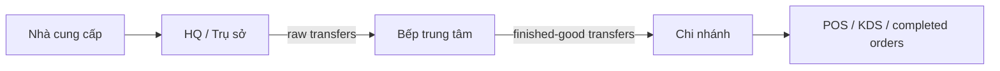
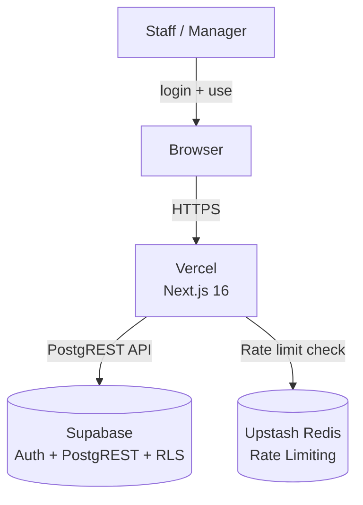
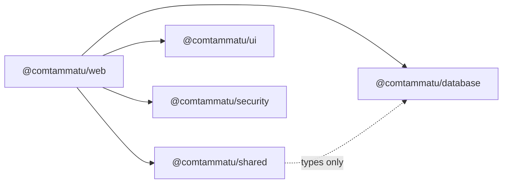
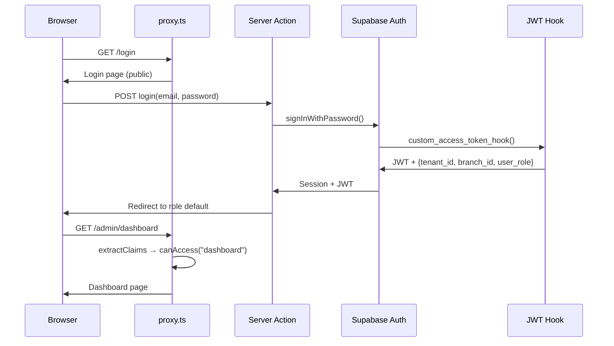

# Codebase Map — Cơm Tấm Má Tư

> **Đối tượng:** Kỹ sư mới onboard, người phụ trách feature, người lập kế hoạch sprint
> **Mục tiêu chính:** (1) Hiểu cấu trúc hệ thống và luồng auth, (2) biết nơi thêm tính năng mới, (3) ước lượng blast radius của thay đổi
> **Mốc quyết định:** Lập kế hoạch sprint, onboarding, rà soát kiến trúc
> **Ngoài phạm vi:** Yêu cầu nghiệp vụ (xem `docs/ref/`), chi tiết sprint và đặc tả tính năng (xem `docs/plan/`, ví dụ [`m2-order-lifecycle.md`](plan/m2-order-lifecycle.md))

## Trạng thái

- **Phiên bản hiện tại:** v1.0.0 — M0–M3, M5 SHIPPED. M4/M6/M7 PARTIAL (blocked on external credentials). M5-Ext Phase 0+1 live, S8 (yield + AP) deferred post-pilot.
- **Mốc tiếp theo:** Pilot Launch v1.0.0 cho mô hình vận hành `HQ -> Bếp trung tâm -> Chi nhánh` — cần wire VietQR/Momo/MISA credentials trước pilot
- **Tech stack:** Next.js 16.2 | React 19.2 | TypeScript 6.0 | Tailwind 4.2 | Zod 4 | Supabase | Turborepo 2.9

## Chỉ mục phân hệ

| Module         | Doc                                            | Purpose                                              | Risk Level                  |
| -------------- | ---------------------------------------------- | ---------------------------------------------------- | --------------------------- |
| Auth & ACL     | [auth.md](modules/auth.md)                     | JWT claims, role hierarchy, RLS, proxy routing       | **High** — gates all access |
| Database       | [database.md](modules/database.md)             | Supabase clients, types, migrations, RLS policies    | **High** — data integrity   |
| Web App        | [web-app.md](modules/web-app.md)               | Next.js routes, layouts, server actions, surface shells | Medium                    |
| UI             | [ui.md](modules/ui.md)                         | shadcn components, design tokens                     | Low                         |
| Security       | [security.md](modules/security.md)             | Rate limiting (Upstash Redis)                        | Medium                      |
| Infrastructure | [infrastructure.md](modules/infrastructure.md) | Monorepo, build, deploy, environment                 | Medium                      |

## Documentation Index

Khi cần đi sâu hơn theo loại tài liệu:

- [docs/README.md](README.md) — cổng vào chung cho toàn bộ docs
- [docs/ref/glossary.md](ref/glossary.md) — glossary chuẩn duy nhất cho toàn repo
- [docs/architecture/README.md](architecture/README.md) — kiến trúc hệ thống và cross-cutting docs
- [ref/README.md](ref/README.md) — canonical reference docs
- [runbooks/README.md](runbooks/README.md) — readiness và smoke gates
- [worklog/README.md](worklog/README.md) — adoption/progress tracking

## Tổng quan kiến trúc

```
Browser ──► proxy.ts (auth + ACL) ──► Next.js App Router ──► Supabase (PostgREST + Auth)
                                                         ──► Upstash Redis (rate limit)
```

### Pilot Operating Model



### C4 Context Diagram



### Sơ đồ phụ thuộc phân hệ



### Luồng dữ liệu — Đăng nhập vào trang tổng quan



## Hub Files (High Blast Radius)

Đây là các file có nhiều chỗ phụ thuộc nhất. Mọi thay đổi ở đây sẽ tác động rộng trong hệ thống.

| File                                            | Importers                          | Impact                                                |
| ----------------------------------------------- | ---------------------------------- | ----------------------------------------------------- |
| `packages/shared/src/auth/module-acl.ts`        | proxy.ts, admin shell, all layouts | Adding/removing modules affects routing, nav, and ACL |
| `packages/shared/src/auth/types.ts`             | Every auth-aware file              | Changing roles or JWT shape breaks auth chain         |
| `packages/shared/src/auth/scope.ts`             | proxy.ts, layouts, server actions  | Changing claim extraction breaks session              |
| `packages/database/src/types/database.types.ts` | All server code                    | Auto-generated — regenerate with `pnpm db:types`      |
| `apps/web/proxy.ts`                             | Next.js middleware entry           | Single point of auth enforcement                      |

## Critical Unknowns

| #   | Unknown                                                     | Verification Step         | Impact                   |
| --- | ----------------------------------------------------------- | ------------------------- | ------------------------ |
| 1   | area_manager has tenant-wide access (no area scoping table) | Deferred — see roadmap H3 | May need migration later |
| 2   | E2E test coverage limited to 5 Playwright specs (kds-queue, daily-limit-realtime, payment-cash, edit-pending-pricing, +1) — no unit/component test suite | Expand spec coverage or adopt vitest as M4/M6 wraps up | Refactor regressions possible on uncovered surfaces |

## Priority Recommendations

1. **v1.0.0 Pilot Launch:** M0–M3, M5 shipped. M4/M6/M7 partial (blocked on credentials). Focus on wiring real payment/invoice APIs, QA, security review, and validating the `HQ -> Bếp trung tâm -> Chi nhánh` operating path.
2. **Watch hub files:** Any change to `module-acl.ts` or `types.ts` requires proxy + layout + nav verification.
3. **RLS pattern:** Every new table must follow the tenant-scoped RLS pattern with explicit GRANTs. See [database.md](modules/database.md).

Inventory route ownership note:
- `/inventory` is the canonical Inventory surface.
- `/admin/inventory/*` page files (`cold-chain`, `express-windows`, `feature-flags`, `trust`) still exist on disk but are RETIRED — the `inventory_admin` module ACL in `module-acl.ts` has `allowedRoles: []`, so no role passes the proxy gate. Treat the URL space as unsupported; do not wire new admin features there.

<!-- ORACLE-META
Updated: 2026-04-15 (status sync: M4/M6/M7 PARTIAL, S8 deferred, H3 deferred)
Data: Direct source reading
Audience: new engineer, feature owner | Confidence: 95%
Unknowns: 2 items pending verification
-->
