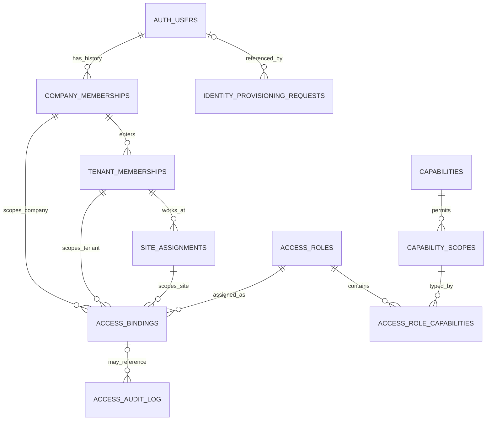

# Auth và Authorization mục tiêu cho Greenfield

> **TARGET ONLY — not current runtime.** Auth callers and ACL today are owned by
> `docs/modules/auth.md` and `packages/shared/src/auth/*` until Greenfield
> cutover. Product Dual Thesis (Hệ thống + Vận hành) for surfaces:
> `docs/spec/architecture.md`.
>
> Trạng thái: kiến trúc mục tiêu đã được owner chấp nhận qua ADR 0015; chưa phải
> contract của hệ thống đang chạy và chưa được triển khai.
>
> Quyết định liên quan: [ADR 0015](../plan/adr/0015-greenfield-authorization-model.md).

Tài liệu này sở hữu mô hình đích cho Auth, route ACL, RBAC, policy, RLS và RPC
được triển khai trong repo `comtammatu` rồi chứng minh trên
`matu-greenfield-company`. `docs/modules/auth.md` tiếp tục mô tả source hiện tại
cho tới khi từng caller được chuyển qua Greenfield Authority.

## 1. Quyết định ngắn

Greenfield dùng một đường authority:

```text
Supabase Auth identity
  → Company membership
  → Tenant membership khi vào dữ liệu Tenant
  → site assignment khi nhận vai trò tại site
  → scoped RBAC binding
  → typed database AuthorizationPolicy
  → RLS hoặc domain RPC
```

- Supabase Auth xác thực danh tính và session.
- RBAC gói capability thành role; binding gắn role vào đúng
  `company | tenant | site`.
- Policy kiểm tra membership, scope, resource lineage, trạng thái, thời hạn và
  session assurance.
- Route ACL chỉ là coarse admission và nguồn navigation; RLS/RPC là authority
  cuối cùng.
- Không có `owner` bypass, quyền ngầm từ chức danh hoặc wildcard “có quyền ở đâu
  đó”.
- Không xây policy engine, JSON rule DSL, explicit deny hoặc policy editor trong
  V1.

Nói cách khác: **có policy-based authorization, nhưng không có một subsystem
PBAC riêng**. Từ `PBAC` không được dùng làm tên code hoặc bảng vì nó có thể được
hiểu là “permission-based” hoặc “policy-based”.

## 2. Vì sao không mở rộng Auth hiện tại

Auth hiện tại được xây quanh một user, một Tenant, một Branch và một role suy ra
từ HR position. Giả định đó không biểu diễn đúng:

- nhân viên Văn phòng chỉ thuộc Company;
- nhân viên làm ở Kho Tổng hoặc Bếp Trung Tâm;
- một người được assignment tới nhiều site;
- quyền Company, Tenant và site tồn tại độc lập;
- thu hồi quyền phải có hiệu lực mà không chờ refresh role trong JWT.

Greenfield không copy hoặc vá nullable quanh authority của retired target:

- `profiles.tenant_id`, `profiles.branch_id` làm scope duy nhất;
- `position_code → user_role`;
- JWT `tenant_id`, `branch_id`, `user_role`, `position_code`;
- `MODULE_ACL.allowedRoles`;
- `has_permission_any()` cho hành động cần scope chính xác;
- `role === owner` hoặc Owner bypass trong RLS, RPC hay Server Action;
- current `staff_permissions` và `role_templates` như target schema.

Các nguyên tắc được giữ lại là Supabase Auth, fail closed, capability rõ ràng,
RLS/RPC ở boundary, grant có thời hạn và audit.

## 3. Từ vựng chuẩn

| Thuật ngữ            | Nghĩa                                                  | Không có nghĩa                 |
| -------------------- | ------------------------------------------------------ | ------------------------------ |
| Identity             | User/session được Supabase Auth xác thực               | hồ sơ nhân sự hoặc quyền       |
| Company membership   | Quan hệ active giữa identity và Company                | tự động vào Tenant/site        |
| Tenant membership    | Quyền nền để identity đi vào một Tenant                | capability thực hiện hành động |
| Site assignment      | Nơi làm việc/assignment đang hiệu lực                  | role hoặc capability           |
| Capability           | Action key ổn định như `orders:create`                 | route, chức danh hoặc UI label |
| Access role          | Một bundle capability tại một loại scope               | HR position                    |
| Role binding         | Principal + role + exact scope + validity              | quyền toàn hệ thống            |
| Route access         | Route family → capability + scope resolver + site kind | final data authority           |
| Authorization policy | Hàm typed quyết định allow/deny từ dữ liệu live        | rule DSL do người dùng viết    |
| RLS                  | Boundary đọc/ghi theo row của Postgres                 | navigation hoặc UX affordance  |
| Domain RPC           | Boundary atomic cho mutation và invariant nghiệp vụ    | cách bỏ qua RLS                |

`central_warehouse`, `central_kitchen` và `branch` là **site kind**.
Authorization chỉ có ba scope kind đóng: `company`, `tenant`, `site`.

## 4. Mô hình dữ liệu tối thiểu



| Relation                         | Trách nhiệm                                                                                                                               |
| -------------------------------- | ----------------------------------------------------------------------------------------------------------------------------------------- |
| `identity_provisioning_requests` | durable request tạo trước external Auth call; giữ idempotency, state, `auth_user_id` và failure category                                  |
| `company_memberships`            | identity, Company, optional employee link, status và validity; Tenant/site relation là optional nhưng Company action vẫn cần role binding |
| `tenant_memberships`             | admission rõ ràng vào Tenant; không suy ra từ Company membership                                                                          |
| `site_assignments`               | placement tới một `operational_site`; không tự cấp capability                                                                             |
| `capabilities`                   | action catalog, scope, AAL, subject kind và assignment-class floor                                                                        |
| `capability_scopes`              | scope kind nào hợp lệ cho từng capability                                                                                                 |
| `access_roles`                   | role RBAC theo một scope kind, assignment class và validity ceiling                                                                       |
| `access_role_capabilities`       | role chứa capability nào                                                                                                                  |
| `access_bindings`                | role được gắn cho identity tại đúng Company, Tenant hoặc site, có validity và revoke state                                                |
| `access_audit_log`               | append-only event theo request/actor/action/target/outcome; `binding_id` nullable cho denial/bootstrap/no-op                              |

`access_bindings` dùng các foreign key thật tới Company, Tenant và site cùng
`CHECK` bảo đảm đúng shape:

- Company scope: có `company_membership_id + company_id`;
- Tenant scope: có `tenant_membership_id + company_id + tenant_id`;
- site scope: có `site_assignment_id + company_id + tenant_id + site_id`.

Foreign key/composite key phải chứng minh `site → tenant → company`; không tin
lineage do client gửi. `(role_id, scope_kind)` và
`(capability_key, scope_kind)` dùng composite foreign key để role, capability và
binding luôn khớp scope.

Membership và assignment là lifecycle row bất biến: row đã end/revoke không
được reactivate; lần tham gia/assignment mới tạo ID mới. Binding tham chiếu đúng
lifecycle ID nên một binding cũ không sống lại khi cùng người quay lại cùng
Tenant/site. Foreign key dùng `RESTRICT` khi xóa làm mất audit; operational
lifecycle được đóng bằng timestamp/status. Partial unique index chỉ cho tối đa
một active Company membership trên `(auth_user_id, company_id)`, một active
Tenant membership trên identity/Tenant và một active assignment trên
identity/site; history vẫn giữ row ID cũ.

Database uniqueness/exclusion chặn hai binding chưa revoke có validity overlap
cho cùng lifecycle row, role và scope dù idempotency key khác nhau. Revoke nhắm
đúng binding ID. Vì nhiều role khác nhau vẫn có thể cùng cấp một capability,
Access UI và audit phải hiển thị mọi effective grant source; không báo “đã mất
quyền” nếu một source khác vẫn còn.

### 4.1. Mutation lifecycle cũng là authorization-sensitive

- Activate/end Company hoặc Tenant membership chỉ đi qua Security Admin RPC,
  AAL2, reason và audit.
- Create/end site assignment đi qua Workforce RPC với capability
  `workforce:assign_site`, exact target/scope và audit. Assignment mới không copy
  role binding.
- Ending assignment atomically đóng các standard binding phụ thuộc. Nếu còn
  privileged binding, Workforce RPC fail và yêu cầu Security Admin
  revoke/transfer trước.
- Không RPC nào reactivate lifecycle row cũ.

Như vậy Workforce vẫn sở hữu placement, nhưng không thể vô tình mở lại hoặc
vô hiệu hóa privileged authority ngoài access boundary.

### 4.2. RBAC không nối với HR position

`department`, `position`, reporting line và title là dữ liệu Company Workforce.
Chúng không có trigger, mapper hoặc implicit foreign key cấp `access_role`.

Onboarding UI có thể đề xuất role theo công việc, nhưng authorized Access hoặc
Security Admin theo `assignment_class` phải tạo binding rõ ràng và audit. Đổi
chức danh không được tự đổi effective authorization.

### 4.3. Không cần direct permission grant trong V1

V1 chỉ bind role, không gắn từng capability trực tiếp vào user. Một ngoại lệ nhỏ
được biểu diễn bằng supplemental role có scope hẹp và `valid_until`, thay vì tạo
song song một hệ permission grant.

Role catalog và role-capability mapping được quản lý bằng migration/review T3.
Chưa tạo custom-role editor. Chỉ thêm direct capability grant khi có use case
thật không biểu diễn được bằng role nhỏ, không phải để “linh hoạt về sau”.

## 5. Quy tắc quyết định

Một action chỉ được allow khi toàn bộ điều kiện liên quan đều đúng:

```text
authenticated session
AND active identity/product membership
AND active membership chain for requested scope
AND active resource with valid Company/Tenant/site lineage
AND active role binding at the scope required by that capability
AND role contains the requested capability
AND capability permits that scope
AND binding validity and session assurance pass
```

Đây là base authorization decision. Nếu thiếu một điều kiện thì deny. Domain
RPC có thể deny thêm theo business state; nó không được biến domain state thành
role hoặc nới base decision.

Ba helper typed là đủ:

```sql
private.can_company(p_capability text, p_company_id bigint)
private.can_tenant(p_capability text, p_tenant_id bigint)
private.can_site(p_capability text, p_site_id bigint)
```

Các hàm tự lấy `auth.uid()`, database time và `aal`. Caller không được truyền
`user_id`, `now`, membership status hoặc Company/Tenant lineage.

Không có scope inheritance ngầm:

- Company role không tự có quyền trên mọi Tenant;
- Tenant role không tự có quyền vận hành mọi site;
- site role chỉ đúng một site;
- oversight dùng capability rõ như `sites:oversee` hoặc
  `finance:consolidated_read`, không dùng wildcard ẩn.

Site-scoped binding yêu cầu site assignment active tại cùng site. Company/Tenant
oversight dùng binding ở scope tương ứng và không cần tạo assignment giả.

`private.can_site()` chỉ xét site binding chính xác. Nếu một domain cho phép
oversight từ Tenant, policy phải ghi rõ hai capability khác nhau, ví dụ:

```sql
private.can_site('orders:read', row.site_id)
or private.can_tenant('orders:read_all', row.tenant_id)
```

Không có helper tổng quát tự nâng Company/Tenant role xuống toàn bộ descendant.
SQL tests phải có cả positive oversight case và negative case khi chỉ có parent
membership nhưng thiếu capability oversight.

Các invariant như shift đang mở, order chưa refund, kỳ lương chưa khóa, người
duyệt không phải người tạo hoặc invoice chưa phát hành nằm trong domain RPC/RLS,
không được nhét vào authorization engine tổng quát.

## 6. Trách nhiệm từng lớp

| Lớp            | Được quyết định                                               | Không được quyết định                     |
| -------------- | ------------------------------------------------------------- | ----------------------------------------- |
| Supabase Auth  | identity, session, token validity, MFA/AAL                    | role, Tenant/site access, business action |
| Proxy          | public/protected boundary, session bootstrap, route shape     | final authorization                       |
| Scope resolver | Company/Tenant/site từ membership, resource và URL site param | capability                                |
| Route registry | capability cần cho route, scope source và allowed site kind   | row visibility                            |
| Feature policy | domain precondition, typed wrapper và safe error              | tự tính lại membership/binding            |
| RLS            | row nào được đọc/ghi trực tiếp                                | multi-row workflow                        |
| RPC            | capability + scope + invariant + mutation atomic              | navigation                                |

Server checks và UI affordance có thể dùng cùng capability catalog, nhưng một
button ẩn hoặc route bị chặn không phải security boundary.

Database helpers là owner duy nhất của live membership/binding decision và được
RLS/RPC dùng trực tiếp. TypeScript không có evaluator song song; nó chỉ giữ type,
route admission, UX projection và gọi database authority.

## 7. Route ACL mục tiêu

Current `MODULE_ACL` không được nhân đôi thành authority Greenfield song song.
Nó được thay tại cùng seam bằng một registry typed, tạm gọi `ROUTE_ACCESS`, không
chứa `allowedRoles`. Bảng sau chỉ minh họa các route family; registry thật phải
cover toàn bộ protected route:

| Route family           | Capability                   | Scope source                  | Site kind           |
| ---------------------- | ---------------------------- | ----------------------------- | ------------------- |
| `/`                    | `company:dashboard_view`     | active Company membership     | —                   |
| `/me/security/*`       | auth-account self-service    | exact `auth.uid()`            | —                   |
| `/me/*`                | `workforce:self_read`        | Company membership            | —                   |
| `/hr/*`                | `workforce:read`             | Company membership            | —                   |
| `/menu/*`              | `catalog:read`               | derived active Tenant         | —                   |
| `/br/:branchId/*`      | `branch:workspace_enter`     | URL `branchId` + live lineage | `branch`            |
| `/warehouse/:siteId/*` | `inventory:workspace_enter`  | URL `siteId` + live lineage   | `central_warehouse` |
| `/kitchen/:siteId/*`   | `production:workspace_enter` | URL `siteId` + live lineage   | `central_kitchen`   |

Vì V1 có một Company và một Tenant, không thêm fake `companyId`/`tenantId` vào
mọi URL. Site workspace mang site identifier qua `branchId` hoặc `siteId`;
Company/Tenant được derive server-side.

`branchId` chính là `operational_sites.id`; resolver bắt buộc xác minh
`operational_sites.kind = 'branch'`. Nó không phải một subtype key hoặc bảng
Branch authority thứ hai.

Registry này sinh hoặc cấp dữ liệu cho:

- route resolver;
- navigation visibility;
- protected-route coverage test;
- generated route-capability matrix.

Protected route không có registry entry phải fail closed. Registry chỉ coarse
gate; query và mutation vẫn đi qua RLS/RPC.

Protected server layout đọc registry, resolve URL/resource scope rồi gọi narrow
`api` authorization RPC để lấy live decision. Navigation dùng cùng registry và
database decision dưới dạng UX projection; không evaluator membership thứ hai
trong TypeScript. Chỉ exact `/me/security/*` là Auth-account exception theo
`auth.uid()` với fixed MFA/session operation allowlist trước Company membership.
Các `/me/*` khác vẫn cần Company membership, capability và RLS; không tạo scope
kinh doanh thứ tư hoặc broad whitelist.

Capability key, allowed scope, required AAL, subject kind và
`assignment_class_floor` có một versioned manifest trong `packages/shared`;
target SQL catalog được generate/check từ manifest trước khi migration được
commit. Role class không được thấp hơn capability nhạy nhất nó chứa; machine
role không chứa human capability. Route registry import `CapabilityKey`, còn CI
và bind RPC chặn unknown key, scope mismatch, AAL drift, misclassified role và
SQL/catalog mismatch. Applied database catalog là runtime authority; generated
artifacts không được sửa tay.

## 8. Auth lifecycle, JWT và session

### 8.1. Provisioning và recovery

- Staff account là invite-only; public self-signup không tạo Company membership.
- `auth.users` là identity, còn employee record thuộc Company Workforce. Không
  phải employee nào cũng cần tài khoản và không dùng Auth metadata làm hồ sơ HR.
- Human `company_membership` có thể link tới đúng một employee; role vẫn được
  bind riêng.
- Chỉ server-side access-administration flow được mời user và kích hoạt
  membership; role binding do Security Admin thực hiện. Signed-in identity chưa
  có active membership luôn bị chặn khỏi business data.
- Server tạo `identity_provisioning_requests` trước khi gọi GoTrue Admin API.
  Request ID gắn vào external call như metadata không có authority; state
  `pending → auth_created → membership_ready → completed` được retry/reconcile.
  Auth user đã tạo nhưng DB step thất bại vẫn không nhận quyền.
- Reconciler chỉ được hoàn tất identity creation. Membership/binding finalization
  phải qua fresh authenticated RPC, recheck live grantor capability, AAL, scope
  và role ceiling; nếu grantor đã mất quyền thì request chuyển
  `reapproval_required` và Auth identity tiếp tục không có authority.
- Idempotency key luôn gắn với canonical request hash; reuse cùng key nhưng khác
  payload bị từ chối.
- Invite/reset redirect dùng allowlist của đúng Greenfield domain. Login và
  recovery error không tiết lộ email hoặc trạng thái membership.

### 8.2. JWT và revocation

V1 không cần custom access-token hook. JWT giữ các claim chuẩn đã được Supabase
xác thực như `sub`, `session_id`, `aal`, issuer và expiry.

Không đưa role, capability array, Tenant membership hoặc site assignment vào
JWT. Những dữ liệu này thay đổi thường xuyên và phải được đọc live để revoke có
hiệu lực trên request tiếp theo.

Nếu sau này có nhiều Company hoặc đo được bottleneck thật, chỉ cân nhắc thêm một
stable, non-authoritative membership anchor. Không cache authorization vào JWT
chỉ để tránh một query chưa được đo.

Deactivation thực hiện ở product membership trước; với offboarding khẩn cấp,
thu hồi Supabase session đồng thời. RLS/RPC vẫn deny từ dữ liệu live dù access
token cũ chưa hết hạn.

Các capability rủi ro cao như access administration, payroll approval, refund
approval hoặc thay invoice credential/profile phải yêu cầu `aal2` tại RPC.

## 9. RLS và RPC contract

- Mọi table trong exposed schema bật RLS và có explicit Postgres grants.
- Policy ghi rõ `TO authenticated`; unauthenticated request fail closed.
- `UPDATE` có cả `USING` và `WITH CHECK`, đồng thời có policy `SELECT` tương ứng.
- Policy luôn dùng exact row-owned Company/Tenant/site; không có
  `has_permission_any()`.
- Authz tables và RLS helpers nằm trong non-exposed schema. Narrow callable RPC
  entrypoint nằm trong explicit exposed `api` schema để `supabase-js` gọi được;
  nó có fixed `search_path`, revoke khỏi `PUBLIC`/`anon`, explicit
  `authenticated` execute và tự kiểm tra `auth.uid()`/AAL.
- Vì RLS expression chạy dưới caller, `authenticated` chỉ nhận schema `USAGE`
  và `EXECUTE` trên exact `private.can_*` helpers cần cho policy; không nhận
  quyền table/sequence hay default function execute. Schema vẫn không nằm trong
  Data API exposed schemas.
- `private.can_*` là `STABLE SECURITY DEFINER SET search_path = ''`, qualify đầy
  đủ mọi object và do non-login migration role sở hữu. Chỉ privileged mutation
  RPC cần đọc private authz tables mới dùng cùng definer discipline; ordinary
  domain function giữ invoker security.
- Authz tables không cho `authenticated` DML trực tiếp. Bind/revoke đi qua RPC
  atomic và ghi audit.
- View exposed dùng invoker security; không vô tình bypass RLS.
- Multi-row write, transition có cạnh tranh hoặc access administration luôn đi
  qua domain RPC.
- Server Action không dùng `service_role` để thay user authority. Site agent
  tuyệt đối không giữ `service_role`.
- Realtime và Storage có policy riêng nhưng cùng membership/scope model.
  Realtime không bao giờ là authority cho mutation.

Một RLS policy chỉ nên ghép:

```text
row lineage/status
AND (
  exact-scope capability
  OR explicit parent-scope oversight capability
)
AND small domain invariant when truly row-local
```

Không tách các nhánh allow thành nhiều permissive policy vì Postgres sẽ `OR`
chúng và có thể làm mất structural gate. Một command/purpose policy phải giữ
lineage/status bên ngoài authorization `OR`; invariant dùng chung có thể là
`AS RESTRICTIVE` policy với SQL test chứng minh composition. Workflow phức tạp
ở RPC thay vì một mega policy.

## 10. Access administration

V1 tập trung quyền quản trị access tại Company:

- chỉ `security_admin` có `access:manage_bindings` và AAL2 mới được bind, extend,
  shorten, revoke, replace hoặc reactivate human role;
- role `machine_only` không đi qua human bind RPC;
- RPC enforce `requires_expiry` và `max_binding_duration` từ role catalog;
- mọi binding mutation yêu cầu grantor khác target; safe self-service dùng RPC
  riêng và không đổi role;
- target principal phải có membership/assignment phù hợp;
- mọi mutation bắt buộc có non-empty reason; privileged role còn cần
  approval/reference;
- binding tạm thời bắt buộc có `valid_until`;
- retry dùng idempotency key;
- bind, extend, revoke và escalation bị chặn đều có audit evidence;
- `valid_until` là end-exclusive và được kiểm tra bằng database time.

Expected policy denial không `RAISE` sau khi ghi audit vì transaction sẽ
rollback cả audit row. RPC trả typed denial result cùng stable reason để commit
security event; unexpected database error được rollback và ghi ở server log.
Idempotency record giữ canonical request hash để một key không thể được replay
với payload khác.

Không có Access Admin hoặc Branch Manager delegation trong V1 vì chưa có
onboarding operator riêng. `security_admin` quản trị human access;
`company_admin` chỉ có capability nghiệp vụ/governance explicit và không được
đổi binding. Khi có workflow thật cần operator chỉ gán role standard, mới thêm
Access Admin cùng assignment-class ceiling; không scaffold trước.

Không có `effect = deny` row. Deny đến từ inactive/suspended state, membership
hoặc assignment hết hạn, resource inactive, binding thiếu/hết hạn/revoked,
lineage sai, AAL thiếu hoặc capability không khớp. Khi cần bỏ một capability,
revoke role rộng và bind role hẹp hơn.

### 10.1. Bootstrap Security Admin đầu tiên

Normal bind RPC không thể tự tạo người quản trị đầu tiên. G5 dùng một owner-run
bootstrap script riêng, không phải public RPC:

1. yêu cầu exact candidate ref, exact Auth user ID và owner approval;
2. chỉ chạy khi chưa có Security Admin binding;
3. tạo membership, Company-scoped Security Admin binding và audit row trong một
   transaction;
4. chỉ cho identity chưa đạt `aal2` vào exact security-enrollment surface dưới
   `/me/security/*`, không vào business data;
5. candidate gate xác minh enroll/challenge `aal2`;
6. Security Admin dùng normal audited RPC để bind một Security Admin recovery
   identity khác;
7. cả hai Security Admin có AAL2/recovery độc lập trước go-live;
8. bootstrap script bị khóa vĩnh viễn sau lần chạy thành công.

Trước go-live phải có owner-approved zero-admin recovery runbook, chỉ hợp lệ khi
không còn Security Admin active, cùng exact identity, AAL2 và audit. Đây là
operational recovery, không phải product bypass.

Runbook còn có nhánh “active nhưng không thể sử dụng” cho Security Admin cuối
cùng: owner-gated procedure phải chứng minh account/session/factor bị mất, revoke
session/factor và stranded binding với audit, rồi mới đi vào zero-admin recovery.
Không có public endpoint cho nhánh này.

## 11. Company admin và emergency access

`company_admin` là role với capability explicit, không phải superuser và không
bypass RLS. Người có role này vẫn bị chặn bởi Company/Tenant/site lineage,
resource state, AAL và domain invariants.

Emergency access không phải product role V1. Nếu sau này cần break-glass, nó là
runbook server-side riêng, time-boxed, AAL2, reason bắt buộc và audit; không tồn
tại như nhánh `if owner return true`.

## 12. Site agent

Print agent là machine identity riêng, gắn đúng một site và chỉ được gọi RPC cho
printer config, claim/complete print job và heartbeat của site đó.

- Không dùng human role.
- Không có Company/Tenant overview.
- Không đọc bảng nghiệp vụ rộng.
- Credential revoke được và không phải Supabase `service_role`.
- Mọi RPC derive site từ machine identity, không tin `siteId` do agent tự chọn.

Schema và negative test của machine credential thuộc Print & Devices/G6. Phase
Greenfield Authority chỉ khóa boundary “không `service_role`, một identity đúng
một site”; nó chưa nhận runtime gate cho feature chưa tồn tại.

## 13. Thứ tự triển khai

1. **Authority contract accepted:** chốt vocabulary, scope, capability format,
   role binding, JWT và no-bypass rule.
2. **Source-ready:** tạo target migration từ empty, typed helpers, RLS/RPC,
   generated types và SQL tests.
3. **Candidate-proven:** provision user/role tối thiểu và chứng minh office,
   Tenant, site, revoke, AAL và cross-scope denial trên exact candidate.
4. **Branch Workspace:** mới chuyển `/br/:branchId`, navigation và route
   registry sang authority mới.
5. Tiếp tục Effective Configuration/HĐĐT, central sites rồi Workforce.

Không chuyển Branch Workspace trước authority; nếu làm vậy route mới buộc phải
kế thừa `branch_id`, role claim và ACL cũ.

### 13.1. Gate trước `source-ready`

1. Target migration replay từ empty và generated types không có diff.
2. Catalog inspection chứng minh exposed table có RLS + explicit grants,
   exposed view dùng invoker security và private schema không bị expose.
3. Routine inspection chứng minh fixed `search_path`, không unintended
   `PUBLIC`/`anon` execute và narrow `api` entrypoint tự authorize; `SET ROLE
authenticated` tests chứng minh RLS gọi được exact helper nhưng không đọc
   authz table hoặc gọi helper khác.
4. SQL matrix đủ `SELECT/INSERT/UPDATE/DELETE/UPSERT`, gồm đổi lineage/scope qua
   `UPDATE`.
5. Negative matrix gồm cross-Company, cross-Tenant, same-Tenant/cross-site, sai
   site kind, inactive resource, expired/revoked lifecycle, thiếu capability và
   AAL1/AAL2.
6. Security-admin tests gồm self-grant, scope mismatch, privileged-revoke,
   conflicting idempotency payload, misclassified privileged capability,
   duplicate/overlapping binding, revoke còn grant source khác, concurrent
   retry, revoke-during-provisioning, lost last-admin MFA/session recovery và
   exactly-one audit result.
7. Rehire/reassignment dùng lifecycle ID mới và không làm binding cũ sống lại.
8. RLS/RPC cùng dùng và test parity cho base `can_*` decision; RPC được deny
   thêm theo domain state. Runtime PostgREST test dùng real user JWT.
9. Route filesystem coverage, runtime fail-closed và
   route-manifest/database-catalog parity đạt.
10. Representative `EXPLAIN` chứng minh index cho membership, assignment,
    binding, role-capability và scope lookup. Realtime/Storage isolation chạy ở
    candidate/G6 khi consumer tương ứng tồn tại.

## 14. Acceptance matrix tối thiểu

1. Office member dùng Company workflow mà không có Tenant/site giả.
2. Company binding không đọc Tenant/site row nếu thiếu explicit
   descendant-oversight capability.
3. Tenant membership không tự cấp capability.
4. Site assignment không tự cấp capability.
5. Site role không đọc/ghi site khác, kể cả cùng Tenant.
6. Worker ở hai site cần hai assignment và hai binding rõ ràng.
7. Branch, Kho Tổng và Bếp Trung Tâm reject sai site kind.
8. Đổi department/position/title không đổi effective access.
9. Suspend membership hoặc revoke binding deny ở request kế tiếp dù JWT cũ còn
   hạn.
10. JWT tự chèn legacy `user_role` hoặc `branch_id` không có tác dụng.
11. Company admin không vượt RLS hoặc domain invariant.
12. AAL1 bị chặn tại capability yêu cầu AAL2.
13. Authenticated user không DML trực tiếp authz tables.
14. Protected route chưa đăng ký fail closed.
15. RLS và RPC dùng cùng base `can_*` decision; RPC có thể deny thêm theo domain
    invariant nhưng không được allow khi base đã deny.
16. Grant/revoke retry idempotent và audit đúng một lần.
17. Candidate ghi nhận JWT expiry/rejoin contract và chứng minh Realtime
    reconnect sau revoke bị chặn. Existing channel có thể giữ cached policy tới
    token update hoặc expiry; không được gọi đây là immediate revoke.

## 15. Khi nào mới cần policy engine đầy đủ

Chỉ revisit một policy engine khi có bằng chứng đồng thời rằng:

- nhiều Tenant độc lập cần admin tự định nghĩa điều kiện runtime;
- cùng một conditional rule phải cấu hình động qua nhiều domain;
- thay policy không thể chờ migration/review;
- typed SQL/TypeScript policies đã tạo duplication hoặc latency được đo.

Cho tới lúc đó, scoped RBAC + ba helper typed + domain invariant là mô hình nhỏ
nhất vẫn an toàn và audit được cho Cơm Tấm Má Tư.

## 16. Platform references

- [Supabase — Securing the Data API](https://supabase.com/docs/guides/api/securing-your-api)
- [Supabase — Row Level Security](https://supabase.com/docs/guides/database/postgres/row-level-security)
- [Supabase — Custom Claims and RBAC](https://supabase.com/docs/guides/api/custom-claims-and-role-based-access-control-rbac)
- [Supabase — Custom Access Token Hook](https://supabase.com/docs/guides/auth/auth-hooks/custom-access-token-hook)
- [Supabase — Realtime Authorization](https://supabase.com/docs/guides/realtime/authorization)
