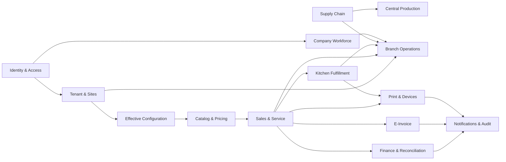
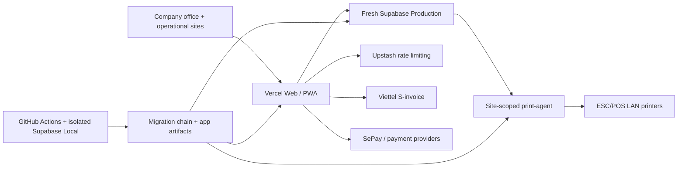

# Modules, Tech Specs, Infra và Project Structure mục tiêu

> Trạng thái: kiến trúc mục tiêu, chưa mô tả hệ thống đang chạy.
>
> `docs/spec/architecture.md` tiếp tục là nguồn mô tả hiện trạng. Package
> manifests và `pnpm-lock.yaml` sở hữu phiên bản dependency chính xác.

## 1. Bối cảnh

Kiến trúc phục vụ một Company, một Tenant vận hành Cơm Tấm Má Tư và nhiều đơn vị
vận hành:

```text
Company
├── Khối Văn phòng dùng chung
└── Tenant
    ├── Kho Tổng
    ├── Bếp Trung Tâm
    └── Chi nhánh vận hành
```

Company là gốc tổ chức và nhân sự dùng chung. Tenant là ranh giới dữ liệu vận
hành F&B. MST, chữ ký số, HĐLĐ và tài khoản HĐĐT là dữ liệu của quy trình tích
hợp bên thứ ba, không phải điều kiện để runtime khởi động.

## 2. Nguyên tắc module

Module là một lát cắt nghiệp vụ có interface, implementation và quyền sở hữu dữ
liệu rõ ràng. Module không đồng nghĩa với route, React component, bảng database
hoặc workspace package.

- Route chỉ chuyển tham số và gọi interface của module.
- Module giữ validation, policy, query và mutation của nghiệp vụ mình sở hữu.
- Không import implementation nội bộ của module khác.
- Luồng ghi liên quan nhiều module đi qua một use case rõ ràng; nếu tính đúng
  đắn trải trên nhiều dòng thì dùng một Postgres RPC.
- Capability và RLS quyết định quyền; tên phòng ban, chức danh hoặc route không
  tự cấp quyền.
- Chỉ tạo package khi code thật sự được dùng qua ranh giới app/runtime.

## 3. Bản đồ module

### 3.1. Nền tảng tổ chức

| Module                  | Sở hữu                                                                                         | Không sở hữu                                                   |
| ----------------------- | ---------------------------------------------------------------------------------------------- | -------------------------------------------------------------- |
| Identity & Access       | đăng nhập, membership, Tenant grant, capability, route resolution, RLS contract                | hồ sơ nhân sự nghiệp vụ                                        |
| Company Workforce       | nhân viên, phòng ban, vị trí, metadata hợp đồng, lịch làm, chấm công, nghỉ phép, payroll input | soạn/ký HĐLĐ pháp lý, quyền dữ liệu hiệu lực, bút toán kế toán |
| Tenant & Sites          | Tenant, Kho Tổng, Bếp Trung Tâm, Chi nhánh, assignment tới site                                | workflow kho, sản xuất hoặc bán hàng                           |
| Effective Configuration | Tenant default, site override, cấu hình hiệu lực và snapshot                                   | logic nghiệp vụ tiêu thụ cấu hình                              |

### 3.2. Vận hành F&B

| Module              | Sở hữu                                                                | Workspace chính                                          |
| ------------------- | --------------------------------------------------------------------- | -------------------------------------------------------- |
| Catalog & Pricing   | món, nhóm món, VAT, giá chuẩn, khả dụng và giới hạn bán               | `/menu/*`, cấu hình được ủy quyền tại Chi nhánh          |
| Sales & Service     | bàn, ca POS, đơn hàng, thanh toán và hoàn tiền                        | `/br/:branchId/pos`, `/br/:branchId/orders`              |
| Kitchen Fulfillment | ticket bếp, trạng thái chế biến, runner và bằng chứng hoàn thành      | `/br/:branchId/kds`, `/br/:branchId/runner`              |
| Supply Chain        | nhà cung cấp, mua hàng, nhận hàng, tồn kho, kiểm kê và điều chuyển    | `/warehouse/:siteId/*`, các tác vụ tồn kho được ủy quyền |
| Central Production  | công thức, mẻ sản xuất, tiêu hao, thành phẩm và xuất sang đơn vị nhận | `/kitchen/:siteId/*`                                     |
| Branch Operations   | control room hằng ngày, ca, đội ngũ, cảnh báo và cấu hình Chi nhánh   | `/br/:branchId/*`                                        |

`Branch Operations` là module điều phối workspace, không sao chép logic của
Sales, Kitchen, Supply Chain hoặc Workforce.

### 3.3. Kiểm soát và tích hợp

| Module                   | Sở hữu                                                                       | Ghi chú                                 |
| ------------------------ | ---------------------------------------------------------------------------- | --------------------------------------- |
| Finance & Reconciliation | doanh thu, tiền mặt, ngân hàng, chi phí, công nợ, kỳ và đối soát             | nhận snapshot từ giao dịch đã hoàn tất  |
| E-Invoice                | invoice profile, hàng đợi phát hành, provider adapter, đồng bộ và audit HĐĐT | không tự thay nhà cung cấp pháp lý      |
| Notifications & Audit    | sự kiện cần chú ý, inbox, anomaly và audit trail                             | không sở hữu trạng thái nghiệp vụ gốc   |
| Print & Devices          | print job, template render, máy in, branch agent và recovery                 | không trở thành nguồn dữ liệu giao dịch |

### 3.4. Hướng phụ thuộc



Mũi tên thể hiện module phía sau tiêu thụ interface hoặc dữ liệu ổn định của
module phía trước. Central Production gọi interface/RPC của Supply Chain để ghi
nhận tiêu hao và thành phẩm; Supply Chain không import ngược Central Production.

## 4. Tech Specs và Tech Stack

### 4.1. Hợp đồng kỹ thuật

| Concern       | Hợp đồng mục tiêu                                                                                                                                                                                           |
| ------------- | ----------------------------------------------------------------------------------------------------------------------------------------------------------------------------------------------------------- |
| Scope         | Company membership, Tenant grant và site assignment là ba quan hệ riêng. URL mang Tenant/site scope; RLS/RPC xác minh lại server-side.                                                                      |
| Tiền          | Giá POS là gross đã gồm VAT. Tiền VND là `NUMERIC(...,0)` trong Postgres và `number` safe-integer theo đơn vị đồng trong TypeScript; quantity và VAT rate là field riêng, không dùng binary float cho tiền. |
| Thời gian     | Lưu instant bằng `TIMESTAMPTZ`; business date và sellable window được tính theo timezone đã cấu hình của site, mặc định `Asia/Ho_Chi_Minh`.                                                                 |
| Cấu hình      | Mỗi domain có typed default/override riêng; không dùng một mega JSON settings, recursive merge hoặc environment variable làm business configuration.                                                        |
| Giao dịch     | Ghi nhiều dòng hoặc chuyển trạng thái có cạnh tranh phải đi qua một RPC atomic; external HTTP không được giữ database lock.                                                                                 |
| Công việc nền | Job bền vững có idempotency key, lease/claim, retry có giới hạn, trạng thái không rõ và reconciliation; Realtime chỉ giảm latency, polling là recovery.                                                     |
| Lỗi           | Client nhận lỗi nghiệp vụ ổn định; raw Postgres, Supabase, provider response và secret chỉ ở server log/audit đã lọc.                                                                                       |
| Audit         | Giá, VAT, payment method và invoice profile hiệu lực được snapshot trên giao dịch; thay đổi cấu hình không viết lại lịch sử.                                                                                |

### 4.2. Hợp đồng giá gross và VAT HĐĐT

- `menu_item` sở hữu VAT rate mặc định; giá bán chuẩn và giá override của site
  đều là giá gross đã gồm VAT.
- Order line snapshot `unit_price_gross`, `vat_rate`, quantity và phần discount
  được phân bổ. Không đọc lại thực đơn khi phát hành HĐĐT.
- Invoice job snapshot `invoice_profile_id`, profile version, seller tax
  identity, `template_code` và `invoice_series` tại thời điểm thanh toán.
  Credential không nằm trong snapshot.
- Nhiều VAT rate trong một đơn phải tạo đúng line/tax breakdown theo contract
  Viettel. Tổng gross sau discount phải bằng số tiền đã thu; tổng net + VAT phải
  reconcile về cùng tổng gross.
- Công thức gross-to-net, thứ tự phân bổ discount và rounding per-line/per-rate
  chỉ được triển khai sau khi có fixture được kế toán duyệt và tài khoản Viettel
  chấp nhận. Không suy ra từ luồng HKD mẫu `2/...` hiện tại.
- Thay profile, template, series hoặc VAT sau thanh toán chỉ áp dụng cho giao
  dịch mới. Hóa đơn draft, replacement và reconciliation tiếp tục dùng snapshot
  đã khóa.
- Replacement/adjustment không dựng lại line, VAT hoặc profile từ order/menu/env
  hiện tại; chúng đọc snapshot của hóa đơn gốc và chỉ thêm metadata nghiệp vụ
  được provider yêu cầu.
- VAT rate dùng basis points nguyên. Gross-to-net và discount allocation dùng
  integer arithmetic theo fixture đã duyệt; chỉ provider adapter mới chuyển sang
  shape số mà Viettel yêu cầu.

### 4.3. Baseline

| Lớp                | Công nghệ                                                                |
| ------------------ | ------------------------------------------------------------------------ |
| Runtime            | Node.js 24                                                               |
| Workspace          | pnpm 10, Turborepo 2                                                     |
| Ngôn ngữ           | TypeScript 6 strict, `noUncheckedIndexedAccess`                          |
| Web                | Next.js 16 App Router, React 19, RSC, Server Actions, route handlers     |
| UI                 | Tailwind CSS 4, Base UI, Má Tư Design System                             |
| Form và validation | React Hook Form, Zod 4                                                   |
| Data               | Supabase Auth, Postgres, PostgREST, RLS, RPC, Realtime, Storage          |
| Rate limiting      | Upstash Redis                                                            |
| PWA                | Serwist, cloud-first; không có local transaction authority               |
| Branch edge        | Node.js print-agent, ESC/POS LAN, Realtime và recovery polling           |
| Kiểm thử           | Node test runner qua `tsx`, Playwright, axe-core, SQL tests              |
| Chất lượng         | ESLint, Prettier, TypeScript, repo guards                                |
| Triển khai         | Vercel cho web, Supabase Cloud cho data, Windows service cho print-agent |

Phiên bản patch không được sao chép vào tài liệu. Nguồn chuẩn:

- runtime và toolchain: `/package.json`;
- web: `/apps/web/package.json`;
- print-agent: `/apps/print-agent/package.json`;
- package dùng chung: `/packages/*/package.json`;
- task graph: `/turbo.json`;
- phiên bản đã khóa: `/pnpm-lock.yaml`.

### 4.4. Các lựa chọn không dùng

- không Prisma; mọi query dùng `supabase-js`;
- không tách REST/GraphQL backend khi Next.js và Supabase đã đủ;
- không microservice theo từng module;
- không generic ERP framework;
- không thêm client state library chỉ để giữ scope;
- không lưu Tenant/site scope trong `localStorage` hoặc React Context;
- không thêm message broker khi `tax_invoice_issue_jobs` và `print_jobs` đã đáp
  ứng durable claim/retry;
- không đưa `service_role` lên máy tại site trong kiến trúc mục tiêu;
- không tạo package `core`, `domain`, `types` hoặc `utils` chung khi chưa có ít
  nhất hai runtime thật sự cần.

## 5. Target Infrastructure

### 5.1. Topology và deployable units



Hệ thống giữ ba đơn vị triển khai:

1. `@comtammatu/web`: web/PWA stateless trên Vercel.
2. Supabase Project: Auth, database, RLS, RPC, Realtime, Storage và scheduled
   database work.
3. `@comtammatu/print-agent`: tiến trình tại cơ sở để giao tiếp máy in LAN.

Business module không trở thành deployable unit riêng. External provider được
kết nối qua adapter server-side của web hoặc worker đã được chứng minh là cần.

### 5.2. Environment và greenfield cutover

| Stage                | Contract                                                                                                                                                  |
| -------------------- | --------------------------------------------------------------------------------------------------------------------------------------------------------- |
| CI                   | Supabase Local chỉ tồn tại trong GitHub Actions để replay from-empty, chạy SQL tests và E2E; không là runtime target.                                     |
| Current Production   | Tiếp tục là current-state authority cho tới cutover; sau cutover chỉ read-only trong retention window đã chốt.                                            |
| Production candidate | Supabase Project mới, không phải DEV. Không được query/apply trước khi exact ref và quyền được thêm đồng bộ vào Environment Registry cùng guard adapters. |
| Production           | Candidate chỉ trở thành Production sau schema replay, RLS negative tests, backup/restore proof, provider/print smoke và owner cutover gate.               |

Không có persistent DEV, không dual-write và không import operational data cũ.
Chỉ seed reference data bắt buộc; Company, Tenant, site, tài khoản và master data
được provision rõ ràng trên target. Vercel Preview tiếp tục fail closed cho tới
khi có một candidate binding được guard xác minh.

Rollback bằng đổi Vercel/agent target chỉ hợp lệ trước giao dịch live đầu tiên.
Sau mốc đó, khôi phục hoặc sửa tiến trên target; quay lại project cũ sẽ tạo
split-brain về payment, HĐĐT và tồn kho. Quyết định đầy đủ nằm trong
`docs/plan/adr/0014-greenfield-company-tenant-cutover.md`.

Trước giao dịch live đầu tiên, current Production phải vào write fence: dừng
cron/webhook ingress, thu hồi credential của runtime/agent cũ và chứng minh không
còn writer. Pre-live rollback phải mở lại authority cũ một cách có kiểm soát;
không được để hai project cùng nhận ghi.

### 5.3. Configuration và secrets

| Lớp                          | Ví dụ                                                                                 | Nơi sở hữu                   |
| ---------------------------- | ------------------------------------------------------------------------------------- | ---------------------------- |
| Browser-public bootstrap     | Supabase URL, publishable key, app URL                                                | env của web                  |
| Server infrastructure secret | service role, cron/webhook secret, Upstash token                                      | env/secret manager của web   |
| Business configuration       | giá, sellable window, payment method, VAT, template, series, invoice profile metadata | typed tables + audit         |
| Edge identity                | site/agent identity và revocable scoped credential                                    | protected env của từng agent |

V1 có một enterprise Viettel profile nên credential có thể ở server env. Khi có
profile thứ hai hoặc cần rotation không deploy, chuyển credential sang secret
store phía server và database chỉ giữ secret reference; không tạo
`USERNAME_BRANCH_1`, `PASSWORD_BRANCH_1` hoặc biến môi trường theo site.

Print-agent không được giữ Supabase `service_role`. Agent dùng identity có scope
đúng site, có thể revoke, và chỉ được claim/complete job cùng đọc printer config
qua RLS/RPC tương ứng.

### 5.4. Reliability, observability và recovery

- Giữ các durable job table hiện tại; không thêm Supabase Queues hoặc broker cho
  tới khi job table không còn đáp ứng throughput/consumer semantics đã đo.
- Health evidence tối thiểu gồm cron run, tuổi job HĐĐT cũ nhất, job failed hoặc
  `reconcile_required`, print-agent heartbeat và print job stuck/failed. Dùng
  health route, notification/audit tables và log hiện có trước khi thêm vendor.
- Print-agent artifact có version và SHA-256, rollout canary một site, giữ bundle
  trước đó để rollback.
- Trước go-live phải chốt RPO/RTO, backup tier và chạy restore drill. Nếu daily
  backup không đáp ứng RPO đã chốt thì bật PITR; không gọi cấu hình backup là
  hoàn tất khi chưa chứng minh restore.
- Web, database và print-agent được promote riêng. `written`, `CI green`,
  `candidate-applied`, `deployed` và `live-proven` là các trạng thái khác nhau.

## 6. Project Structure

### 6.1. Giữ nguyên package graph

Không thêm package trong giai đoạn tái cấu trúc đầu tiên:

```text
apps/
├── web/                # Next.js ERP/POS/PWA
└── print-agent/        # Branch-local printing runtime

packages/
├── database/           # Supabase clients và generated database types
├── shared/             # Pure contracts/rules thật sự dùng chung
├── ui/                 # Má Tư Design System
├── security/           # Rate limiting adapter
└── print-render/       # Rendering dùng chung giữa web và print-agent
```

Hướng phụ thuộc được giữ một chiều:

```text
web
├── database
├── shared
├── ui
├── security
└── print-render ──> shared

print-agent ──> print-render ──> shared
```

Package không import ngược từ `apps/*`, không deep-import source của package
khác và không tạo dependency cycle.

### 6.2. Cấu trúc mục tiêu của web

```text
apps/web/
├── app/                         # Route adapters, layouts, route handlers
├── features/                    # Business modules dùng trong web runtime
│   ├── access/
│   ├── workforce/
│   ├── tenant-sites/
│   ├── effective-config/
│   ├── catalog/
│   ├── sales/
│   ├── kitchen-fulfillment/
│   ├── supply-chain/
│   ├── central-production/
│   ├── branch-operations/
│   ├── finance/
│   ├── e-invoice/
│   └── notifications/
├── lib/                         # Web infrastructure, không chứa domain logic
├── e2e/
└── tests/
```

Không tạo trước các thư mục rỗng. Một feature chỉ xuất hiện khi lát cắt đầu tiên
được chuyển hoặc xây mới.

### 6.3. Shape tối thiểu của một feature

Feature không bắt buộc có đủ mọi file. Chỉ thêm file khi có trách nhiệm thật:

```text
features/<module>/
├── actions.ts           # Zod-validated Server Actions
├── queries.ts           # Read models cho module
├── policy.ts            # Capability và invariant của module
├── components/          # Composition dùng bởi nhiều route cùng module
└── __tests__/           # Targeted tests cho logic không tầm thường
```

Quy tắc đặt code:

- dùng bởi một route duy nhất và không chứa invariant: giữ cạnh route;
- dùng bởi nhiều route trong cùng web app: đưa vào `features/<module>`;
- pure rule/contract dùng qua nhiều app/runtime: cân nhắc `packages/shared`;
- UI primitive dùng xuyên sản phẩm: `packages/ui`;
- Supabase client factory và generated types: `packages/database`;
- receipt/template rendering dùng bởi web và print-agent: `packages/print-render`.

### 6.4. Route adapter

Page và layout không sở hữu business workflow:

```text
URL params
  → route/scope guard
  → feature query hoặc action
  → view model
  → Má Tư UI
```

Một route không import từ route sibling. Logic đang bị lặp giữa dashboard,
settings và workspace phải được gom vào interface của feature sở hữu nó.

### 6.5. Public interface

Mỗi feature chỉ mở các entry point mà caller cần. Implementation nội bộ không
được xuất qua barrel rộng. Interface phải che được:

- validation và normalization;
- authorization precondition;
- transaction/RPC selection;
- mapping database row thành domain result;
- lỗi an toàn cho client;
- audit hoặc notification hậu điều kiện.

Không tạo interface với một adapter giả định. Provider, storage hoặc printer chỉ
có seam riêng khi thực tế có từ hai adapter hoặc cần fake để kiểm thử một
workflow có side effect.

## 7. Routing theo workspace

| Workspace            | Route family           | Module điều phối                           |
| -------------------- | ---------------------- | ------------------------------------------ |
| Company control room | `/`                    | Company Workforce, Finance, Tenant & Sites |
| Cá nhân              | `/me/*`                | Company Workforce                          |
| Kho Tổng             | `/warehouse/:siteId/*` | Supply Chain                               |
| Bếp Trung Tâm        | `/kitchen/:siteId/*`   | Central Production                         |
| Chi nhánh            | `/br/:branchId/*`      | Branch Operations                          |

`/br/:branchId` là Branch Workspace duy nhất. `dashboard` và `settings` không
được trở thành hai workspace cạnh tranh; cấu hình sâu chỉ tồn tại cho tác vụ cụ
thể.

## 8. Kế hoạch chuyển đổi

### 8.1. Invariant phải khóa trước khi viết code

1. `Company` chỉ bắt buộc có định danh kỹ thuật và trạng thái vận hành.
   `company_code`, `company_legal_name`, brand, MST, chứng thư, HĐLĐ và thông tin
   phát hành không phải điều kiện để runtime khởi động.
2. Khối Văn phòng thuộc Company. Nhân viên Văn phòng không cần Branch giả để
   được phân quyền, chấm công hoặc xem dữ liệu được giao.
3. Tenant là ranh giới vận hành F&B và chỉ nhận ba loại site đóng:
   `central_warehouse`, `central_kitchen`, `branch`. Không dựng cây site tổng
   quát, region hoặc organizational unit giả định.
4. Scope hiệu lực nằm trên URL và authority server-side. Không đưa Tenant/site
   vào tab state, React Context hoặc `localStorage`.
5. V1 chỉ kích hoạt invoice profile Doanh nghiệp của Viettel. Data model cho
   phép site tham chiếu profile khác, nhưng không xây luồng HKD khi chưa có pháp
   nhân, tài khoản và nhu cầu phát hành thứ hai đã được xác nhận.

### 8.2. Những seam hiện trạng phải thay

- `packages/shared/src/providers/invoice.ts` và
  `apps/web/lib/invoice-provider-init.ts` đang khởi tạo một provider HĐĐT toàn
  cục từ environment. Mô hình này không thể biểu diễn Tenant default và site
  override.
- Luồng replacement/adjustment HĐĐT hiện đọc lại order và environment. Phase
  HĐĐT phải chuyển cả phát hành mới, replacement, adjustment và reconciliation
  sang cùng invoice/profile snapshot đã khóa.
- `/br/:branchId`, `/br/:branchId/dashboard` và
  `/br/:branchId/settings` đang là ba landing page chồng trách nhiệm. Chúng phải
  trở thành một Branch Workspace cùng các deep route theo tác vụ.
- `apps/web/app/_lib/branch-context.ts` và dashboard tồn kho đang neo scope vào
  `branch`. Kho Tổng và Bếp Trung Tâm cần `operational_site` có kind rõ ràng,
  không giả làm Branch.
- Package graph hiện tại đã đủ cho việc chuyển đổi. Chưa có bằng chứng để thêm
  package, backend service hoặc state library.

### 8.3. Quy tắc cấu hình hiệu lực

Mỗi domain cấu hình dùng cùng một thứ tự:

```text
Tenant default
  → site override đang hiệu lực
  → validate invariant của domain
  → resolved configuration
  → snapshot trên giao dịch cần audit
```

Áp dụng cho giá bán, khoảng thời gian được bán, phương thức thanh toán và invoice
profile. Metadata của profile gồm loại chủ thể phát hành, provider,
`template_code`, `invoice_series` và trạng thái; username, password, token hoặc
chứng thư chỉ tồn tại ở server.

Override là typed record theo domain, không phải JSON merge:

- không có row hoặc `mode = inherit`: dùng Tenant default;
- `mode = override`: thay đúng các field mà domain contract cho phép;
- `mode = disabled`: chỉ tồn tại ở domain hỗ trợ tắt, như payment method hoặc
  sellability; không dùng để tạo invoice profile thiếu cấu hình;
- `valid_from` và version quyết định hiệu lực; thay đổi cạnh tranh dùng
  optimistic version hoặc RPC atomic;
- resolver trả resolved value cùng source/version để caller snapshot.

Đơn hàng đã hoàn tất không phụ thuộc vào kết nối Viettel. Yêu cầu phát hành đi
qua hàng đợi có idempotency, retry, reconciliation và audit; giao dịch chỉ lưu
snapshot metadata cần đối soát, không lưu secret.

### 8.4. Các lát cắt triển khai

| Phase                              | Kết quả nhỏ nhất phải đạt                                                                                                                        | Bề mặt sở hữu                                                                                    | Exit evidence                                                                                                                                                                                                        |
| ---------------------------------- | ------------------------------------------------------------------------------------------------------------------------------------------------ | ------------------------------------------------------------------------------------------------ | -------------------------------------------------------------------------------------------------------------------------------------------------------------------------------------------------------------------- |
| 1 — Branch Workspace               | `/br/:branchId` là control room duy nhất; dashboard được nhập vào workspace, settings landing bị loại bỏ nhưng deep settings còn nguyên          | operator home/dashboard/settings, route registry, ACL, navigation và route tests                 | không còn landing cạnh tranh; deep link và capability guard vẫn đúng; route matrix, typecheck, lint và build đạt                                                                                                     |
| 2 — Greenfield authority           | Supabase mới có Company tối thiểu, Company workforce, Tenant, `operational_site`, membership, grant và assignment; không có migration dữ liệu cũ | migrations, RLS, RPC, auth claims, generated types và SQL tests                                  | chứng minh Văn phòng không cần Branch; worker site không đọc chéo site; target ref được xác minh trước khi apply                                                                                                     |
| 3 — Effective Configuration & HĐĐT | thay provider/env singleton bằng resolver `Tenant default → site override`; chỉ provision profile Doanh nghiệp Viettel; phát hành bất đồng bộ    | typed configuration, provider adapter, issue/replace/adjust jobs, line/profile snapshot và audit | test inherit/override/disabled; mixed-VAT gross-price reconcile; replacement/adjustment tái dùng snapshot; credential không tới client; một hóa đơn thật đi qua issue và reconcile; lỗi mạng không chặn hoàn tất đơn |
| 4 — Kho Tổng và Bếp Trung Tâm      | hai workspace có scope, quyền và workflow riêng; không dùng shell hoặc kind của Branch                                                           | `/warehouse/:siteId/*`, `/kitchen/:siteId/*`, Supply Chain và Central Production                 | route/RLS chặn sai kind; tồn kho và sản xuất ghi qua RPC đúng authority                                                                                                                                              |
| 5 — Workforce & Attendance         | Văn phòng chấm công theo Company policy; nhân sự vận hành chấm công theo assignment tới site                                                     | workforce, schedule, attendance, leave và payroll input                                          | test cả Company-scoped và site-scoped worker; không sinh Branch giả hoặc quyền ngầm từ phòng ban                                                                                                                     |

Mỗi phase chỉ tạo feature khi chuyển workflow thật. Route tiếp tục làm adapter;
implementation trùng được xóa sau caller cuối cùng. Phase sau không bắt đầu nếu
exit evidence của phase trước chưa đạt.

## 9. Điều kiện chấp nhận

- mỗi business rule có đúng một module sở hữu;
- `MODULE_ACL` biểu diễn capability, không tiếp tục phình theo từng landing page;
- route page không chứa transaction workflow lớn;
- nhân viên Văn phòng không cần Branch giả;
- Kho Tổng và Bếp Trung Tâm không dùng route hoặc shell của Chi nhánh;
- web và print-agent chia sẻ đúng rendering contract, không chia sẻ app code;
- không có `service_role` trên máy tại site;
- current Production không còn writer trước giao dịch live đầu tiên trên target;
- backup/restore và pre-live rollback được chứng minh trước cutover;
- không có package mới nếu chưa có consumer chéo runtime;
- task graph vẫn chạy qua `turbo run`;
- thay đổi module không làm yếu Zod, RPC, ACL hoặc RLS.
