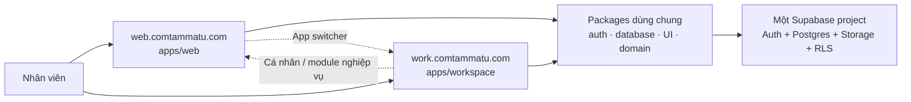

# Thiết kế ứng dụng Workspace cho khối văn phòng

> Trạng thái: Đã duyệt hướng kiến trúc ngày 2026-08-03. Tài liệu này khóa các
> quyết định cần thiết để lập kế hoạch triển khai; chưa ủy quyền tạo Vercel
> project, apply migration hoặc deploy Production.

## 1. Mục tiêu

Xây dựng `work.comtammatu.com` thành nơi quản lý công việc của khối văn phòng
không có module nghiệp vụ cố định. Kế toán, Kho, HR và nhân viên chi nhánh chỉ
tham gia khi được mời vào dự án hoặc được giao một công việc liên phòng ban.

Workspace khác hoàn toàn với `/me/*`:

- `/me/*` tiếp tục phục vụ hồ sơ cá nhân, chấm công, lịch/ca làm, nghỉ phép và
  phiếu lương.
- Workspace phục vụ dự án, công việc, người phụ trách, người phối hợp, thời
  hạn, checklist, bình luận, tệp, thông báo và lịch sử thay đổi.
- Module Finance, Inventory, HR và Branch tiếp tục là nơi xử lý dữ liệu nghiệp
  vụ. Workspace chỉ liên kết đến bản ghi nghiệp vụ; không sao chép số tiền,
  bảng lương, tồn kho hoặc dữ liệu HR nhạy cảm vào task.

## 2. Quyết định sản phẩm

### 2.1. Người dùng

- Thành viên thường trực là nhân viên văn phòng tổng hợp được gán vào đúng một
  phòng ban làm việc trong Workspace.
- Owner là quản trị viên giám sát và có thể cấu hình phòng ban/thành viên.
- Người thuộc Kế toán, Kho, HR hoặc Chi nhánh không trở thành thành viên phòng
  ban mặc định. Họ chỉ đọc được dự án hoặc task được mời rõ ràng.
- Chỉ tài khoản nhân viên đang hoạt động trong hệ thống chính mới có thể được
  thêm. Workspace không tạo `auth.users`, `profiles`, `employees` hoặc
  `positions` mới.

### 2.2. Phạm vi MVP

MVP gồm:

- Phòng ban và thành viên phòng ban.
- Dự án và thành viên dự án.
- Task với trạng thái, ưu tiên, người phụ trách, người phối hợp, deadline.
- Board, danh sách và “Việc của tôi”.
- Checklist, bình luận, tệp đính kèm.
- Thông báo trong ứng dụng và lịch sử thay đổi.
- App switcher giữa `web.comtammatu.com` và `work.comtammatu.com`.

MVP không gồm:

- Docs/wiki, import Markdown, AI, `Improve`, cron tự cải tiến hoặc báo cáo năng
  suất cá nhân.
- Nhiều tenant hoặc nhiều Workspace trong một tenant.
- Gantt, time tracking, chấm công, payroll hoặc nghiệp vụ của module khác.
- Realtime cho board/task. Sau mutation, Server Action revalidate dữ liệu;
  Realtime chỉ tiếp tục được dùng cho lớp chú ý của notification nếu contract
  hiện tại cho phép.
- Di chuyển dữ liệu từ database của `matu-workspace`. Codebase đó là nguồn tham
  khảo, không phải nguồn dữ liệu Production.

## 3. Kiến trúc runtime



- `apps/workspace` là một Next.js app và một Vercel project riêng.
- Monorepo, lockfile, package graph, database types và migration chain vẫn do
  repository `comtammatu` sở hữu.
- Cả hai web app dùng `@comtammatu/database`, `@comtammatu/shared` và
  `@comtammatu/ui`; không tạo UI package, Supabase client hoặc auth catalog thứ
  hai.
- `apps/workspace` chỉ phụ thuộc package; không import file riêng tư từ
  `apps/web`.
- Vercel project của Workspace phải được thêm vào Environment Registry và guard
  trước khi nhận biến Production. Cả hai Vercel project phải trỏ đúng Supabase
  Production ref `enloyfnuerqgaqderbwb`.

## 4. Danh tính và phiên đăng nhập

- Cùng một Supabase Auth project và cùng một `auth.users` record được dùng ở cả
  hai ứng dụng.
- Workspace đọc tên, avatar, chức danh và trạng thái hoạt động từ
  `profiles`/`employees`/`positions` hiện có.
- Mỗi hostname giữ cookie phiên HttpOnly của riêng nó. Không đặt cookie auth ở
  domain `.comtammatu.com`; cách đó làm tăng blast radius nếu một subdomain bị
  xâm nhập.
- Lần đầu mở Workspace, người dùng có thể cần đăng nhập lại bằng cùng tài khoản.
  Không truyền access token hoặc refresh token trong query string, fragment hay
  app-switcher URL.
- Workspace login trả người dùng về URL nội bộ an toàn đã yêu cầu. Đăng xuất
  trong Workspace dùng local scope; việc vô hiệu hóa tài khoản ở hệ thống chính
  vẫn làm Auth liveness fail và chặn cả hai app.
- Redirect URL của Supabase Auth cho phép origin Production
  `https://work.comtammatu.com` và origin Preview đã đăng ký; không dùng wildcard
  vượt quá các Vercel origin được kiểm soát.

## 5. Mô hình quyền

Quyền đọc mặc định theo phòng ban, không theo application role:

1. Thành viên phòng ban đọc mọi dự án/task thuộc phòng ban đó.
2. Thành viên dự án liên phòng ban đọc toàn bộ dự án và task của dự án.
3. Người tham gia một task đọc đúng task đó cùng checklist, comment, attachment
   và activity con.
4. Owner có quyền giám sát toàn tenant và quản lý phòng ban/thành viên.
5. Người không thỏa một trong bốn điều kiện trên không mở được Workspace.

Membership là authority rõ ràng. Không tự cấp hoặc thu hồi quyền bằng cách suy
ngược “nhân viên này hiện không có module”, vì permission/module có thể thay đổi
trong khi trách nhiệm công việc vẫn còn.

`module-acl.ts` được mở rộng với candidate key `workspace` cho mọi application
role hợp lệ. Candidate gate chỉ xác nhận loại tài khoản có thể thử mở app; RPC
`can_access_workspace()` và RLS mới là authority cuối cùng.

Permission tenant mới `work:manage` chỉ dành cho Owner trong MVP. Department
lead và project lead nhận quyền từ membership trong bảng Workspace, không nhận
quyền tenant-wide.

### 5.1. Ma trận hành động

| Hành động                    | Owner | Trưởng phòng | Thành viên phòng        | Project lead        | Cộng tác viên dự án     | Người tham gia task |
| ---------------------------- | ----- | ------------ | ----------------------- | ------------------- | ----------------------- | ------------------- |
| Quản lý phòng ban/thành viên | Có    | Không        | Không                   | Không               | Không                   | Không               |
| Tạo/sửa dự án của phòng      | Có    | Có           | Không                   | Sửa dự án được giao | Không                   | Không               |
| Thêm thành viên dự án        | Có    | Có           | Không                   | Có                  | Không                   | Không               |
| Tạo task trong dự án         | Có    | Có           | Có                      | Có                  | Có                      | Không               |
| Sửa nội dung/giao người      | Có    | Có           | Nếu là creator/assignee | Có                  | Nếu là creator/assignee | Nếu là assignee     |
| Đổi trạng thái               | Có    | Có           | Nếu tham gia task       | Có                  | Nếu tham gia task       | Có                  |
| Bình luận/checklist          | Có    | Có           | Nếu đọc được task       | Có                  | Nếu đọc được task       | Có                  |
| Hủy/khôi phục task           | Có    | Có           | Không                   | Có                  | Không                   | Không               |

MVP không hard-delete project, task, comment hoặc attachment metadata qua UI.
Project/task kết thúc bằng trạng thái; attachment có thể bị gỡ khỏi task nhưng
activity/audit vẫn ghi lại sự kiện.

## 6. Mô hình dữ liệu

Không tạo lại bảng `workspaces` hoặc hồ sơ người dùng. Các bảng mới dùng prefix
`work_` để giữ ranh giới domain rõ ràng:

| Bảng                        | Trách nhiệm chính                                              |
| --------------------------- | -------------------------------------------------------------- |
| `work_departments`          | Phòng ban làm việc trong Workspace; không thay thế HR position |
| `work_department_members`   | Một membership phòng ban đang hoạt động cho mỗi người dùng     |
| `work_projects`             | Dự án thuộc một phòng ban chủ quản                             |
| `work_project_members`      | Thành viên/lead/cộng tác viên liên phòng ban                   |
| `work_tasks`                | Task thuộc phòng ban và tùy chọn thuộc dự án                   |
| `work_task_participants`    | Người phụ trách, phối hợp và theo dõi task                     |
| `work_task_checklist_items` | Checklist có thứ tự và trạng thái hoàn tất                     |
| `work_task_comments`        | Bình luận văn bản, không chứa HTML tùy ý                       |
| `work_task_attachments`     | Metadata của object trong private Storage bucket               |
| `work_task_events`          | Activity user-facing, append-only                              |

Mọi bảng business có `tenant_id`; các foreign key quan trọng dùng cặp
`(id, tenant_id)` để chặn liên kết chéo tenant. User foreign key dùng
`(user_id, tenant_id) -> profiles(id, tenant_id)`.

`work_tasks` có:

- `status`: `backlog | todo | in_progress | review | done | canceled`.
- `priority`: `low | normal | high | urgent`.
- `assignee_id`, `due_at`, `started_at`, `completed_at`.
- `revision` tăng sau mỗi mutation để phát hiện ghi đè đồng thời.
- `created_by`, `created_at`, `updated_at`.

Board MVP chỉ kéo task giữa các trạng thái. Trong một cột, task sắp theo ưu
tiên, deadline rồi `updated_at`; chưa hỗ trợ kéo để sắp thứ tự thủ công.

## 7. RLS và mutation boundary

- Mọi bảng bật RLS và có grant tối thiểu cho `authenticated`; `anon` không có
  quyền.
- Helper `can_access_workspace()`, `can_read_work_department()`,
  `can_read_work_project()` và `can_read_work_task()` fail closed, đặt
  `search_path` an toàn và không tin tenant/user từ client.
- Chính sách bảng con luôn suy quyền từ parent task/project; không lặp logic
  membership khác nhau ở comment, checklist, attachment và activity.
- Mutation nhiều bảng đi qua atomic Postgres RPC. Ví dụ giao task đồng thời cập
  nhật participant, activity, audit và notification trong một transaction.
- Server Action validate Zod, gọi RPC bằng caller-scoped client và map mã lỗi
  sang copy tiếng Việt. Không trả raw Postgres/Supabase message.
- Update task gửi `expected_revision`; mismatch trả lỗi conflict có thể phục hồi
  thay vì ghi đè thay đổi của đồng nghiệp.

## 8. Route và UI

| Route                      | Công việc người dùng                    | Archetype                 |
| -------------------------- | --------------------------------------- | ------------------------- |
| `/`                        | Board của phòng ban/dự án đang chọn     | `BOARD` quản lý công việc |
| `/my-work`                 | Task được giao hoặc đang phối hợp       | `LIST`                    |
| `/projects`                | Danh sách dự án được phép đọc           | `LIST`                    |
| `/projects/[projectId]`    | Tổng quan và task của một dự án         | `DETAIL`                  |
| `/tasks/[taskId]`          | Địa chỉ canonical của task              | `DETAIL`                  |
| `/team`                    | Phòng ban, thành viên và quyền làm việc | `LIST`/settings           |
| `/notifications`           | Thông báo Workspace                     | `LIST` feed               |
| `/login`, `/access-denied` | Auth và trạng thái bị chặn              | `GATE/AUTH`               |

Filter board/list nằm trên URL: `department`, `project`, `status`, `assignee`,
`q` và `view`. Không dùng `localStorage` hoặc React Context làm scope.

Workspace dùng Má Tư Design System và `@comtammatu/ui`. UI từ donor chỉ được
chuyển sau khi thay primitive, token và accessibility contract tương ứng; không
mang app-local Shadcn tree hoặc theme của `matu-workspace` sang.

Desktop là viewport làm việc chính của khối văn phòng. Mobile vẫn hỗ trợ xem
“Việc của tôi”, mở task, đổi trạng thái, checklist, comment và attachment; board
nhiều cột chuyển thành list/tab trạng thái thay vì ép ngang quá rộng.

## 9. Luồng dữ liệu chính

### 9.1. Mở ứng dụng

```text
Request -> Workspace proxy -> session/claims candidate gate
        -> can_access_workspace()
        -> load memberships + permitted departments/projects
        -> render server component
```

### 9.2. Tạo hoặc cập nhật task

```text
Form -> Zod Server Action -> caller-scoped RPC
     -> authorize from membership
     -> mutate task/participants
     -> append work_task_events + audit_logs
     -> create exact-recipient notification when another user is affected
     -> commit -> revalidate affected routes -> toast result
```

### 9.3. Lỗi và phục hồi

- Validation field-level hiển thị cạnh field; action failure dùng toast/callout.
- Permission mất giữa lúc mở và submit trả trạng thái “Bạn không còn quyền thực
  hiện thao tác này”, refresh dữ liệu và không mutate.
- Revision conflict hiển thị “Công việc vừa được người khác cập nhật”, cho phép
  tải bản mới trước khi sửa lại.
- Storage upload thất bại không tạo attachment metadata. Finalize thất bại cố
  gắng xóa object vừa upload và trả retry an toàn.
- Màn hình có loading, empty, error, permission-denied và retry state rõ ràng.

## 10. Notification và attachment

Notification hiện tại được mở rộng bằng `target_user_ids uuid[]`:

- Legacy role/branch targeting tiếp tục hoạt động không đổi.
- Notification Workspace dùng exact recipients; người cùng application role
  nhưng không tham gia task không nhìn thấy.
- Constraint yêu cầu ít nhất một target mode: `target_roles` hoặc
  `target_user_ids`.
- RLS cho exact-user mode kiểm tra `auth.uid() = ANY(target_user_ids)`.
- Kind MVP: `work.task_assigned`, `work.task_participant_added`,
  `work.task_commented`, `work.task_status_changed`.
- Link notification dùng allowlist origin `https://work.comtammatu.com`; không
  chấp nhận external URL tùy ý.

Attachment dùng private bucket `work-attachments`:

- Path: `{tenant_id}/{task_id}/{object_uuid}/{safe_filename}`.
- Tối đa 10 MiB.
- MIME allowlist: PDF, DOCX, XLSX, PNG, JPEG và WebP.
- Download bằng signed URL ngắn hạn sau khi RLS xác nhận quyền task.
- Metadata lưu tên gốc, storage path, MIME, byte size, uploader và thời gian.

## 11. Donor codebase

Baseline donor được review là commit `2e27b852a03387694f1daa31fab9d7e91c65e16a`
từ `github.com/comtammatu/matu-workspace`. Không copy từ dirty worktree hoặc
branch chưa merge.

Ưu tiên tham khảo/chuyển chọn lọc:

- Board/list/calendar filtering helpers và task card composition.
- Task detail, checklist, comment, watcher/participant interaction.
- Keyboard shortcuts phù hợp với route mới.
- Empty/loading/error patterns đã kiểm chứng.

Loại bỏ:

- `workspaces`, `workspace_members`, `profiles`, auth provisioning và role
  `owner/admin/member` của donor.
- Database migrations, generated types và Supabase project của donor.
- Docs/wiki, imported sources, Improve, AI/cron, nhiều workspace và theme/UI
  primitive riêng.

## 12. Kiểm chứng và phát hành

Mỗi lát cắt cần unit/static tests, pgTAP RLS tests và targeted runtime tests.
Trước khi gọi implementation hoàn tất phải chạy:

```bash
corepack pnpm typecheck
corepack pnpm lint
corepack pnpm build
corepack pnpm test
```

Database triển khai trước runtime phụ thuộc schema. Migration được rehearsal
trên verified Preview Branch; Production chỉ apply sau khi owner ủy quyền đúng
batch. Sau apply chạy `corepack pnpm db:types` rồi mới merge runtime code dùng
generated types.

Rollout theo ba vòng:

1. Owner và một trưởng phòng kiểm tra quyền, route, task mutation và attachment.
2. Một phòng ban văn phòng dùng pilot trong 7 ngày.
3. Mở các phòng còn lại và chỉ sau đó mời cộng tác viên Kế toán/Kho/HR/Chi
   nhánh vào task thật.

Rollback runtime bằng cách gỡ domain/đưa deployment về bản trước và thu hồi
membership. Schema MVP là additive nên giữ nguyên khi rollback; không drop bảng
hoặc sửa migration đã apply.
