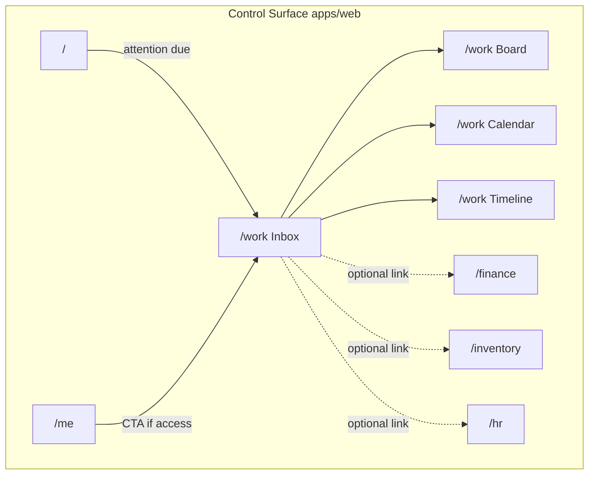

# Work module integration — Control Surface (comprehensive)

> **Status:** Accepted · 2026-08-11 (Owner implement Accept; pilot dept **`Văn phòng`**)  

> **Supersedes (host/runtime):** separate-app design on `codex/workspace-foundation` / PR #348  
> **Keeps (domain ideas):** `work_*` tables, membership authority, inbox-first landing, no dual money/stock/HR data in tasks  
> **Related locks:** Control `/` is not Work shell; `/` may show one attention row deep-linking `/work`; no second Vercel app / `work.comtammatu.com`

## 1. Goal

Ship **`Công việc`** (`/work`) as a first-class Control Surface module for office
collaboration (departments, projects, assigned work), with progressive views:

| View | Product job | Default audience |
| --- | --- | --- |
| Inbox (list) | `Việc được giao` / `theo dõi` — name, status, people, due | Every Work member |
| Kanban | Move tasks across status in **one** department or **one** project | Lead / member of that scope |
| Calendar | See due dates across allowed tasks | Members with due-dated work |
| Timeline | Sequence / dependency span for a project (later) | Project lead |

This document is the integration plan for adding Work **and** the reusable
checklist for any future Control Surface module.

## 2. Locked product / architecture decisions

1. **Same Surface only** — routes live under `apps/web` Control Surface chrome.
   No `apps/workspace`, no `work.*` host, no second Production Vercel project, no
   Work-specific auth cookie domain.
2. **Landing** — `/work` opens **Inbox** (`view=mine`), not a multi-department
   Kanban wall.
3. **Control home `/`** — stays module attention hub; adds **one** Work attention
   row (due today + overdue) → `/work` when `can_access_workspace()` passes.
4. **`/me`** — stays personal day (clock + `Việc trong ca`). When Work access
   exists, add a CTA/list entry to `/work`. Do not merge `work_tasks` into
   `position_shift_tasks`.
5. **Login destinations unchanged** — Owner / accountant / central → `/`;
   pure `self_service` → `/me`.
6. **Authority** — candidate ACL admits the route family; live read/write is
   membership + RLS + RPC (`can_access_workspace()` and helpers). Fail closed.
7. **No business dual-write** — tasks may **link** to Finance / Inventory / HR
   records; they must not copy amounts, stock qty, or payroll fields.

## 3. Reusable checklist — integrating a new Control Surface module

Use this table for Work and for later modules. Each row has a single owner file
family; do not invent a parallel map.

| # | Seam | Must update | Proof |
| --- | --- | --- | --- |
| M1 | Module ACL | `packages/shared/src/auth/module-acl.ts` (+ matrix test) | Role x module lock test green |
| M2 | Path → module | `route-resolution.ts` / `resolveModuleFromPath` | Static + matrix |
| M3 | Nav | `nav-config.ts` + label VI glossary/messages | Visible only when candidate allows; deep-nav contract |
| M4 | Login / landing | Only if module changes default home — **Work: no** | `login-destination` tests unchanged |
| M5 | Screen context | `docs/ref/screen-context-map.md` section | Actor / job / device / NOT list |
| M6 | Archetype | `docs/spec/page-archetypes.md` + `scripts/page-archetypes.mjs` if new compose | CI compose gate |
| M7 | UI contract | `scripts/check-ui-contract.mjs` / registry as needed | `lint:ui-contract` |
| M8 | Role x route matrix | `scripts/gen-role-route-matrix.mjs` + committed matrix | `lint:route-matrix` |
| M9 | Permissions | SQL permission keys + `permissions.ts` + seed lint | `lint:seed-permissions` |
| M10 | Schema / RLS / RPC | Additive migrations; composite tenant FKs; atomic multi-row RPC | pgTAP + advisors |
| M11 | Types | `pnpm db:types` after Production-source apply | `lint:typegen` |
| M12 | Messages | `apps/web/lib/messages/*` VI only; glossary / synonym lint | `lint:copy` |
| M13 | Control home | Optional attention bucket in `control-home-attention.ts` | Soft-fail; hide count 0 |
| M14 | Notifications | Kind + `action_url` same-origin paths; toast contract | Spec + tests |
| M15 | Proxy / gates | No new host registry; existing session gates | Guard sync unchanged for dual Vercel |
| M16 | E2E / static | Membership +/− access; revision conflict; mobile list | Targeted suite |

**Work-specific ACL shape:** `ModuleKey` `work`, `path: "/work"`, no `app`
field (web default). Do not reuse foundation’s `app: "workspace"` + path `/`.

## 4. Route map and views

URL scope only (no `localStorage` / Context as source of truth).

| Route | View | Archetype strategy |
| --- | --- | --- |
| `/work` | Inbox — mine / following | **LIST** (queue/card variant allowed; not KDS BOARD) |
| `/work?view=board&department=` or `&project=` | Kanban one scope | **New compose:** Control Surface task board (see §5) — not station_chrome KDS BOARD |
| `/work?view=calendar&…` | Month/week by `due_at` | **New compose:** Control Surface calendar (see §5) |
| `/work?view=timeline&project=` | Project bars by date | **Later compose** — after Calendar ships |
| `/work/projects` | Project list | LIST |
| `/work/projects/[id]` | Project detail + default child view | DETAIL + nested view switcher |
| `/work/tasks/[id]` | Canonical task | DETAIL |
| `/work/team` | Departments / members (Owner / `work:manage`) | LIST / settings-panel fold |

**View switcher** on project (and department when board-capable): Inbox · Board ·
Calendar · Timeline (Timeline disabled until W4). Persisted only via URL
`view=`.

### Filters (URL)

`view`, `department`, `project`, `status`, `assignee`, `q`, `from`, `to`
(calendar/timeline). Reject unknown enums; cap `q` length; never take
`tenant_id` from the client.

## 5. Archetype gap (must Accept before Kanban/Calendar UI)

Today’s **BOARD** archetype = Branch **station_chrome** realtime queue (KDS
exemplar). That is the wrong chrome for office task Kanban.

Before W2 UI:

1. Add Control Surface compose recipes (ADR 0033):
   - `TASK_BOARD` — columns by `work_tasks.status`; drag updates status via RPC
     with `expected_revision`; desktop primary; mobile = status tabs + list
   - `TASK_CALENDAR` — month/week cells from `due_at`; click → task DETAIL
   - `TASK_TIMELINE` — single-project Gantt-like rows; read-heavy MVP
2. Register in `page-archetypes.md` + `page-archetypes.mjs`.
3. Reuse Má Tư tokens only; no second design system; no donor Shadcn theme.

DnD: pick one approach in W2 kickoff (HTML5 vs small dependency already allowed
by lockfile policy). No new component library.

## 6. Domain model (additive)

Prefix `work_` (unchanged intent from foundation):

| Table | Role |
| --- | --- |
| `work_departments` | Collaboration org unit (≠ HR position) |
| `work_department_members` | One active membership per user |
| `work_projects` | Owned by a department |
| `work_project_members` | Cross-department collaborators / leads |
| `work_tasks` | Status, priority, assignee, due, revision, optional project |
| `work_task_participants` | Assignee / collaborator / follower |
| `work_task_checklist_items` | Ordered checklist |
| `work_task_comments` | Plain text |
| `work_task_attachments` | Private Storage metadata |
| `work_task_events` | Append-only activity |

**Status (Kanban columns):** `backlog | todo | in_progress | review | done | canceled`  
**Priority:** `low | normal | high | urgent`

Optional later (not MVP): `work_task_links` to `(module, record_id)` for
Finance/Inventory/HR deep links without copying payload.

RPCs: create/update/assign/status-change/comment/attach in atomic transactions;
`expected_revision` on updates; map SQLSTATE → VI copy.

Notifications: exact-user kinds (`work.task_assigned`, …) with
`action_url` `/work/tasks/[id]`. Patch `canonicalize_notification` if required
(known gap from foundation review).

## 7. Control Surface integrations

| Surface | Integration |
| --- | --- |
| `/` | One attention item `work:mine-due` via `loadControlHomeAttention` |
| `/me` | CTA “Việc được giao” when access; never replace `Việc trong ca` |
| Nav | Sidebar / deep-nav **`Công việc`** → `/work` |
| Notifications | Same-origin paths; existing Realtime attention bus |
| Search (future) | Out of scope until Inbox+Board stable |

## 8. Release waves

| Wave | Outcome | Gate |
| --- | --- | --- |
| **W0 — Docs / ADR** | Same-surface Accept; screen-map `/work`; archetype TASK_BOARD/CALENDAR stubs named; supersede separate-app plan | Owner Accept |
| **W1 — Schema + Inbox read** | `work_*` + RLS/RPC read helpers + types; `/work` Inbox + `/work/tasks/[id]` read; membership seed for pilot dept | pgTAP isolation; ACL− denied; `db:types` |
| **W2 — Mutations + attention** | Create/update/status/assign/checklist/comment; Control `/` attention; `/me` CTA; notifications | Atomic RPC + revision conflict tests; attention soft-fail |
| **W3 — Kanban** | `view=board` one department **or** one project; mobile tabs; drag → status RPC | No cross-dept wall; mobile usable without horizontal trap |
| **W4 — Calendar** | `view=calendar` on allowed task set; due-date edit from detail (not drag-MVP required) | Timezone Vietnam day boundaries documented |
| **W5 — Timeline + pilot** | `view=timeline` single project; 7-day pilot one office department; runbook | Pilot: no RLS leak; rollback = hide nav + disable RPCs grants if needed |

Schema ships before any view that needs generated types. **Do not** combine
unapplied migration with dependent UI in one Production deploy.

Suggested pilot: one office department membership set; Owner has `work:manage`.

## 9. Non-goals (explicit)

- Separate Work deployable / second Supabase project
- Default landing = full org Kanban
- Realtime multiplayer cursors on board (revalidate after mutation is enough for MVP)
- Docs/wiki, AI, personal productivity scoring
- Gantt resource leveling, time tracking, billing from tasks
- Merging Work into `/me` as the only surface for module roles
- Changing Branch KDS BOARD archetype to host office Kanban

## 10. Risks and mitigations

| Risk | Mitigation |
| --- | --- |
| Stretching KDS BOARD for office Kanban | New TASK_* compose recipes before W3 |
| Candidate ACL too wide (`STAFF_ROLES`) | Always gate UI data with `can_access_workspace()` / RLS |
| Notification exact-user rejected by canonicalize trigger | Fix in W1/W2 with foundation review gap |
| Calendar/Timeline scope creep | Wave-lock; Timeline after Calendar Accept |
| PR #348 drift (separate app + 50+ commits behind) | Rewrite design docs on fresh branch from `main`; cherry-pick only terminology/origin utilities if still useful |
| Office UX confusion with `Việc trong ca` | Distinct copy: **`Việc được giao`** vs **`Việc trong ca`**; screen-map NOT list |

## 11. Accept asks (Owner)

1. Accept **same-surface** `/work` (this doc §2) — reject separate app.
2. Accept wave order W0→W5 (Inbox before Kanban before Calendar before Timeline).
3. Accept Control `/` attention = single due/overdue count only.
4. Name pilot department when unlocking W1 apply.

After Accept: open implementation outcomes in `tasks/todo.md` per wave; do not
keep a parallel task board outside that file.
