# Branch Operations Chrome Rebuild & Screen Layout Blueprint

Comprehensive architecture, screen layout specifications, touch target standards, and component hierarchy for standardizing the Branch Runtime Plane (`/br/[branchId]/*`) across all 56 operator screens in strict alignment with the **Má Tư Design System** (`packages/ui/src/components/*`), ADR 0025, and ADR 0038.

---

## 1. Architectural Foundations & Design Principles

### A. Personal Plane vs. Branch Runtime Plane

- **Personal Self-Service Plane (`/me/*`):** Central and office-based self-service (desktop-first or standalone personal mobile portal).
- **Branch Runtime Plane (`/br/[branchId]/*`):** Fast-paced, store-level operations running on mobile phones, iPad/Android store tablets, and POS terminals. Staff are on active store shifts.
- **Embedded Self-Service (`/br/[branchId]/shift/*`, `/br/[branchId]/profile/*`):** Personal staff workflows accessed while operating inside a store shift must be wrapped in the branch operator chrome with a single-tap `AppBackLink` returning directly to store operations.

### B. Viewport & Maximum Width Scale

- **Scale Standard:** Normalized branch runtime content width across `AppHeader`, `AppPage`, and `OperatorBottomNav`:
  - **Mobile (390px – 767px):** `max-w-lg` (fills viewport with standard horizontal padding).
  - **Tablet Portrait (768px – 1023px):** `md:max-w-2xl` (avoids excessive card stretching while preserving thumb-friendly ergonomics).
  - **Tablet Landscape & POS Terminals (≥ 1024px):** `lg:max-w-4xl` (capped canvas preventing widescreen horizontal sprawl).
- **Single-Scrollport Guarantee:**
  - Outer container: `chrome-safe-pt flex h-dvh w-full flex-col overflow-hidden bg-muted/30`.
  - Exactly one vertical scrollport at `#main-content` (`overflow-y-auto overscroll-contain`).
  - `AppHeader` and `OperatorBottomNav` remain static and in-flow (`position="static"`), never fixed overlays that obscure active inputs or action footers.

### C. Compact Inline Mobile Header (<= 84px Budget)

- **Problem Statement:** Stacked headers containing breadcrumbs, back buttons, large H1 text, and multi-line descriptions previously consumed ~20% of vertical screen real estate on mobile devices.
- **Solution Contract:**
  - **Single-Line Inline Layout:** On mobile viewports (`max-sm:`), the back affordance (`AppBackLink`), page title (`Heading`), and status badge are rendered on a single horizontal row (`flex items-center gap-2 py-1`).
  - **Secondary Copy Suppression:** Subtitles, eyebrows, and descriptive helper text are hidden on small screens (`max-sm:hidden`) and reserved for tablet/desktop viewports.
  - **Height Cap:** Total top chrome height is capped at <= 84px, leaving over 85% of viewport height for critical operational tables, touch counting grids, and queue cards.

### D. Touch Target Standard: 48px (`min-h-12`)

To guarantee zero mis-taps in oily, high-speed kitchen and store environments, touch targets are strictly standardized:

| Dimension Standard                        | Evaluation & Verdict                                                                                                        | Usage Policy in Branch Operations                                                                                                           |
| ----------------------------------------- | --------------------------------------------------------------------------------------------------------------------------- | ------------------------------------------------------------------------------------------------------------------------------------------- |
| **40px (`size="sm"`)**                    | **REJECTED for primary operations.** Too small for rapid kitchen/register touch; high error rate.                           | Permitted only for secondary table-dense desktop indicators or compact badges.                                                              |
| **44px (`size="default"`)**               | **ACCEPTABLE but suboptimal.** Meets minimum Apple HIG touch criteria, but lacks margin for greasy fingers or moving hands. | Used for standard desktop buttons outside active touch workflows.                                                                           |
| **48px (`size="touch"` / `min-h-12`)**    | **MANDATORY SSOT STANDARD.** Meets Android Material and WCAG AAA touch target requirements.                                 | **Strictly required** for all branch operator primary buttons, sub-tab triggers, select triggers, quantity steppers, and list action items. |
| **56px (`size="touch-lg"` / `min-h-14`)** | **HERO STANDARD.** Large single-action keypads and primary submission footers.                                              | Used for Order Confirmation, Clock-In Punch CTA, and Final Checkout submissions.                                                            |

### E. Visual Ergonomics & 5-Zone Layout Model

Every operational screen adheres to the 5-Zone layout blueprint to maximize thumb ergonomics and prevent vertical fragmentation:

```text
┌────────────────────────────────────────────────────────┐
│ [LOGO] Branch 1                             […][👤][🔔] │ ← ZONE 1: Shell Header (48px - Global navigation only)
├────────────────────────────────────────────────────────┤
│ [←] Checkout Approvals        [3 pending]     [+ New]  │ ← ZONE 2: Inline Title (Back icon 48px tap + Title)
├────────────────────────────────────────────────────────┤
│ ┌────────────────────────────────────────────────────┐ │
│ │ 👤 Nguyen Van A • Morning Shift       [DIFF -50K]  │ │ ← ZONE 3: Touch Card List (56px - 80px / row)
│ │ 🕒 14:05 • Cash in Drawer: 3,450,000 d             │ │   (Tap whole card to open review sheet)
│ └────────────────────────────────────────────────────┘ │
│ ┌────────────────────────────────────────────────────┐ │
│ │ 👤 Tran Thi B • Evening Shift         [BALANCED]   │ │
│ │ 🕒 22:00 • Cash in Drawer: 5,120,000 d             │ │
│ └────────────────────────────────────────────────────┘ │
├────────────────────────────────────────────────────────┤
│ [ ← CANCEL / BACK ]    [ 💾 APPROVE CHECKOUT (Hero) ]  │ ← ZONE 4: THUMB ZONE (Sticky Footer 56px at bottom)
│ (variant="outline", 48px)    (variant="default", 56px) │   (Instant thumb reachability)
├────────────────────────────────────────────────────────┤
│ [ 🏠 Home ] [ ⏱️ Shift ] [ 👥 Team ] [ 📦 Stock ] [ ⚙️ ] │ ← ZONE 5: Bottom Nav (Static in-flow)
└────────────────────────────────────────────────────────┘
```

---

## 2. Sub-Tab & Content-Tab Standardization (Pattern A & Pattern B)

All sub-navigation tabs across all 56 operator screens are strictly consolidated into two standardized patterns built upon `@comtammatu/ui/components/tabs`:

### Pattern A: Equal-Width Tabs (`layout="equal"`, 48px Touch)

Designed for binary or ternary workspace modes, approval queues (Pending vs. History), or distinct view switches.

```text
┌────────────────────────────────────────────────────────┐
│ ┌──────────────────────────┬─────────────────────────┐ │
│ │ ⚡ Pending [ 3 ]         │ 🕒 Today History [ 12 ] │ │ ← TabsList size="touch"
│ └──────────────────────────┴─────────────────────────┘ │   grid grid-cols-2 (48px min-h-12)
└────────────────────────────────────────────────────────┘
```

- **Technical Structure:**
  ```tsx
  <Tabs value={view} onValueChange={(next) => next && setView(next)}>
    <TabsList size="touch" layout="equal">
      <TabsTrigger value="pending">
        <IconZap data-icon="inline-start" />
        Pending (3)
      </TabsTrigger>
      <TabsTrigger value="history">
        <IconHistory data-icon="inline-start" />
        History
      </TabsTrigger>
    </TabsList>
  </Tabs>
  ```
- **Standardized Implementations:**
  - `/orders`: `[ Active Orders ] [ Order History ]`
  - `/team/leave-approvals`: `[ Pending (3) ] [ Approval History ]`
  - `/team/attendance`: `[ Today Attendance ] [ Weekly Summary ]`
  - `/team/checkout-approvals`: `[ Pending Approvals (2) ] [ Checked Out ]`
  - `/stock/count-slips`: `[ Active Slips ] [ Count History ]`
  - `/stock/consumption`: `[ Recorded Items ] [ Consumption Slips ]`
  - `/stock/waste-approvals`: `[ Pending Approvals (1) ] [ Waste History ]`
  - `/feedback`: `[ Feedback Inbox ] [ Table QR Codes ]`

### Pattern B: Scrollable Tabs (`layout="scroll"`, 48px Touch)

Designed for multi-state status filters, ingredient categories, or floor selectors where items exceed 3 options.

```text
┌────────────────────────────────────────────────────────────────────────┐
│ [ All (86) ] [ ⚠️ Low Stock (4) ] [ 🥩 Meat ] [ 🥬 Veggies ] [ 📦 Packs ] │ ← no-scrollbar flex
└────────────────────────────────────────────────────────────────────────┘   overflow-x-auto (48px)
```

- **Technical Structure:**
  ```tsx
  <Tabs value={filter} onValueChange={(next) => next && setFilter(next)}>
    <TabsList size="touch" layout="scroll">
      <TabsTrigger value="all" className="shrink-0">
        All (86)
      </TabsTrigger>
      <TabsTrigger value="low_stock" className="shrink-0 text-destructive">
        ⚠️ Low Stock (4)
      </TabsTrigger>
      {categories.map((cat) => (
        <TabsTrigger key={cat.id} value={cat.id} className="shrink-0">
          {cat.name}
        </TabsTrigger>
      ))}
    </TabsList>
  </Tabs>
  ```
- **Standardized Implementations:**
  - `/stock/on-hand`: Category filtering + Low-stock trigger (`?category=...`).
  - `/stock/purchase-requests`: Multi-stage requisition tracking (`[ All ] [ Requested ] [ Ordered ] [ Received ]`).
  - `/stock/grn`: Goods receipt stages (`[ All ] [ QC Inspection ] [ Price Verification ] [ Finalized ]`).
  - `/settings/tables`: Multi-floor dining zones (`[ Floor 1 ] [ Floor 2 ] [ Garden ]`).

---

## 3. Systematic Breakdown of the 5 Functional Domains (56 Screens)

```mermaid
graph TD
  Root["/br/[branchId] (Branch Runtime)"] --> D1["1. Home & Sales Orders"]
  Root --> D2["2. Team & Personnel Management"]
  Root --> D3["3. Shift & Personal Self-Service"]
  Root --> D4["4. Stock, Logistics & Catalog"]
  Root --> D5["5. Settings, Hardware & Close-Day"]

  D1 --> D1_1["/orders (Pattern A Tabs)"]
  D1 --> D1_2["/orders/[id] (Detail + Footer)"]
  D1 --> D1_3["/menu-limits (Fast Limit Toggles)"]

  D2 --> D2_1["/team (Today Shifts & Roster)"]
  D2 --> D2_2["/team/members (Directory & Skills)"]
  D2 --> D2_3["/team/leave-approvals (Pattern A Tabs)"]
  D2 --> D2_4["/team/attendance (Pattern A Tabs)"]
  D2 --> D2_5["/team/checkout-approvals (Variance Alerts)"]

  D3 --> D3_1["/shift (Personal Shift Tasks)"]
  D3 --> D3_2["/shift/clock (Biometric/Photo Punch)"]
  D3 --> D3_3["/shift/schedule (7-Day Calendar)"]
  D3 --> D3_4["/shift/schedule/leave (Request Form)"]
  D3 --> D3_5["/profile & /profile/payslip"]

  D4 --> D4_1["/stock (Shortage Summary Hub)"]
  D4 --> D4_2["/stock/on-hand (Pattern B Tabs)"]
  D4 --> D4_3["/stock/count & /stock/count-slips"]
  D4 --> D4_4["/stock/waste & /stock/waste-approvals"]
  D4 --> D4_5["/stock/grn & /stock/grn/[id]"]
  D4 --> D4_6["/stock/transfer & /stock/receive/[id]"]
  D4 --> D4_7["/stock/issues & /stock/issues/[id]"]
  D4 --> D4_8["/stock/catalog/* (Master Tables)"]

  D5 --> D5_1["/settings (Hardware & POS Config)"]
  D5 --> D5_2["/settings/tables (Pattern B Floor Tabs)"]
  D5 --> D5_3["/feedback & /feedback/qr"]
  D5 --> D5_4["/close-day & /pos-sessions (Till Reconciliation)"]
```



---

### Domain 1: Home & Sales Orders

- **`/br/[branchId]` (Operational Landing):**
  - KPI Dashboard tiles with active shift metrics, live order count, revenue estimate, and inventory alerts.
  - Action Door Grid (`BranchStockDoors` / station tiles) with 48px touch targets.
- **`/br/[branchId]/orders` (Order Management):**
  - **Pattern A Tabs:** `[ Active Orders ] [ Order History ]`.
  - Item Card Structure: Order code, dining table/takeaway tag, elapsed timer badge, item count, total VND.
  - Inline mobile header with `AppBackLink` pointing to `/br/[branchId]`.
- **`/br/[branchId]/orders/[id]` (Order Detail):**
  - Line item status with kitchen notes, dish modifiers, and payment status.
  - Sticky bottom `AppDetailFooter` with primary actions: Print Bill, Settle Payment, Void Line.
- **`/br/[branchId]/menu-limits` (Menu Limit Steppers):**
  - Fast out-of-stock and limit steppers (`+` / `-` 48px buttons) to halt sales when stock runs low.

---

### Domain 2: Team & Personnel Management

- **`/br/[branchId]/team` (Team Hub Overview):**
  - **Pattern A Tabs:** `[ Today Shifts ] [ Member Directory ]`.
  - Real-time headcount on shift vs. scheduled.
- **`/br/[branchId]/team/members` & `[id]` (Employee Profiles & Shift History):**
  - Contact info, role badge, assigned kitchen station, and performance metrics.
- **`/br/[branchId]/team/roster` (Shift Assignment & Weekly Calendar):**
  - Weekly schedule grid mapping morning/evening shifts across stations (Head Chef, Barista, Cashier, Service).
  - Shift swap and manual reassignment dialogs with conflict detection.
- **`/br/[branchId]/team/attendance` (Attendance & Time Tracking):**
  - **Pattern A Tabs:** `[ Today Attendance ] [ Weekly Summary ]`.
  - Real-time punch status: On-time, Late, Absent, Missing check-out.
  - Manual timecard adjustment via `AppSheet`.
- **`/br/[branchId]/team/leave-approvals` (Leave Request Approvals):**
  - **Pattern A Tabs:** `[ Pending (N) ] [ Approval History ]`.
  - Exception-first queue displaying leave reason, remaining balance, and conflict preview with shift roster.
  - Sticky thumb-zone actions (`Approve` / `Reject`) in bottom sheet.
- **`/br/[branchId]/team/checkout-approvals` (Shift Handover & Till Sign-off):**
  - Cash collected verification and shift handover confirmation with cash variance warnings (`warning` badge if delta != 0).

---

### Domain 3: Shift & Personal Self-Service

- **`/br/[branchId]/shift` (Shift Task List):**
  - Opening checklist (Prep ingredients, Stove ignition, Printer check).
  - Active shift timer and personal break triggers.
- **`/br/[branchId]/shift/clock` (Timecard Clock-In / Out):**
  - GPS branch geo-fence validation + selfie camera capture.
  - 56px Hero CTA: "Clock In" / "Clock Out".
  - Inline `AppBackLink` pointing back to `/br/[branchId]/shift`.
- **`/br/[branchId]/shift/schedule` (Personal Work Schedule):**
  - 7-day strip and monthly view with assigned store locations and station duties.
  - Direct CTA to submit leave requests: "Request Leave".
- **`/br/[branchId]/shift/schedule/leave` (Leave Request Form):**
  - Leave type picker (Annual Leave, Sick Leave, Unpaid Leave, Personal).
  - Automatic balance calculator deducting requested days from annual quota.
- **`/br/[branchId]/profile` & `/profile/payslip` (Profile & Payslips):**
  - Personal data, emergency contacts, and monthly downloadable salary statements wrapped in branch operator shell with return back affordance.

---

### Domain 4: Stock, Logistics & Catalog

- **`/br/[branchId]/stock` (Stock Hub & Shortage Alerts):**
  - Action cards: Goods Receipt (GRN), Waste Report, Stocktake, Inter-Branch Transfer.
  - Red alert strip highlighting ingredients below reorder threshold.
- **`/br/[branchId]/stock/on-hand` & `[ingredientId]` (Real-Time On-Hand Inventory):**
  - **Pattern B Tabs:** Category filtering (`All`, `Fresh Meat`, `Vegetables`, `Spices`, `Packaging`).
  - Search bar + quick stock adjustment sheet with 48px number pad.
- **`/br/[branchId]/stock/count` & `/stock/count-slips` (Stock Counting & Slips):**
  - **Pattern A Tabs:** `[ Active Slips ] [ Count History ]`.
  - Rapid touch keypad for counting shelf units vs. bulk pack units.
- **`/br/[branchId]/stock/waste` & `/stock/waste-approvals` (Waste Recording & Approvals):**
  - **Pattern A Tabs:** `[ Pending Approvals ] [ Waste History ]`.
  - Reason taxonomy: Spoilage, Expired, Burned, End-of-Day Waste + Photo evidence upload.
- **`/br/[branchId]/stock/grn` & `[id]` (Supplier Goods Receipts):**
  - Draft QC mode: Ordered vs. Delivered quantity matching with unit cost verification.
  - Finalized mode: Read-only signed inspection summary.
- **`/br/[branchId]/stock/transfer` & `/stock/receive/[id]` (Inter-Branch Transfers):**
  - Requisition form, dispatch verification, and inbound receiving QC inspection.
- **`/br/[branchId]/stock/purchase-requests` (Purchase Requisitions):**
  - **Pattern B Tabs:** `[ All ] [ Pending ] [ Ordered ] [ Received ]`.
- **`/br/[branchId]/stock/issues` & `[id]` (Stock Issue Slips):**
  - Detail view and line item editor with stock reduction confirmation.
- **`/br/[branchId]/stock/catalog/*` (Catalog Master Reference):**
  - Ingredients, Suppliers, Units of Measure, Storage Locations, Thresholds.

---

### Domain 5: Settings, Operations & Close-Day

- **`/br/[branchId]/settings` (Configuration Center):**
  - Station routing, peripheral health, and local network status.
- **`/br/[branchId]/settings/tables` (Floor & Table Layout):**
  - **Pattern B Tabs:** Floor selectors (`Floor 1`, `Floor 2`, `Garden`).
  - Table grid with live dining status (Vacant, Dining, Awaiting Cleanup).
- **`/br/[branchId]/settings/pos`, `/kds`, `/printers`, `/network`, `/audio`:**
  - Cash drawer triggers, kitchen screen routing, thermal ESC/POS printer LAN testing, offline sync health, and voice chime volume controls.
- **`/br/[branchId]/feedback` & `/feedback/qr` (Guest Feedback):**
  - **Pattern A Tabs:** `[ Feedback Inbox ] [ Table QR Management ]`.
  - Real-time guest satisfaction ratings and quick table QR export for printing.
- **`/br/[branchId]/close-day` & `/pos-sessions` (End-of-Day Report & Register Sessions):**
  - Cash drawer reconciliation: Expected cash vs. Actual cash count with denomination sheet.
  - Final day summary: Net sales, payment breakdown (Cash, VietQR, Card), voided dishes tally, and shift attendance sign-off.

---

## 4. Component Authority & Anti-Hardcoding Matrix

To prevent component fragmentation, raw HTML and ad-hoc CSS are strictly prohibited. All screens must use the canonical component registry:

| UI Need                     | Prohibited Anti-Pattern                                  | Mandatory Má Tư DS Component                                              |
| --------------------------- | -------------------------------------------------------- | ------------------------------------------------------------------------- |
| **Buttons & Triggers**      | Raw `<button>`, `<div onClick>`, `h-10`, `h-12`          | `<Button size="touch">` (`@comtammatu/ui/components/button`)              |
| **Sub-Tabs / Mode Toggles** | Raw `<button>` loops, standalone toggle buttons          | `<TabsList size="touch">` (`@comtammatu/ui/components/tabs`)              |
| **Back Navigation**         | Custom back links or raw icons                           | `<AppBackLink href={...} />` (`@/components/surface`)                     |
| **Form Inputs**             | Raw `<input>`, `<select>`                                | `<InputGroup>`, `<InputGroupInput>`, `<Combobox>`                         |
| **Numeric Keypads**         | Native OS number input keyboard popups                   | `<NumberPadSheet>`, `<QuantityInput>`                                     |
| **Modal / Bottom Sheets**   | Custom dialog overlays or ad-hoc drawer divs             | `<AppSheet>`, `<Drawer>` (`@/components/surface`)                         |
| **Empty States**            | Plain text paragraphs like `<p>No data</p>`              | `<AppEmptyState compact mode="no-data" />` (`@/components/surface`)       |
| **Sticky Action Bars**      | Ad-hoc `fixed bottom-0` div with arbitrary z-index       | `<AppDetailFooter>` (`@/components/surface`)                              |
| **Status Indicators**       | Raw coloured span tags `<span className="text-red-500">` | `<StatusBadge domain="..." status="..." />` (`@/components/status-badge`) |

---

## 5. Verification Gates & Quality Assurance Protocol

Every implementation step must pass the strict CI gate (`corepack pnpm verify`):

```bash
corepack pnpm verify
```

1. **`deps:security` & `deps:audit` & `deps:boundaries`:** Zero security vulnerabilities, lockfile purity, and clean architectural boundaries across 1,958 files in 7 workspace packages.
2. **`typecheck`:** Strict TypeScript compilation with `noUncheckedIndexedAccess: true`.
3. **`lint`:**
   - `lint:copy`: 100% compliance with `docs/ref/glossary.md`.
   - `lint:language-policy`: Strict English for engineering/specs and Vietnamese for product UI.
   - `lint:ui-contract`: AST verification of Má Tư Design System primitives and 48px touch contracts.
   - `lint:doc-staleness`: Plan registration and task lifecycle tracking.
4. **`build`:** Production Next.js build compilation.
5. **`test`:** 100% test pass rate across all 2,381 unit and static contract tests.
