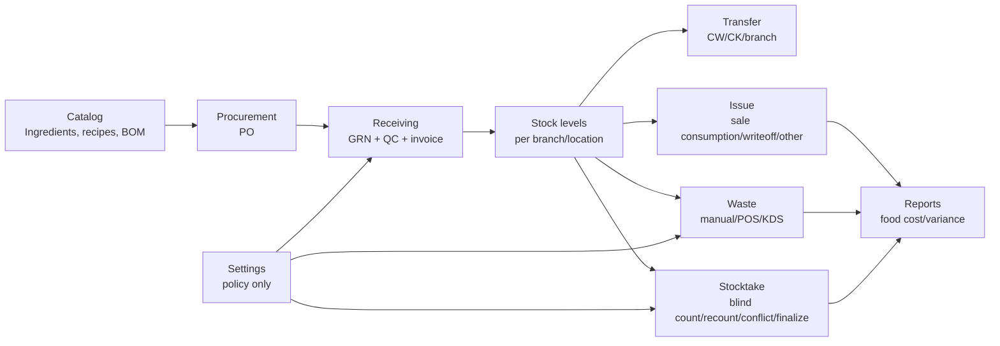

# Inventory workflow audit - 2026-04-25

## Mục tiêu

Rà soát Inventory theo đúng workflow vận hành, không chỉ theo UI hiện có. Mỗi page phải trả lời ngay được:

- Người dùng đang làm việc ở chi nhánh/kho nào?
- Thao tác này tạo chứng từ gì?
- Input nào là quyết định nghiệp vụ, input nào chỉ là ghi chú?
- Select/checkbox nào có thể làm sai dữ liệu nếu nhân viên chọn nhầm?
- Khi nào cần chặn, khi nào chỉ cảnh báo, khi nào phải qua RPC/audit?

## Workflow map

## Page audit summary

| Surface | Primary job | Must show first | Input/control contract | Status after wave 1 |
|---|---|---|---|---|
| Inventory shell | Chọn scope vận hành | Branch/site picker, nav label theo site kind | Scope chỉ nằm ở URL `?branchId=`; không cookie/localStorage/context | Fixed: bỏ `inv_branch_id`, nav giữ URL branch |
| PO create | Tạo đơn đặt hàng cho CW/CK | Supplier, procurement branch, suggested lines | `branchId` là bắt buộc; branch phải là CW/CK và role branch-scoped phải khớp | Fixed: client gửi branch, server không fallback |
| GRN draft/from PO | Nhận hàng vào đúng kho | Supplier/PO, receiving branch, QC line state | `branchId` bắt buộc với draft; PO branch phải là CW/CK | Fixed: draft/from-PO validate procurement branch |
| Stock page | Xem tồn và điều hướng nghiệp vụ | Branch/location stock, alerts, movement entry points | Không nên khuyến khích điều chỉnh trực tiếp; adjustment phải là exception workflow | Not fixed in wave 1 |
| Transfers | Điều chuyển giữa kho/chi nhánh | Direction, sender, receiver, line variance | Direction phải được validate ở app/RPC; receive cần variance/evidence per line | Not fixed in wave 1 |
| Issues | Xuất kho/tiêu hao | Label theo branch kind, issue type | Không còn `kitchen_use`; WAC không nhập tay | Partially verified, no active `kitchen_use` UI found |
| Waste | Hủy/hao hụt có tier approval | Branch/location, reason, evidence, cap meter | Cost không nên nhập tay; tier/photo/self-approval do RPC quyết | Fixed auth/error mapping; cost UI still needs next wave |
| Stocktake new | Mở phiên kiểm kê | Branch, location, mode policy preview | Blind/threshold là policy audited, không phải override trên form nhân viên | Fixed UI: override controls removed |
| Stocktake count | Đếm blind/recount | Round, lock, draft, count grid | Client không nhận `system_quantity`; chỉ sửa khi giữ lock; close round phải đủ submitted lines | Fixed route/lock/close client guard |
| Stocktake detail | Xem kết quả | Completed/cancelled results only | In-progress không được đi detail legacy/direct update/finalize legacy | Fixed: in-progress redirects to `/count` |
| Reports | Xem variance/cost | Branch, period, report family | Consumption variance phải dùng `movement_subtype`, không gom mọi `type=consumption` | Fixed subtype query; filter UX still next wave |
| Settings | Cấu hình policy | Policy sections, audit state | Settings là policy, không phải operational processing page | Not fixed in wave 1 |

## Model/input decisions

### Branch scope

- `branchId` là scope bắt buộc cho page vận hành có dữ liệu chi nhánh.
- URL là source of truth duy nhất.
- Shell phải giữ `branchId` khi điều hướng sidebar.
- Server action không được tự fallback sang "kho đầu tiên" cho write path.

### Procurement branch

- PO/GRN chỉ được tạo cho `central_warehouse` hoặc `central_kitchen`.
- Role `warehouse_manager`/`production_manager` chỉ được tạo cho `claims.branch_id`.
- UI phải chặn submit nếu chưa có branch.
- Server vẫn phải validate lại branch, vì UI không phải security boundary.

### Stocktake

- In-progress count path duy nhất: `/inventory/stocktake/[id]/count`.
- Detail legacy chỉ dùng cho completed/cancelled result view.
- Count grid read-only cho tới khi zone lock state là `held`.
- Close round chỉ cho phép khi current round lines đã có `countedQuantity` hoặc `isFinal`.
- Blind/threshold override không nằm ở form tạo session của nhân viên.

### Reports

- Sale consumption variance phải đọc `movement_subtype = sale_consumption`.
- `type = consumption` quá rộng vì có thể bao gồm writeoff/other operational issues.

## Remaining high-risk backlog

| Priority | Work item | Reason |
|---|---|---|
| P0 | Sửa RPC `finalize_stocktake` để vừa enforce R1-final/conflict gate vừa post adjustment movements atomically | Audit phát hiện finalize hiện có nguy cơ chỉ mark completed mà không tác động tồn |
| P0 | SQL `close_recount_round` phải reject missing counted quantities server-side | Client guard chưa đủ; server phải là chốt cuối |
| P1 | Load stocktake drafts khi mở count page | Autosave hiện có nhưng resume chưa hoàn chỉnh |
| P1 | Waste create UI bỏ editable unit cost, derive WAC/server cost preview | Tránh nhân viên nhập sai giá vốn |
| P1 | Stock page bỏ direct adjustment khỏi workflow thường | Adjustment phải đi exception/audit path |
| P1 | Transfer receive thêm variance/evidence per line và validate sender/receiver app-layer | Nhân viên cần thấy nhận thiếu/thừa làm gì |
| P1 | Reports thêm URL-backed filter bar: branch/site, period, report family, export | Hiện data action đã sửa subtype nhưng UX report vẫn thiếu |
| P1 | Settings tách policy khỏi operational expiry/QC pages | Tránh nhân viên dùng nhầm settings như màn xử lý nghiệp vụ |

## Wave 1 code changes

- Removed Inventory branch cookie fallback and cookie write.
- Made PO/GRN create paths require explicit procurement branch.
- Replaced Inventory auth helper empty role arrays with `STAFF_ROLES`.
- Mapped stocktake/waste raw DB errors to safe user-facing errors.
- Redirected in-progress stocktake detail to blind count route.
- Added zone-lock state feedback to count page editability.
- Disabled close round until current round is fully submitted.
- Removed blind/threshold override controls from new stocktake session UI.
- Changed consumption variance report to use `movement_subtype = sale_consumption`.
