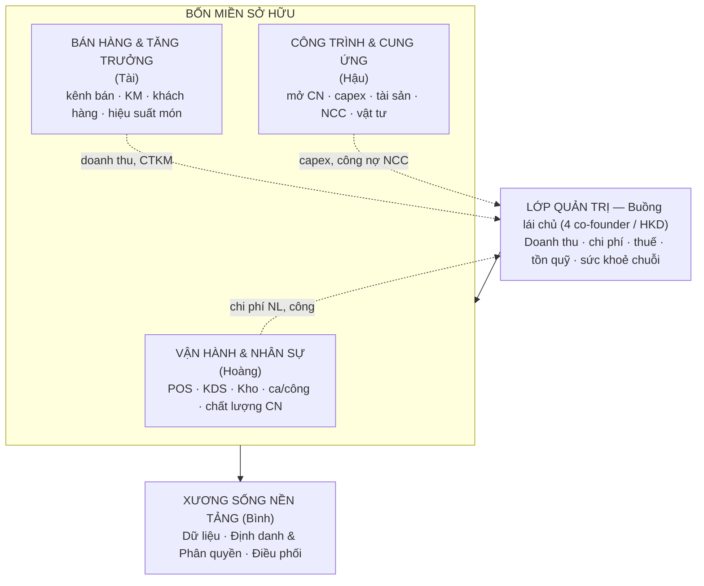
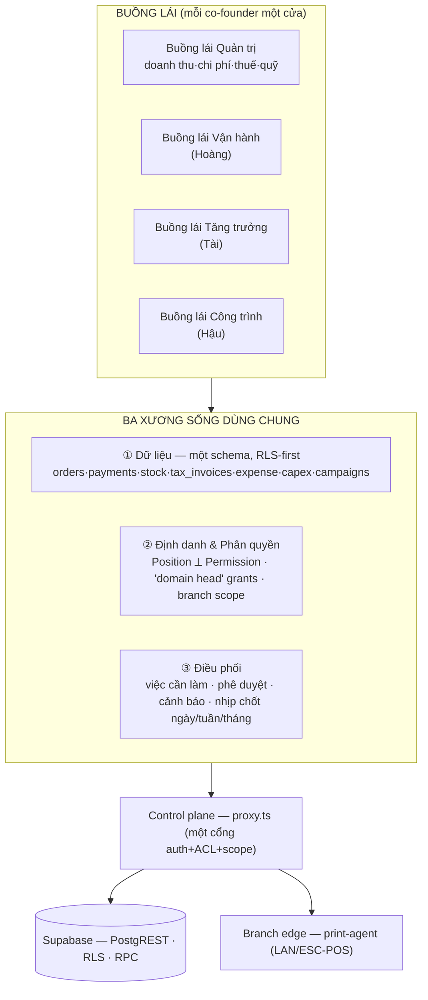
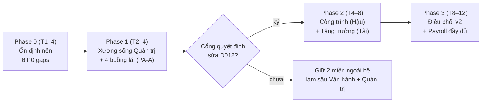

# Blueprint tái thiết — Nền tảng vận hành thống nhất Cơm Tấm Má Tư

> **Trạng thái:** DRAFT — bản thảo để 4 co-founder rà soát, chưa phải quyết định đã duyệt.
> **Đối tượng:** 4 co-founder (Bình · Tài · Hoàng · Hậu) + người onboard hệ thống.
> **Mục tiêu tài liệu:** (1) chẩn đoán hiện trạng theo *3 lớp × 4 miền*, (2) chốt hình hài *nền tảng thống nhất* mục tiêu, (3) lộ trình 6–12 tháng để bốn miền cùng chạy và cùng phát triển trên một nền.
> **Quan hệ với decisions log:** Tài liệu này KHÔNG đảo bất kỳ `D0xx` nào. Nơi nào đề xuất chạm vào quyết định đã duyệt (đặc biệt **D012**, **D015**, **D017**), tài liệu nêu rõ và đẩy thành "việc cần co-founder quyết" (§7) — đúng kỷ luật: muốn đảo một quyết định phải sửa quyết định đó trước, kèm số liệu.
> **Last verified:** 2026-06-14 (đối chiếu `tasks/todo.md`, `docs/plan/decisions.md` D000–D022, `module-acl.ts`, `business-context.md`, worklog `platform-consolidation-2026-06-12.md`). D022 (2026-06-14) RESOLVED: owner chốt phát hành realtime, defer lập-lô nháp-bị-bác — không đảo P0-4 (lưu trữ + ingest CQT).

---

## 1. Tóm tắt điều hành

Hôm nay hệ thống là **"bộ phần mềm quản lý vận hành và bán hàng"** — tổ chức theo *chức năng nhà hàng*: POS, KDS, Kho, Thanh toán, HĐĐT, Finance, HR. Nó đang chạy thật trên 4 chi nhánh, ~100 đơn/ngày, ~500tr đã thu trong 50 ngày đầu, HĐĐT phát hành hằng ngày qua Viettel. Đây là một tài sản sống, không phải bản nháp.

Điều bốn co-founder đang muốn là một bước nhảy *bậc khác*: biến hệ này thành **xương sống điều hành của doanh nghiệp** — nơi bốn miền sở hữu cùng chạy trên một nền chung:

| Miền | Co-founder | Mức phủ của phần mềm hôm nay |
| --- | --- | --- |
| **Nền tảng / Hệ thống** | Bình | Chính là xương sống — đã có |
| **Vận hành & Nhân sự** | Hoàng | Phủ tốt nhất (POS/KDS/Kho/HR cơ bản) |
| **Bán hàng & Tăng trưởng** | Tài | Gần như chưa có miền (chỉ có giao dịch, chưa có growth) |
| **Công trình & Cung ứng** | Hậu | Cung ứng có (PO/GRN/NCC); công trình/capex **chưa tồn tại** |
| **Quản trị / Buồng lái chủ** | Cả 4 (HKD) | Một phần (cockpit L0 + finance cơ bản); một-chủ, chưa phải bốn-chủ |

**Luận điểm trung tâm của tài liệu này:** Hệ thống đã lớn lên dọc theo các trục mà bản dựng ban đầu ưu tiên — giao dịch, bếp, kho, finance/HR cơ bản. Tình cờ, các trục đó **phủ rất tốt miền Vận hành (Hoàng)** và **đương nhiên là miền Nền tảng (Bình)**, nhưng để **miền Tăng trưởng (Tài) và miền Công trình/Capex (Hậu) gần như nằm ngoài hệ thống**. "Cùng nhau phát triển" có nghĩa là kéo hai miền bị bỏ rơi đó lên nền chung — mà đó *chính là* phạm vi **D012** đã cắt ("phần mềm hỗ trợ HKD, không thêm nghi thức quản trị HKD không dùng"). Vậy nên đây không thuần tuý là bài toán kỹ thuật; nó là một **quyết định quản trị** mà bốn người phải cùng ký.

**Ba ràng buộc dẫn đường, rút từ chính lịch sử quyết định của dự án:**

1. **Tiến hoá tại chỗ, KHÔNG đập đi xây lại.** **D015** đã chốt: một Platform duy nhất = hệ production hiện tại; mọi rebuild/cutover phải sửa D015 trước, kèm số liệu. Base-rate nội bộ: 5/5 lần rebuild trước thất bại. "Tái thiết" ở đây = **tái chiếu + mở rộng tại chỗ**, không phải greenfield.
2. **Mở rộng phạm vi = một quyết định có chủ đích.** Thêm miền Tăng trưởng và miền Công trình là mở lại scope D012 đã cắt. Hợp lý — vì doanh nghiệp đang vượt khỏi giả định "HKD một chủ" (4 đồng sở hữu, đa chi nhánh, run-rate 3–3,7 tỷ) — nhưng phải ghi thành quyết định mới, không lặng lẽ phình.
3. **Nền móng trước, buồng lái sau, miền mới sau cùng.** Không dựng miền mới trên nền chưa vững. Các lỗ hổng P0 (chốt ca/ngày, bảng `expense`, idempotency, archive HĐĐT, test tầng DB) phải đóng trước — đây cũng đúng thứ tự ưu tiên D015 đã đặt.

**Hình hài mục tiêu:** một nền với **ba xương sống dùng chung** — Dữ liệu, Định danh & Phân quyền, Điều phối — đỡ **bốn buồng lái miền** và **một lớp quản trị**. Bốn co-founder không còn nhìn cùng một màn hình "Admin" đa năng, mà mỗi người có một buồng lái của miền mình, đọc/ghi chung một nguồn sự thật, và phối hợp qua một lớp điều phối tường minh (việc cần làm, phê duyệt, cảnh báo, nhịp chốt ngày/tuần/tháng).

**Nhịp 6–12 tháng, 4 giai đoạn:** Phase 0 ổn định nền (tuần 1–4) → Phase 1 xương sống Quản trị + buồng lái 4 chủ (tháng 2–4) → Phase 2 hai miền còn thiếu: Công trình/Cung ứng và Tăng trưởng (tháng 4–8) → Phase 3 xương sống Điều phối trưởng thành + payroll đầy đủ (tháng 8–12).

**Một cảnh báo chiến lược, nêu sớm (§6):** bốn đồng sở hữu + run-rate 3–3,7 tỷ/năm + đa chi nhánh về bản chất *là một doanh nghiệp*, không phải hộ gia đình. Mô hình pháp lý **HKD** và mô hình định danh "một owner" trong code đang là cùng một giả định — và giả định đó sắp hết hạn. Lộ trình phải để ngỏ đường chuyển đổi HKD → doanh nghiệp mà không phải đập lại nền.

---

## 2. Khung khái niệm: 3 lớp × 4 miền + 1 lớp quản trị

Để "tái thiết cả ba lớp" không thành khẩu hiệu, cần định nghĩa rạch ròi ba lớp và bốn miền, rồi mọi phần sau soi chiếu theo đúng khung này.

### 2.1 Ba lớp (trục dọc — "tái thiết cái gì")

- **Lớp 1 — Mô hình miền nghiệp vụ (Domain model):** bản đồ khái niệm của doanh nghiệp. Hôm nay hệ được mô hình hoá theo *chức năng* (đơn hàng, kho, hoá đơn). Mục tiêu: mô hình hoá thêm theo *miền sở hữu* (Vận hành, Tăng trưởng, Công trình/Cung ứng, Quản trị) để mỗi miền có ngôn ngữ, dữ liệu, và buồng lái riêng mà vẫn chung một schema.
- **Lớp 2 — Kiến trúc phần mềm (Software architecture):** các operating plane đã có (Control / Execution / Domain / UI / Data / Branch Edge / Security Edge). Mục tiêu: bổ sung ba *xương sống dùng chung* (Dữ liệu, Định danh, Điều phối) như hạ tầng bậc-nền mà mọi miền tiêu thụ, thay vì mỗi miền tự dựng lối riêng.
- **Lớp 3 — Mô hình vận hành (Operating model):** ai sở hữu dữ liệu gì, quyết định nào chảy đi đâu, nhịp điều hành ra sao (chốt ca → chốt ngày → review tuần → quản trị tháng). Đây là "môi trường hoạt động" — phần mềm là công cụ thực thi nó, không thay thế nó.

### 2.2 Bốn miền + lớp quản trị (trục ngang — "tái thiết cho ai")

Lớp quản trị **đọc** từ ba miền vận hành (Vận hành, Tăng trưởng, Công trình) và **kết** lại thành bức tranh tài chính–tuân thủ cho cả HKD. Cả ba miền cùng đứng trên xương sống nền tảng của Bình. Đây là sơ đồ tổ chức *của phần mềm*, ánh xạ 1–1 với sơ đồ tổ chức *của con người*.

---

## 3. Hiện trạng — chẩn đoán theo 3 lớp × 4 miền

### 3.1 Cái gì đang vững (đừng động vào nền móng tốt)

Đây là phần quan trọng nhất để không "tái thiết" nhầm thứ đang chạy tốt:

- **Hệ sống là nguồn sự thật (D015).** 50 ngày live, 6.138 đơn, 504,6tr đã thu, 2.876 HĐĐT phát hành. Không ETL, không cutover. Mọi thiết kế mục tiêu phải *cộng vào* hệ này.
- **Control plane một cổng (`proxy.ts`).** Auth + ACL + branch-scope dồn về một nơi; layout/page tin tưởng proxy. Đây là tài sản kiến trúc lớn — bốn buồng lái mới sẽ *tái dùng* cổng này, không dựng cổng song song.
- **Định danh Position ⟂ Permission.** 8 access bucket + 86 permission key + `has_permission(branch, key)` ở RLS, revoke tức thời, grant theo cửa sổ thời gian + theo `branch_id`. Đây *đã* là một mô hình phân quyền đủ giàu để biểu diễn bốn miền — ta mở rộng nó, không thay nó.
- **Dữ liệu một schema, RLS-first.** Tenant→Branch, RLS tenant-scoped + GRANT tường minh, multi-row write qua RPC. Xương sống Dữ liệu mục tiêu *kế thừa* nguyên tắc này.
- **Quản trị UI đã có kỷ luật (D014/D019).** Hai họ chrome ("Quản trị" / "Vận hành"), token enforce bằng máy, ratchet chỉ-giảm. Buồng lái miền mới phải qua cổng cấu trúc này.
- **Tài chính đã đúng hình HKD (D020).** Đã thoái GL kế toán kép doanh nghiệp (TT 200/VAS) — đúng, vì HKD ghi sổ đơn (TT 152/2025). Giữ HĐĐT, doanh thu, food-cost, chứng từ NCC. Nghĩa là lớp tài chính *không* nợ một mớ kế toán DN thừa; nó gọn và đúng pháp lý hiện hành.

### 3.2 Lỗ hổng nền móng (P0 — phải đóng trước khi dựng miền)

Rút thẳng từ `tasks/todo.md` + worklog D015. Đây là Phase 0:

| # | Lỗ hổng | Vì sao chặn | Nguồn |
| --- | --- | --- | --- |
| P0-1 | **Không có màn chốt ca / chốt ngày** cho thu ngân (RPC `enqueue_shift_close_print` có, thiếu UI) | Không chốt được tiền mặt cuối ca = lỗ hổng đối soát tiền + niềm tin số liệu quản trị | D015 §gap 1 |
| P0-2 | **Bảng `expense` KHÔNG tồn tại** — chi vận hành nằm ngoài hệ (đã verify: schema sống 0 bảng expense, dù permission key `finance:expense_approve` *đã* có sẵn — scaffolding chờ bảng) | Run-rate vắt ranh Nhóm 3 (NĐ 68/2026): TNCN tính trên *doanh thu − chi phí*. Không có sổ chi phí = rủi ro thuế trực tiếp | D015 §gap 2, D020 §3 |
| P0-3 | **Chưa có idempotency formal** (`idempotency_keys`) | Payment/order dựa natural key — nguy cơ ghi trùng khi mạng chập chờn | D015 §gap 3, harvest (b) |
| P0-4 | **HĐĐT thiếu archive PDF/XML + ingest trạng thái CQT + batch tổng hợp ngày** | Nghĩa vụ lưu trữ + tra cứu hoá đơn (NĐ 70/2025) chưa khép kín | D015 §gap 4 |
| P0-5 | **Chưa có gói export kế toán quý** (sổ TT 152/2025: S1a/S2a-HKD) | Kế toán không khai quý được từ hệ → vẫn phải làm tay | D015 §gap 5 |
| P0-6 | **0 test tầng DB** cho ~253 RPC + RLS; chưa có e2e smoke trọn chuỗi | Refactor lớn (sắp tới) không có lưới an toàn | D015 §gap 6, harvest (a) |

> Cả 6 đều đã có "đường đóng" rõ trong D015 (daily close → expense → harvest idempotency+pgTAP). Blueprint này **không phát minh lại** chúng — nó xếp chúng làm Phase 0 và nối tiếp vào các phase miền.

### 3.3 Chẩn đoán theo từng miền

**Miền Vận hành & Nhân sự (Hoàng) — phủ tốt nhất, nhưng "người" còn hở.**
POS/KDS/Kho/điều chuyển/sản xuất/đơn hàng: SHIPPED và chạy thật. Đây là trái tim đang đập của hệ. Khoảng hở: (a) HR mới ở mức ngày-công/ca/phiếu lương; **BHXH/PIT chưa wire**, payroll đang quản bằng Excel (todo M7); (b) chưa nối *chi phí lao động* vào bức tranh giá vốn/lợi nhuận vận hành; (c) "chất lượng vận hành chi nhánh" (chuẩn món, tốc độ bếp, sự cố) chưa có chỉ số. Miền này cần *đào sâu*, không cần dựng mới.

**Miền Bán hàng & Tăng trưởng (Tài) — gần như chưa tồn tại như một miền.**
Hệ ghi *giao dịch* bán (đơn, thanh toán, chiết khấu per-item — D021) nhưng không có lớp *tăng trưởng*: không CRM/khách hàng, không chương trình KM có cấu trúc (chỉ chiết khấu tay), không phân tích kênh/giờ vàng/hiệu suất món theo chi nhánh ở mức marketing, không vòng phản hồi khách. **D012 đã chủ động cắt** CRM/Loyalty/Voucher/Advanced Analytics xuống Tier-2 và **QR Self-Order** đang nằm chờ. Đây là miền có *khoảng trống lớn nhất giữa nhu cầu của một co-founder và những gì phần mềm cho phép* — và mở nó ra đòi sửa D012.

**Miền Công trình & Cung ứng (Hậu) — cung ứng có, công trình bằng không.**
*Cung ứng:* NCC/PO/GRN/3-way/chứng từ NCC đã SHIPPED dưới `/inventory` — phần này phục vụ Hậu khá tốt cho vật tư vận hành. *Công trình:* mở chi nhánh mới, dự toán/capex, theo dõi tài sản cố định, tiến độ thi công, nghiệm thu nhà thầu — **không có bất kỳ bảng hay surface nào**. Với một chuỗi đang mở rộng (4 → n chi nhánh), đây là miền mà mỗi lần mở quán là một dự án vốn lớn đang chạy *hoàn toàn ngoài hệ*. Khoảng trống này song song với khoảng trống `expense` ở tầng quản trị.

**Miền Quản trị / Buồng lái chủ (cả 4) — một phần, và đang là "một-chủ".**
Đã có: cockpit L0 Tenant Command (D017), báo cáo điều hành cơ bản, finance vận hành (doanh thu/đã thu/food-cost), HĐĐT. Thiếu/lệch: (a) **không có `expense`** nên bức tranh lợi nhuận chưa khép (P0-2); (b) dashboard đang **trộn hai khung tài chính** — "doanh thu = tiền đã thu" vs "lãi gộp = subtotal trước VAT trừ nguyên liệu" — chưa chốt định nghĩa metric (todo "Owner metric definitions"); (c) **mô hình định danh là một `owner`** thấy tất cả (D018 gộp `super_manager` vào `owner`) — *không* phản ánh bốn đồng sở hữu mỗi người chủ một miền. Đây là lệch pha cốt lõi giữa phần mềm và thực tế tổ chức.

### 3.4 Lệch pha cốt lõi: hệ tổ chức theo *chức năng*, doanh nghiệp tổ chức theo *miền*

Bảng ACL nói rõ điều này: `dashboard`, `staff`, `finance`, `reports`, `settings`, `accounting`, `hr_payroll` đều **chỉ `owner`**. Mọi quyền quản trị dồn vào một vai. Trong thực tế bốn người chia bốn miền, nhưng phần mềm chỉ biết "owner" và "nhân viên". Hệ quả:

- Tài muốn xem hiệu suất tăng trưởng → phải mở màn "Admin" của owner, không có buồng lái của mình.
- Hậu muốn theo dõi mở chi nhánh/capex → không có chỗ nào trong hệ.
- Hoàng có `/inventory`, `/hr`, Branch Command — gần nhất với một buồng lái miền, nhưng vẫn xen kẽ quyền owner.
- Mọi báo cáo tài chính–quản trị giả định một người đọc duy nhất.

→ Đây chính là cái "tái thiết" cần giải: **tách lớp quản trị một-chủ thành bốn buồng lái miền trên cùng một nguồn sự thật**, đồng thời *điền* hai miền đang trống (Tăng trưởng, Công trình).

---

## 4. Mục tiêu — Kiến trúc nền tảng thống nhất

Nguyên tắc thiết kế: **một schema, một cổng auth, một nguồn sự thật; nhiều miền, nhiều buồng lái.** Ba xương sống dùng chung là hạ tầng bậc-nền; bốn miền + quản trị là phần "tiêu thụ" hạ tầng đó. Không miền nào được dựng lối dữ liệu/định danh/điều phối riêng.

### 4.1 Sơ đồ mục tiêu

### 4.2 Xương sống ① — Dữ liệu (một nguồn sự thật, mở rộng theo miền)

Giữ nguyên triết lý hiện hành (Tenant→Branch, RLS tenant-scoped, multi-row write qua RPC, `pnpm db:types` sau migration). Mở rộng *nội dung*, không đổi *nguyên tắc*:

- **Đóng các bảng nền còn thiếu:** `expense` (sổ chi phí đơn — P0-2, D020 §3), `idempotency_keys` (P0-3), archive HĐĐT (P0-4).
- **Miền Công trình:** thêm cụm `capex_projects` (dự án mở/sửa chi nhánh), `assets` (tài sản cố định + khấu hao đơn giản), `contractor_milestones` (tiến độ/nghiệm thu). Tách bạch với `expense` vận hành (capex ≠ chi phí kỳ).
- **Miền Tăng trưởng:** thêm cụm `customers` (tối thiểu, opt-in), `campaigns` (KM có cấu trúc thay chiết khấu tay), và *view* phân tích bán hàng (giờ vàng, hiệu suất món/CN) — đọc từ `orders`/`payments` đã có, không nhân bản dữ liệu.
- **Mọi bảng mới theo đúng pattern RLS + GRANT tường minh** (Hub File `module-acl.ts` + database.md). Không bảng nào "lậu" RLS.

### 4.3 Xương sống ② — Định danh & Phân quyền (từ một-chủ → bốn chủ-miền)

Đây là thay đổi *nhạy cảm nhất* và phải tôn trọng **ADR 0005** (tách 3 nghĩa của "owner": `tenants.representative` pháp lý ≠ `positions.code='owner'` runtime ≠ `tenants.owner_user_id` định danh auth). Hai phương án, để co-founder chọn (§7):

- **Phương án A — "Domain head" qua Permission (nhẹ, trong khuôn D018, khuyến nghị cho 6–12 tháng):** giữ một `owner` bucket, nhưng cấp mỗi co-founder một *bộ permission key theo miền* + một buồng lái mặc định. Tài = `growth:*`, Hoàng = `ops:*` + HR, Hậu = `build:*` + procurement, Bình = `platform:*`. Tận dụng đúng mô hình Position⟂Permission đang có (grant theo key + branch + cửa sổ thời gian). Không đụng schema auth lõi, không vỡ RLS. Risk thấp.
- **Phương án B — Multi-principal ownership (nặng, mở đường chuyển đổi DN):** mô hình hoá 4 đồng sở hữu như 4 principal thật (vốn góp, quyền biểu quyết, phê duyệt nhiều chữ ký). Đây thực chất là bước *tiền-doanh-nghiệp* — chỉ nên làm khi quyết chuyển HKD → công ty (§6). Risk cao, chạm `tenants.owner_user_id`, `transfer_ownership` (đang deferred trong todo).

> Khuyến nghị: **A trước** (đủ để bốn buồng lái hoạt động ngay, zero rủi ro auth), giữ B như nhánh kích hoạt khi-và-chỉ-khi quyết chuyển đổi pháp lý.

### 4.4 Xương sống ③ — Điều phối (cái "điều phối" còn thiếu)

Hôm nay sự phối hợp giữa các miền diễn ra *ngoài hệ* (chat, gọi điện, Excel). Xương sống Điều phối đưa nó vào hệ, tái dùng hạ tầng đã có (`notifications` SHIPPED, RPC, realtime):

- **Việc cần làm liên miền (tasks):** ví dụ Hậu nghiệm thu xong chi nhánh → tạo việc cho Hoàng "setup sàn/bếp + tuyển ca" → tạo việc cho Tài "lên lịch khai trương/KM". Một dòng việc, nhiều miền.
- **Phê duyệt (approvals):** chi vượt ngưỡng, capex, KM giảm sâu → định tuyến tới đúng chủ-miền. (Giữ tinh thần D012: chỉ thêm phê duyệt khi có *giá trị tiền thật*, không nghi thức rỗng.)
- **Nhịp điều hành đóng gói:** chốt ca (P0-1) → chốt ngày → review tuần → quản trị tháng. Đây là "môi trường hoạt động" (Lớp 3) được mã hoá thành lịch + checklist + số liệu, không phải tài liệu chết.
- **Cảnh báo theo miền:** mỗi buồng lái có ngưỡng cảnh báo riêng (Tài: doanh thu món tụt; Hoàng: lệch kiểm kê; Hậu: capex vượt dự toán; Quản trị: dòng tiền/thuế).

### 4.5 Bốn buồng lái + lớp quản trị (mặt tiền của mỗi co-founder)

Mỗi buồng lái là một *workspace* trong họ chrome "Quản trị" (D019) — KHÔNG phải tab con của `/admin` (đúng D017: domain workspace là surface độc lập). Route gợi ý, tái dùng `module-acl.ts`:

| Buồng lái | Route home gợi ý | Đọc gì | Ghi gì |
| --- | --- | --- | --- |
| Quản trị (4 chủ) | `/admin/dashboard` (đã có, làm sâu) | doanh thu·chi phí·thuế·quỹ·sức khoẻ 4 miền | định nghĩa metric, ngưỡng |
| Vận hành (Hoàng) | `/ops` (gộp từ `/inventory`+`/hr`+Branch Command) | bếp·kho·ca/công·chất lượng | điều chuyển, duyệt công, chuẩn vận hành |
| Tăng trưởng (Tài) | `/growth` (mới) | doanh thu theo kênh/giờ/món·KM·khách | tạo KM có cấu trúc, mục tiêu |
| Công trình (Hậu) | `/build` (mới) | dự án CN·capex·tài sản·NCC·vật tư | dự toán, nghiệm thu, mua sắm |

Lớp quản trị **kết** số từ ba miền. Đây là nơi định nghĩa metric phải chốt (todo "Owner metric definitions"): "doanh thu" = `tax_invoices` issued (nguồn khai thuế, theo D020 §2) hay tiền đã thu; "lợi nhuận" = doanh thu − giá vốn (GRN) − chi phí (`expense` mới) − lương (HR) − khấu hao capex (`assets` mới). Bốn miền góp đủ bốn mảnh, lần đầu cho một bức tranh P&L thật của HKD.

---

## 5. Lộ trình 6–12 tháng

**Nguyên tắc xếp thứ tự:** nền móng trước → xương sống + buồng lái sau → miền mới sau cùng; governance-first (khoá cổng trước, cleanup sau — pattern D019); mỗi slice chạm tiền/auth/multi-row là **T3** (debate PM/BA/Dev/QA) theo `workflow.md`.

**Một sự thật về năng lực phải nói thẳng:** D015 ước lượng nhịp ~1 dev. Bốn miền *đầy đủ* trong 6–12 tháng là quá tải nếu làm tuần tự một mình. Lộ trình dưới đây ưu tiên **đặt xương sống + mở khung bốn miền** trong 12 tháng, và làm *sâu* từng miền theo giá trị; "đầy đủ mọi miền" là đích nhiều năm, không phải 12 tháng. Nếu muốn ép đủ trong 12 tháng → cần thêm người hoặc thuê ngoài có kiểm soát (§7).

### Phase 0 — Ổn định nền (Tuần 1–4) · *điều kiện cần cho mọi thứ sau*

Đóng đúng 6 lỗ hổng P0 (§3.2), bám sát ưu tiên D015:

1. **Daily close UI** (P0-1) — màn chốt ca thu ngân + xác nhận ngày. T3 (tiền mặt).
2. **Expense capture** (P0-2) — bảng `expense` + form nhập + gắn vào `/finance`. T3 (thuế Nhóm 3). Là sổ chi phí đơn, KHÔNG phải GL (D020 §3).
3. **Harvest idempotency + pgTAP** (P0-3, P0-6) — port `idempotency_keys` + webhook event-claim + harness test-db từ matu-platform theo D015 §3 (a)(b), viết test payment/permission trước.
4. **HĐĐT khép kín** (P0-4) — archive PDF/XML + ingest trạng thái CQT (post-pilot P0/P1 trong todo).
5. **Gói export kế toán quý** (P0-5) — sổ TT 152/2025; chốt với kế toán việc xếp Nhóm doanh thu.

**Cổng ra Phase 0:** chuỗi smoke POS→payment→KDS/print→HĐĐT có test; định nghĩa metric quản trị đã chốt (doanh thu/lãi gộp). Không qua cổng này thì *không* mở Phase 1.

### Phase 1 — Xương sống Quản trị + buồng lái 4 chủ (Tháng 2–4)

Mục tiêu: lần đầu mỗi co-founder có một cửa của riêng mình, đọc chung một P&L thật.

1. **Định danh "domain head" — Phương án A** (§4.3): cấp permission key theo miền (`growth:*`/`ops:*`/`build:*`/`platform:*`) + buồng lái mặc định. Mở rộng `module-acl.ts` + `permissions.ts` (T3 auth) — KHÔNG đụng schema auth lõi.
2. **Buồng lái Quản trị làm sâu** (`/admin/dashboard`): P&L HKD khép kín = doanh thu (`tax_invoices`) − giá vốn (GRN) − `expense` − lương − khấu hao. Dòng tiền + cảnh báo ngưỡng thuế Nhóm 2/3.
3. **Gộp khung Vận hành (Hoàng):** đưa `/inventory` + `/hr` + Branch Command vào một buồng lái `/ops` mạch lạc (qua cổng cấu trúc D019). Đây là *tái tổ chức điều hướng*, không viết lại logic.
4. **Xương sống Điều phối v1:** nhịp chốt ngày/tuần đóng gói + cảnh báo theo miền, dựng trên `notifications` đã có.

**Cổng ra Phase 1:** 4 buồng lái mở được theo đúng quyền; P&L khớp số tay của kế toán một kỳ.

### Phase 2 — Hai miền còn thiếu: Công trình & Tăng trưởng (Tháng 4–8)

> **Cổng quyết định BẮT BUỘC trước Phase 2:** mở hai miền này = sửa **D012**. Phải có một quyết định mới (`D0xx`) ratify "mở rộng phạm vi sang Tăng trưởng + Công trình vì doanh nghiệp đã vượt giả định HKD-một-chủ", kèm số liệu. Không có quyết định đó thì Phase 2 vi phạm D012.

**2A — Công trình & Cung ứng (Hậu)** — *làm trước, ít tranh cãi phạm vi hơn, gắn trực tiếp với chi phí/thuế:*

- `capex_projects` (mở/sửa chi nhánh: dự toán vs thực chi), `assets` (tài sản + khấu hao đơn giản), `contractor_milestones` (tiến độ/nghiệm thu).
- Buồng lái `/build`: dự án đang chạy, capex vs dự toán, công nợ NCC vật tư (nối từ procurement đã có).
- Nối vào Quản trị: capex → khấu hao → P&L; tách bạch capex (đầu tư) vs `expense` (chi phí kỳ).

**2B — Bán hàng & Tăng trưởng (Tài)** — *làm sau, phạm vi cần kỷ luật để không thành "platform đa năng" mà D012 cảnh báo:*

- **KM có cấu trúc** thay chiết khấu tay (xây trên D021 per-item discount): `campaigns` + quy tắc áp dụng + đo hiệu quả. KHÔNG dựng promotion engine nặng (D021 đã chốt tinh thần này).
- **Phân tích bán hàng**: view giờ vàng/hiệu suất món/CN — đọc từ `orders`/`payments`, không nhân bản.
- **Khách hàng tối thiểu** (opt-in) + **QR Self-Order** (đang chờ ở Tier-2) nếu — và chỉ nếu — quyết định mở phạm vi đã ký.
- Buồng lái `/growth`: mục tiêu doanh thu, hiệu quả KM, xu hướng món.

**Cổng ra Phase 2:** quyết định mở phạm vi đã ký; mỗi miền mới có buồng lái + ít nhất một vòng dữ liệu thật.

### Phase 3 — Điều phối trưởng thành + Nhân sự đầy đủ (Tháng 8–12)

1. **Xương sống Điều phối v2:** việc-cần-làm liên miền + phê duyệt định tuyến theo chủ-miền (capex/KM/chi vượt ngưỡng). Nhịp quản trị tháng.
2. **Payroll đầy đủ (M7):** wire BHXH/PIT (`legal-versions.ts` đã version sẵn biểu 5 bậc từ 01/07/2026 + giảm trừ 15,5tr/6,2tr) — gỡ Excel khỏi vòng lương.
3. **Chất lượng vận hành (Hoàng):** chỉ số chuẩn món/tốc độ bếp/sự cố.
4. **Hardening + telemetry:** dead-RPC wave 2 (cần `pg_stat_user_functions` từ traffic thật), unused index re-assess sau ≥1 chu kỳ tháng.

**Cổng ra Phase 3:** bốn miền cùng chạy trên ba xương sống; nhịp điều hành (ngày→tuần→tháng) chạy trong hệ; lương không còn ngoài hệ.

### Bản đồ một trang

---

## 6. Nguyên tắc, rủi ro & cảnh báo chiến lược

### 6.1 Nguyên tắc giữ suốt lộ trình

- **Tiến hoá tại chỗ.** Mọi phase *cộng vào* hệ sống. Không nhánh "viết lại" song song (D015; base-rate 0/5).
- **Mỗi mở rộng phạm vi là một `D0xx`.** Đặc biệt Phase 2 phải sửa D012 *trước*. Phần mềm không được lặng lẽ phình ra ngoài quyết định.
- **Phễu D012 vẫn áp cho từng tính năng:** giảm thao tác hằng ngày của chủ + nhân viên; chỉ thêm "nghi thức" (phê duyệt, phân tầng) khi có *giá trị tiền/tuân thủ thật*. Khác biệt 2026: doanh nghiệp *đã* đủ lớn để vài nghi thức (chốt ca, duyệt capex, sổ chi phí) trở thành giá trị thật — không còn là nghi thức rỗng.
- **Một schema, một cổng, một nguồn sự thật.** Buồng lái/miền mới tái dùng `proxy.ts` + RLS + RPC; cấm lối dữ liệu/định danh riêng.
- **Governance-first khi chạm cấu trúc** (D019): khoá cổng (ratchet/test) trước, refactor sau.

### 6.2 Rủi ro & giảm thiểu

| Rủi ro | Mức | Giảm thiểu |
| --- | --- | --- |
| Ôm 4 miền cùng lúc → vỡ tiến độ 1-dev | Cao | Phase hoá; xương sống + khung trước, làm sâu sau; cân nhắc thêm người (§7) |
| Phase 2 mở phạm vi không kiểm soát → lại thành "ERP đa ngành" D012 cấm | Cao | Cổng quyết định bắt buộc + giữ phễu D012 từng tính năng |
| Đổi mô hình định danh làm vỡ auth/RLS | Cao | Chọn Phương án A (chỉ thêm permission key, không đụng schema lõi); mọi slice auth là T3 |
| Thuế Nhóm 3 ập đến trước khi có `expense` | Cao | `expense` nằm Phase 0; chốt xếp Nhóm với kế toán ngay |
| Định nghĩa metric quản trị mơ hồ → 4 chủ đọc 4 kiểu | Trung bình | Chốt định nghĩa ở cổng ra Phase 0 |
| Refactor lớn không lưới an toàn | Trung bình | pgTAP + e2e smoke ở Phase 0 trước mọi refactor miền |

### 6.3 Cảnh báo chiến lược — mô hình pháp lý đang chạm trần

Đây là điểm vượt khỏi phần mềm, nhưng là *điều kiện biên* của toàn lộ trình, nên phải nêu:

**HKD là mô hình một-chủ-thể.** `business-context.md` ghi rõ: "không mặc định coi HKD là pháp nhân doanh nghiệp; `tenant` là hồ sơ chủ thể kinh doanh, không phải công ty mẹ". Nhưng thực tế của Má Tư là **bốn đồng sở hữu, đa chi nhánh, run-rate 3–3,7 tỷ/năm, vắt ranh Nhóm 2/3** (NĐ 68/2026). Về bản chất tổ chức, đây *đã là* một doanh nghiệp đang vận hành dưới vỏ HKD.

Hệ quả cho blueprint:

- **Mô hình định danh "một owner" trong code và mô hình "một chủ hộ" trong luật là *cùng một giả định* — và nó đang hết hạn.** Phương án A (domain head qua permission) là cách *mua thời gian* đúng đắn: cho bốn người bốn buồng lái mà không phải tuyên bố bốn pháp nhân. Nhưng nó không giải quyết quyền sở hữu/biểu quyết/chia lãi thật.
- **Khi nào chạm Phương án B / chuyển đổi DN:** nếu (a) cần hợp đồng/đầu tư/vay vốn dưới tên pháp nhân, (b) cần ghi nhận vốn góp & chia lãi chính thức giữa 4 người, hoặc (c) quy mô buộc lên chế độ kế toán doanh nghiệp — thì chuyển HKD → công ty (TNHH/CP) là việc *pháp lý-kế toán*, và phần mềm chỉ cần *không cản đường*. D020 đã giữ lịch sử GL ở `_archive` đúng cho tình huống này ("DN khi chuyển đổi mở sổ mới").
- **Việc của blueprint:** kiến trúc dữ liệu/định danh phải để *capex, vốn, đồng sở hữu* biểu diễn được khi cần, nhưng KHÔNG kích hoạt sớm (tránh nghi thức DN mà HKD chưa cần — đúng D012).

→ Đây là một câu hỏi cho cả bốn + một kế toán/luật sư, không phải câu hỏi kỹ thuật. Blueprint chỉ chịu trách nhiệm: *đừng khoá cứng giả định HKD vào nền tới mức chuyển đổi phải đập lại.*

---

## 7. Việc cần bốn co-founder quyết

Những điểm dưới đây phần mềm không tự quyết được; chúng định hình toàn lộ trình:

1. **Phạm vi (sửa D012 hay không?).** Có chính thức mở miền **Tăng trưởng (Tài)** và **Công trình (Hậu)** lên hệ không? Nếu có → cần một `D0xx` ratify trước Phase 2. Nếu không → hai miền này ở ngoài hệ, lộ trình co lại còn làm sâu Vận hành + Quản trị.
2. **Mô hình định danh.** Chốt **Phương án A** (domain head qua permission, khuyến nghị) cho 6–12 tháng? Hay nhắm thẳng **Phương án B** vì đã có ý định chuyển đổi DN?
3. **Định nghĩa metric quản trị.** "Doanh thu" = HĐĐT issued hay tiền đã thu? "Lợi nhuận" gồm những khoản trừ nào? Đây là cổng ra Phase 0, bốn người phải đồng thuận một định nghĩa.
4. **Mô hình pháp lý.** Giữ HKD trong tầm 12 tháng tới, hay khởi động đường chuyển đổi DN? Quyết định này bật/tắt Phương án B và cách thiết kế lớp vốn/sở hữu.
5. **Năng lực thực thi.** Nhịp 1-dev có giữ không, hay thêm người/thuê ngoài để ép đủ 4 miền trong 12 tháng? Tốc độ lộ trình phụ thuộc trực tiếp câu trả lời.
6. **Xếp Nhóm doanh thu (với kế toán).** Đang ở Nhóm 2 hay Nhóm 3 (NĐ 68/2026)? Quyết định độ gấp của `expense` + gói export quý.

### Bước kế tiếp đề xuất

Chốt §7.1–§7.3 trước (đủ để khởi động Phase 0 ngay, vì Phase 0 không phụ thuộc quyết định phạm vi). Song song, đưa §7.4 (pháp lý) cho kế toán/luật sư. Khi có câu trả lời phạm vi, ghi một `D0xx` mới và mở Phase 2.

> Tài liệu này là bản thảo định hướng. Sau khi bốn co-founder rà soát, các quyết định chốt nên được ghi vào `docs/plan/decisions.md` dưới dạng `D0xx` để vào đúng dòng quản trị của dự án.
