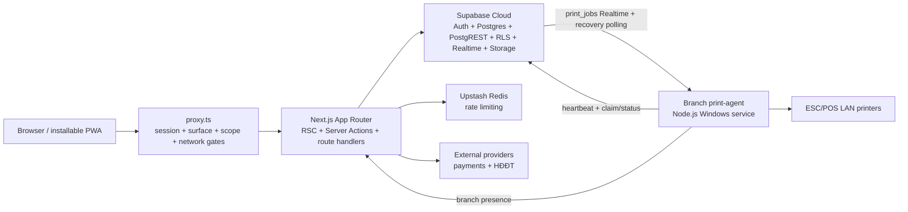
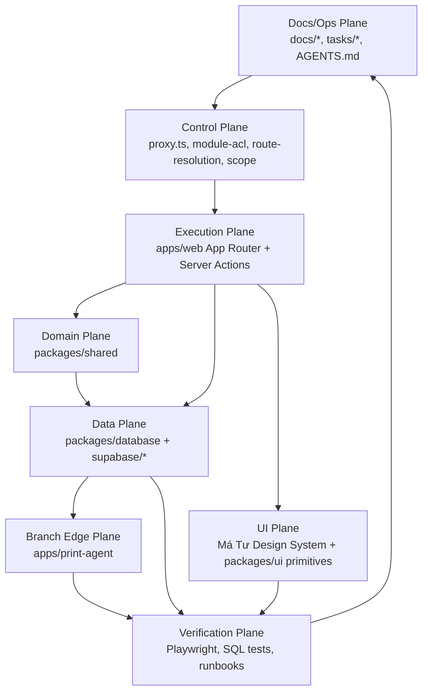

# Architecture — Cơm Tấm Má Tư

## Hierarchy

```text
Tenant (L0, single operating tenant)
├── Operating sites persisted in `branches`
│   ├── `branch`
│   ├── `central_supply`
│   └── `central_kitchen`
└── Staff profiles and site assignments
```

`branches` remains the current site table and `branch_id` remains the current
technical scope key. `Company` and `operational_site` are not runtime hierarchy
levels in the current schema.

## System Topology



The platform has two deployable runtimes: the stateless web application and one
branch-local print-agent process per active branch. Supabase Cloud remains the
operational system of record; the print-agent is an adapter for physical LAN
printers, not a second business-data authority.

## Technical Specifications

| Concern              | Contract                                                                                                                               |
| -------------------- | -------------------------------------------------------------------------------------------------------------------------------------- |
| Product shape        | Single tenant, multiple branches, path-based surfaces on one web domain                                                                |
| Web runtime          | Node.js 24.x, Next.js App Router on Vercel; RSC, Server Actions, route handlers, and scheduled routes share one app                    |
| Data authority       | Supabase Cloud owns Auth, Postgres, PostgREST, RLS, Realtime, and Storage                                                              |
| Authorization        | `proxy.ts` gates session/surface/scope; RLS and authorized RPCs own data/action authority                                              |
| Mutation correctness | Server Action input is Zod-validated; multi-row correctness is implemented in one Postgres RPC                                         |
| Offline posture      | Cloud-first PWA; cached shell/static assets may degrade gracefully, but POS has no local-first transaction authority                   |
| Printing             | `print_jobs` is the durable queue; the branch agent claims idempotently, retries LAN delivery, and recovery-polls around Realtime gaps |
| Delivery             | Web deploys through Vercel; database and branch-agent releases have separate promotion gates                                           |

Precise framework versions belong to package manifests and `pnpm-lock.yaml`.
Environment, deployment, and release contracts live in
`docs/modules/infrastructure.md`.

## Auth Flow

```
Login → signInWithPassword() → custom_access_token_hook (SECURITY DEFINER)
  → JWT minted with the claim shape owned by packages/shared/src/auth/types.ts
  → proxy.ts reads claims (from access_token, not user.app_metadata) → route to post-login target

Database access → RLS, authorized RPC, or trusted service-role boundary
```

**Auth layer:** `user_role` is derived from `positions.code` and kept for
backward compatibility (route-level `canAccess`). Permission-sensitive browser
writes use live grants through RLS/RPC; trusted service code derives scope from
server context. See `docs/modules/auth.md` and `docs/agent/rules/database.md`.

### Role → Post-Login/Fallback Target

Defined in `getDefaultRedirect(claims)` (`packages/shared/src/auth/scope.ts`).

| Role                | Route                                             |
| ------------------- | ------------------------------------------------- |
| `owner`             | `/`, rồi resolver mở branch khi chỉ có một branch |
| Branch-pinned staff | `/br/{branchId}`                                  |

Root `/` delegates to this same resolver; multiple active branches produce the
picker, while exactly one active branch opens its Branch home.

POS/KDS are not anyone's post-login fallback target — operators reach
`/br/[branchId]/pos` or `/br/[branchId]/kds` via Branch home or a direct link.

## Data Authorization Pattern

RLS chooses the boundary from the table and action semantics; there is no
generic role predicate to copy across policies:

- Tenant scope derives from `auth_tenant_id()`.
- Branch scope derives from `auth_branch_id()` plus the documented Owner path.
- Revocable action/data authority uses `has_permission(branch_id, key)` or
  `has_permission_any(key)`.
- `auth_role()` remains a compatibility route bucket and an explicitly
  documented structural side guard, not a destructive permission grant.

The complete layer contract lives in `docs/modules/auth.md`; database policy
rules live in `docs/agent/rules/database.md`.

## Current Package Dependencies

```text
@comtammatu/web
  ├── @comtammatu/shared    (auth types, ACL, scope helpers)
  ├── @comtammatu/database  (Supabase clients)
  ├── @comtammatu/ui        (Má Tư DS shared components + token runtime)
  ├── @comtammatu/security  (Upstash rate limiting)
  └── @comtammatu/print-render
        └── @comtammatu/shared

@comtammatu/print-agent
  └── @comtammatu/print-render
        └── @comtammatu/shared
```

The two applications are deployable graph leaves; packages never import an
application. Internal packages expose source through explicit `exports` and are
compiled by their consumers. Workspace imports must be declared with
`workspace:*` and must not bypass an export map through a source-path alias.

Keep this graph small. Create a package only for a second runtime consumer, a
distinct trust boundary, or an independently built artifact—not for folder
size or possible future reuse.

## Code Placement

Use the highest row that fits:

| Reuse/correctness boundary          | Location                        |
| ----------------------------------- | ------------------------------- |
| One route                           | Beside that route               |
| Multiple routes in one route family | The route-family `_lib`         |
| Multiple web route families         | `apps/web/lib/<domain>`         |
| Multiple runtimes or applications   | An existing `packages/*` export |
| Correctness across database rows    | Supabase RPC/migration          |

Route-local `_lib`, actions, and components are private to their route family;
sibling domains must promote shared behavior to `apps/web/lib/<domain>` before
importing it. `packages/shared` owns stable, runtime-neutral contracts—not
web-only convenience code. A new package requires a real consumer and a
declared dependency edge.

## Operating Planes

The codebase should be navigated and changed by operating plane, not by folder name alone. Use these active planes before planning broad changes:



Change ownership:

| Plane       | Owns                                                       | First files to inspect                                                                                                                             |
| ----------- | ---------------------------------------------------------- | -------------------------------------------------------------------------------------------------------------------------------------------------- |
| Control     | Auth, ACL, host/surface routing, branch scope              | `apps/web/proxy.ts`, `packages/shared/src/auth/route-resolution.ts`, `packages/shared/src/auth/module-acl.ts`, `packages/shared/src/auth/scope.ts` |
| Execution   | Route behavior, Server Actions, realtime UI flows          | `apps/web/app/**`, route-local `actions.ts`, `apps/web/app/_lib/*`                                                                                 |
| Domain      | Business rules shared across routes/providers              | `packages/shared/src/**`                                                                                                                           |
| Data        | Schema, RLS, RPCs, generated types, Supabase clients       | `supabase/migrations/**`, `packages/database/src/**`                                                                                               |
| UI          | Má Tư Design System, reusable primitives, surface rhythm   | `docs/spec/design-system.md`, `packages/ui/src/components/**`, `apps/web/app/components/surface.tsx`                                               |
| Branch Edge | Local print daemon and branch print/QR behavior            | `apps/print-agent/src/**`, branch settings surfaces                                                                                                |
| Docs/Ops    | Current source-of-truth, runbooks, active work state       | `docs/CODEBASE_MAP.md`, `docs/modules/**`, `docs/runbooks/**`, `tasks/**`                                                                          |

## Import Boundaries

| Context              | Import from                                | Reason                        |
| -------------------- | ------------------------------------------ | ----------------------------- |
| Server Actions / RSC | `@comtammatu/database/supabase/server`     | Request-scoped user client    |
| Privileged server    | `@comtammatu/database/supabase/service`    | Intentional RLS bypass        |
| proxy.ts             | `@comtammatu/database/supabase/middleware` | Session refresh boundary      |
| "use client"         | `@comtammatu/database/supabase/client`     | No server deps (next/headers) |

## Product Dual Thesis

Cơm Tấm Má Tư is **two product halves**, not one mixed dashboard. Structure,
naming, chrome, and adapters must make both halves obvious.

| Product half (VI)               | Job                                                                     | Plane ID          | Route root                                                                                      | Shell                    | Adapter prefix    |
| ------------------------------- | ----------------------------------------------------------------------- | ----------------- | ----------------------------------------------------------------------------------------------- | ------------------------ | ----------------- |
| **Quản lý hệ thống**            | Tenant/branch oversight, menu, central inventory, finance, HR, settings | `control_surface` | `/`, `/menu`, `/orders`, `/inventory`, `/finance`, `/hr`, `/branches`, `/settings`, `/feedback` | `AppShell` (nav-as-data) | `App*`            |
| **Vận hành bán hàng (ca)**      | Shift work, branch stock, team, branch settings                         | `branch_surface`  | `/br/[branchId]/*` (excl. stations)                                                             | Branch operator chrome   | `BranchOperator*` |
| **Vận hành bán hàng (station)** | Sell / kitchen / runner queue                                           | `station_chrome`  | `/br/[branchId]/{pos,kds,runner}`                                                               | Station chrome           | station adapters  |
| **Public / khách**              | Auth, guest order, feedback QR                                          | `public`          | `/login`, `/q`, `/r`, …                                                                         | none                     | —                 |

- UI copy for the L0 half: **Quản trị** / **Hệ thống**. Role ACL `owner` is not a plane name.
- Runtime plane id `RouteSurface: "owner"` remains a technical alias of
  **`control_surface`**. DOM scrollport is `data-control-surface-scroll`.
  Chrome component is `ControlSurfaceShell`. New docs/UI copy use
  `control_surface` / Quản trị.
- Dual-plane inventory keeps **two jobs** (`/inventory/*` oversight vs `/br/.../stock/*` shift work). Share implementation; do not merge URLs.
- Vocabulary detail: `docs/ref/glossary.md`. Chrome: `docs/spec/design-system.md`. Routes: `docs/modules/web-app.md`, `docs/spec/role-route-matrix.md`.

### Folder placement (Dual Thesis)

| Concern                                      | Lives under                                                     | Notes                                                                                                 |
| -------------------------------------------- | --------------------------------------------------------------- | ----------------------------------------------------------------------------------------------------- |
| Quản trị L0 routes                           | `apps/web/app/(protected)/{menu,orders,inventory,finance,hr,…}` | `App*` adapters; shells converge to one `AppShell` + **nav-as-data** (module shells are transitional) |
| Vận hành branch + stations                   | `apps/web/app/(protected)/br/[branchId]/…`                      | `BranchOperator*` / station chrome                                                                    |
| Branch settings UI (POS/KDS/tables/printers) | `apps/web/app/(protected)/br/_shared/settings/`                 | Must not sit as a fake L0 `branch-settings/` tree                                                     |
| Dual-plane shared domain logic               | `apps/web/lib/inventory/*` (e.g. `grn-list-model`)              | Same core; different route presenters / density                                                       |

**Nav-as-data:** one `AppShell` is the only L0 chrome. Layouts import
`ControlSurfaceShell` directly. Deep nav dispatches through
`resolveControlSurfaceDeepNav` (`apps/web/app/lib/control-surface-nav.ts`).
Do not rewrite POS/KDS.

## Routing (path-based, single domain)

> Decision: D009 — path-based, không sub-domain. Sub-domain không nằm trong backlog hiện tại.

Route families are grouped into product halves / planes; exact role/module
mappings are generated in `docs/spec/role-route-matrix.md` and must not be
copied here:

| Surface (product) | Plane ID                            | Route families                                                                                  | Boundary                                                             |
| ----------------- | ----------------------------------- | ----------------------------------------------------------------------------------------------- | -------------------------------------------------------------------- |
| Quản lý hệ thống  | `control_surface`                   | `/`, `/menu`, `/orders`, `/inventory`, `/finance`, `/branches`, `/hr`, `/settings`, `/feedback` | L0 Tenant Command; runtime `RouteSurface: "owner"` is the code alias |
| Vận hành bán hàng | `branch_surface` + `station_chrome` | `/br/[branchId]/*`                                                                              | Module ACL + URL/JWT branch scope; PBAC/RLS owns actions and data    |
| Utility           | —                                   | `/notifications`, `/access-denied`                                                              | Explicit utility/public contracts, not a product plane               |

Branch Manager and Staff daily work stays under `/br/[branchId]/*`; the
`control_surface` families remain L0-gated per ADR 0012.

## Infrastructure Strategy

The web and database remain cloud-authoritative. D012 removes local-first/offline
POS and a native-app rewrite from scope; it does not remove the D062 minimal PWA
offline shell or the branch-local print adapter. Infrastructure topology,
environment separation, secret ownership, CI, and promotion gates are canonical
in `docs/modules/infrastructure.md`.
