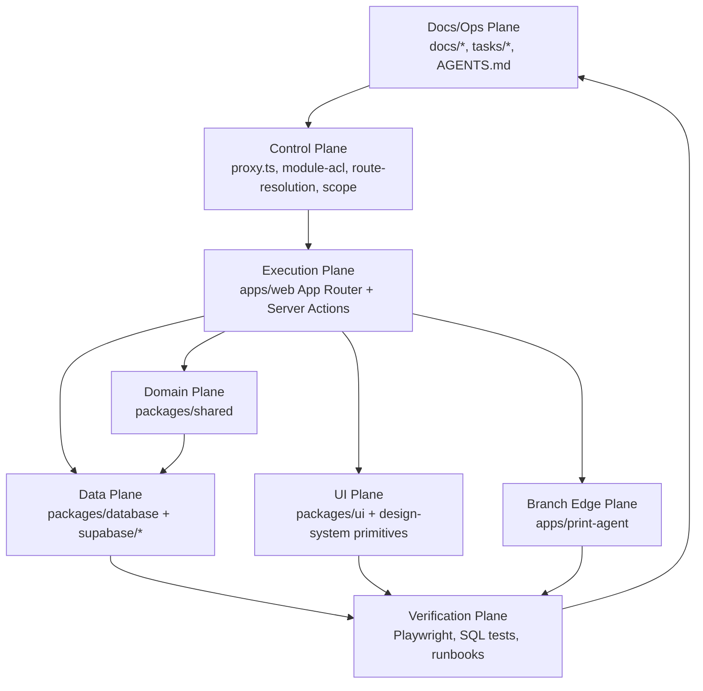

# Architecture — Cơm Tấm Má Tư

## Hierarchy

```
Tenant (L0, single row: Cơm Tấm Má Tư CTCP)
  └── Branch (L1, multiple: Chi nhánh Q1, Q3, ...)
        └── Staff (profiles, role-based)
```

## System Overview

```
┌──────────────────────────────────────────────────────────────────────────┐
│  Browser                                                                  │
│  ┌──────────┐ ┌──────────┐ ┌──────────┐ ┌──────────┐ ┌──────────┐        │
│  │ Admin    │ │Inventory │ │ Finance  │ │ HR       │ │Notifs    │        │
│  │ /admin/* │ │/inventory│ │ /finance │ │ /hr      │ │/notifs.  │        │
│  └──────────┘ └──────────┘ └──────────┘ └──────────┘ └──────────┘        │
│  ┌──────────┐ ┌──────────┐ ┌──────────┐ ┌──────────┐ ┌──────────┐        │
│  │ Orders   │ │ POS      │ │ KDS      │ │ Br Settings/Menu Limits        │
│  │ /orders  │ │ /br/*/pos│ │ /br/*/kds│ │ /br/[id]/{settings,menu-limits}│
│  └──────────┘ └──────────┘ └──────────┘ └──────────┘ ┌──────────┐        │
│                                                       │Employee  │        │
│                                                       │/employee │        │
│                                                       └──────────┘        │
└────────────────────┬─────────────────────────────────────────────────────┘
                     │
              ┌──────▼──────┐
              │  proxy.ts   │  Auth + ACL routing
              └──────┬──────┘
                     │
              ┌──────▼──────┐
              │  Next.js 16 │  App Router (RSC + Server Actions)
              │  App Router │
              └──────┬──────┘
                     │
         ┌───────────┼───────────┐
         │           │           │
    ┌────▼────┐ ┌────▼────┐ ┌───▼────┐
    │Supabase │ │Supabase │ │Upstash │
    │  Auth   │ │PostgREST│ │ Redis  │
    │  + JWT  │ │  + RLS  │ │  Rate  │
    └─────────┘ └─────────┘ └────────┘
```

## Auth Flow

```
Login → signInWithPassword() → custom_access_token_hook (SECURITY DEFINER)
  → JWT minted with { tenant_id, branch_id, user_role, position }
  → proxy.ts reads claims (from access_token, not user.app_metadata) → route to role's default page

Every DB query/mutation → RLS → has_permission(branch_id, key) on staff_permissions
```

**Auth v2 layer:** `user_role` is derived from `positions.legacy_role_code` and kept for backward compat (route-level `canAccess`). Row-level authz runs against the `staff_permissions` grant table via the `has_permission()` SQL helper (owner bypass, temporal validity window, tenant-wide via NULL branch). See `docs/modules/auth.md` for the full model.

### Role → Default Route

Defined in `getDefaultRedirect(claims)` (`packages/shared/src/auth/scope.ts`).

| Role                                                                                                            | Route              |
| --------------------------------------------------------------------------------------------------------------- | ------------------ |
| `ADMIN_ROLES` = owner, super_manager                                                                            | `/admin/dashboard` |
| All others (area_manager, branch_manager, warehouse_manager, production_manager, cashier, waiter, chef, office) | `/employee`        |

POS/KDS are not anyone's default landing — operators reach `/br/[branchId]/pos` or `/kds` via the employee shell or a direct link.

## RLS Pattern

```sql
-- Tenant-scoped (all tables)
USING (tenant_id = auth_tenant_id())

-- Branch-scoped (with manager override)
USING (branch_id = auth_branch_id()
  OR auth_role() IN ('owner', 'super_manager', 'area_manager'))
```

## Package Dependencies

```
@comtammatu/web
  ├── @comtammatu/shared    (auth types, ACL, scope helpers)
  ├── @comtammatu/database  (Supabase clients)
  ├── @comtammatu/ui        (shadcn/ui components)
  └── @comtammatu/security  (Upstash rate limiting)
```

## Operating Planes

The codebase should be navigated and changed by operating plane, not by folder name alone. The current Understand Anything graph snapshot identifies these active planes:



Change ownership:

| Plane       | Owns                                                 | First files to inspect                                                                                                                             |
| ----------- | ---------------------------------------------------- | -------------------------------------------------------------------------------------------------------------------------------------------------- |
| Control     | Auth, ACL, host/surface routing, branch scope        | `apps/web/proxy.ts`, `packages/shared/src/auth/route-resolution.ts`, `packages/shared/src/auth/module-acl.ts`, `packages/shared/src/auth/scope.ts` |
| Execution   | Route behavior, Server Actions, realtime UI flows    | `apps/web/app/**`, route-local `actions.ts`, `apps/web/app/_lib/*`                                                                                 |
| Domain      | Business rules shared across routes/providers        | `packages/shared/src/**`                                                                                                                           |
| Data        | Schema, RLS, RPCs, generated types, Supabase clients | `supabase/migrations/**`, `packages/database/src/**`                                                                                               |
| UI          | Reusable primitives and surface rhythm               | `packages/ui/src/components/**`, `apps/web/app/components/surface.tsx`, `docs/spec/design-system.md`                                               |
| Branch Edge | Local print daemon and branch print/QR behavior      | `apps/print-agent/src/**`, branch settings surfaces                                                                                                |
| Docs/Ops    | Current source-of-truth, runbooks, active work state | `docs/CODEBASE_MAP.md`, `docs/modules/**`, `docs/runbooks/**`, `tasks/**`                                                                          |

## Import Boundaries

| Context              | Import from                                | Reason                        |
| -------------------- | ------------------------------------------ | ----------------------------- |
| Server Actions / RSC | `@comtammatu/database`                     | Full barrel OK — server-only  |
| proxy.ts / Edge      | `@comtammatu/database/supabase/middleware` | No Node.js deps               |
| "use client"         | `@comtammatu/database/supabase/client`     | No server deps (next/headers) |

## Routing (path-based, single domain)

> Decision: D009 — path-based, không sub-domain. Sub-domain là Post-v1.0.

Top-level surfaces (see `module-acl.ts` for canonical role lists):

| Surface            | Route                        | Allowed roles (summary)                                                                   |
| ------------------ | ---------------------------- | ----------------------------------------------------------------------------------------- |
| Admin              | `/admin/*`                   | owner, super_manager (+ area/branch_manager on settings sub-routes)                       |
| Inventory          | `/inventory/*`               | owner, super_manager, area_manager, branch_manager, warehouse_manager, production_manager |
| Finance            | `/finance/*`                 | owner, super_manager                                                                      |
| HR                 | `/hr/*`                      | owner, super_manager                                                                      |
| Orders             | `/orders`                    | owner, super_manager, area_manager, branch_manager, cashier                               |
| Notifications      | `/notifications`             | all staff                                                                                 |
| POS                | `/br/[branchId]/pos`         | cashier, waiter, branch_manager                                                           |
| KDS                | `/br/[branchId]/kds`         | chef, branch_manager                                                                      |
| Branch settings    | `/br/[branchId]/settings/*`  | owner, super_manager, area_manager, branch_manager                                        |
| Branch menu limits | `/br/[branchId]/menu-limits` | owner, super_manager, area_manager, branch_manager, cashier, chef                         |
| Employee           | `/employee/*`                | all staff                                                                                 |
| Access denied      | `/access-denied`             | public (rendered with reason copy from `blocked-state.ts`)                                |
| Payment return     | `/payment/momo/return`       | public (Momo redirect target)                                                             |

## Infrastructure Strategy

> Decision: D008 — cloud-first MVP, local-first Phase 2.

```
MVP (v1.0.0):
  Browser → proxy.ts → Next.js → Supabase Cloud
  + PWA Service Worker cache cho offline cơ bản

Post-v1.0 (nếu cần):
  Branch LAN: Mini PC + Bun + SQLite
    POS/KDS → local server (< 1ms)
    Sync worker → Supabase Cloud (mỗi 1-5 min)
```

| Module      | MVP runs on | Post-v1.0 option       |
| ----------- | ----------- | ---------------------- |
| Admin, Menu | Cloud       | Cloud (giữ nguyên)     |
| POS, KDS    | Cloud + PWA | Local-first per branch |
| Payment     | Cloud       | Local-first per branch |
| Stock       | Cloud       | Hybrid                 |
| Finance, HR | Cloud       | Cloud (giữ nguyên)     |
