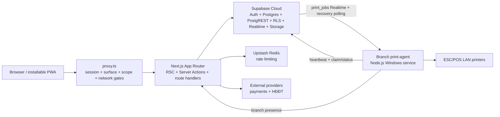
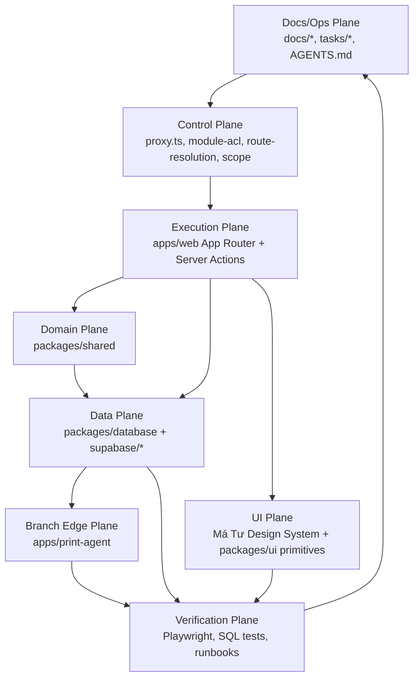

# Architecture — Cơm Tấm Má Tư

## Hierarchy

```text
Tenant (L0, single operating tenant)
├── Operating sites persisted in `branches`
│   ├── `branch`
│   ├── `central_supply`
│   └── `central_kitchen`
└── Staff profiles and site assignments
```

`branches` remains the site table; `branch_id` is the technical scope key.
`Company` and `operational_site` are not runtime hierarchy levels.

**Authority.** Runtime topology, Dual Thesis, and package graph: this file.
Product scope and evolve-in-place: [ADR 0025](../plan/adr/0025-fnb-operating-erp-scope-and-evolution-boundary.md)
— do not treat vendor catalogs as layout or backlog. Owner / Branch / Self
planes: [ADR 0012](../plan/adr/0012-owner-branch-boundary.md) — shared Branch
capability keys never admit the matching L0 family. Coordination `/` and `/me`
as personal plane: [ADR 0037](../plan/adr/0037-control-home-queue-first-and-personal-plane.md)
(compose: `docs/ref/screen-context-map.md`, `docs/spec/page-archetypes.md`).
Work hosting: [ADR 0033](../plan/adr/0033-work-control-surface-module.md) — same
Control Surface, no second app/host. Native Android: [ADR 0038](../plan/adr/0038-native-android-apps-and-pwa-coexistence.md)
— not a runtime of this monorepo; PWA contract in `docs/spec/pwa.md`. Placement:
`docs/CODEBASE_MAP.md#project-placement-matrix`; imports: `docs/agent/rules/engineering.md`.

## System Topology



Two deployable runtimes in this repository: stateless web app + one
branch-local print-agent per active branch. Supabase Cloud is the system of
record; the print-agent adapts LAN printers only. Native Android clients are
a separate Git repository (`app`) per ADR 0038 — not a runtime of this
monorepo.

## Technical Specifications

| Concern              | Contract                                                                                                                               |
| -------------------- | -------------------------------------------------------------------------------------------------------------------------------------- |
| Product shape        | Single tenant, multiple branches, path-based surfaces on one web domain                                                                |
| Web runtime          | Node.js 24.x, Next.js App Router on Vercel; RSC, Server Actions, route handlers, and scheduled routes share one app                    |
| Data authority       | Supabase Cloud owns Auth, Postgres, PostgREST, RLS, Realtime, and Storage                                                              |
| Authorization        | `proxy.ts` gates session/surface/scope; RLS and authorized RPCs own data/action authority                                              |
| Mutation correctness | Server Action input is Zod-validated; multi-row correctness is implemented in one Postgres RPC                                         |
| Offline posture      | Cloud-first PWA (D012); no local-first POS. Install / SW / OS: `docs/spec/pwa.md`                                                      |
| Printing             | `print_jobs` is the durable queue; the branch agent claims idempotently, retries LAN delivery, and recovery-polls around Realtime gaps |
| Delivery             | Web deploys through Vercel; database and branch-agent releases have separate promotion gates                                           |

Framework versions: package manifests + `pnpm-lock.yaml`. Env/deploy/release:
`docs/modules/infrastructure.md`.

## Auth Flow

```
Login → signInWithPassword() → custom_access_token_hook (SECURITY DEFINER)
  → JWT minted with the claim shape owned by packages/shared/src/auth/types.ts
  → proxy.ts reads claims (from access_token, not user.app_metadata) → route to post-login target

Database access → RLS, authorized RPC, or trusted service-role boundary
```

`user_role` derives from `positions.code` (route-level `canAccess` compat).
Permission-sensitive writes use live grants via RLS/RPC. See `docs/modules/auth.md`
and `docs/agent/rules/database.md`.

### Role → Post-Login/Fallback Target

`getDefaultRedirect(claims)` (`packages/shared/src/auth/scope.ts`):

| Role                         | Route                                                 |
| ---------------------------- | ----------------------------------------------------- |
| `owner`                      | `/`, then branch resolver when only one branch exists |
| L0 adapters + `self_service` | `/` (coordination Control home, ADR 0037)             |
| Branch-pinned staff          | `/br/{branchId}`                                      |

Root `/` uses the same resolver (multi-branch → picker). POS/KDS are not
post-login fallbacks — reach via Branch home or direct link.

## Data Authorization Pattern

No generic role predicate to copy:

- Tenant: `auth_tenant_id()`
- Branch: `auth_branch_id()` + documented Owner path
- Revocable authority: `has_permission(branch_id, key)` / `has_permission_any(key)`
- `auth_role()` = compatibility route bucket / structural side guard only

Layer contract: `docs/modules/auth.md`. Policy rules: `docs/agent/rules/database.md`.

## Current Package Dependencies

```text
@comtammatu/web
  ├── @comtammatu/shared | @comtammatu/database | @comtammatu/ui
  ├── @comtammatu/security | @comtammatu/print-render → shared

@comtammatu/print-agent → @comtammatu/print-render → shared
```

Apps are graph leaves; packages never import apps. Use explicit `exports` and
`workspace:*`. New package only for a second runtime, trust boundary, or
independently built artifact.

Project and file placement is owned by
`docs/CODEBASE_MAP.md#project-placement-matrix`; import/runtime boundaries are
owned by `docs/agent/rules/engineering.md`. This architecture spec does not
mirror either contract.

## Operating Planes



| Plane       | Owns                                                     | First files to inspect                                                                               |
| ----------- | -------------------------------------------------------- | ---------------------------------------------------------------------------------------------------- |
| Control     | Auth, ACL, host/surface routing, branch scope            | `apps/web/proxy.ts`, `packages/shared/src/auth/{route-resolution,module-acl,scope}.ts`               |
| Execution   | Route behavior, Server Actions, realtime UI flows        | `apps/web/app/**`, route-local `actions.ts`, `apps/web/app/_lib/*`                                   |
| Domain      | Business rules shared across routes/providers            | `packages/shared/src/**`                                                                             |
| Data        | Schema, RLS, RPCs, generated types, Supabase clients     | `supabase/migrations/**`, `packages/database/src/**`                                                 |
| UI          | Má Tư Design System, reusable primitives, surface rhythm | `docs/spec/design-system.md`, `packages/ui/src/components/**`, `apps/web/app/components/surface.tsx` |
| Branch Edge | Local print daemon and branch print/QR behavior          | `apps/print-agent/src/**`, branch settings surfaces                                                  |
| Docs/Ops    | Current source-of-truth, runbooks, active work state     | `docs/CODEBASE_MAP.md`, `docs/modules/**`, `docs/runbooks/**`, `tasks/**`                            |

## Product Dual Thesis

Two product halves — structure, naming, chrome, and adapters must make both obvious.

| Product half (VI)                 | Job                                                                     | Plane ID          | Route root                                                                                      | Shell                       | Adapter prefix    |
| --------------------------------- | ----------------------------------------------------------------------- | ----------------- | ----------------------------------------------------------------------------------------------- | --------------------------- | ----------------- |
| **`Quản lý hệ thống`**            | Tenant/branch oversight, menu, central inventory, finance, HR, work, settings | `control_surface` | `/`, `/menu`, `/orders`, `/inventory`, `/finance`, `/hr`, `/work`, `/branches`, `/settings`, `/feedback` | `AppShell` (nav-as-data)    | `App*`            |
| **`Vận hành bán hàng` (ca)**      | Shift work, branch stock, team, branch settings                         | `branch_surface`  | `/br/[branchId]/*` (excl. stations)                                                             | Branch operator chrome      | `BranchOperator*` |
| **`Vận hành bán hàng` (station)** | Sell / kitchen / pickup queue                                           | `station_chrome`  | `/br/[branchId]/{pos,kds,pickup}`                                                               | Station chrome              | station adapters  |
| **`Trang cá nhân`**               | Self `/me` (ADR 0012/0037); Owner excluded (`module-acl` `me`)          | `self_surface`    | `/me/*`                                                                                         | Control shell / `Employee*` | `Employee*`       |
| **Public / `khách`**              | Auth, guest order, feedback QR, pickup display                          | `public`          | `/login`, `/q`, `/r`, …                                                                         | none                        | —                 |

- UI copy for the L0 half: **`Quản trị`** / **`Hệ thống`**. Role ACL `owner` is not a plane name.
- Runtime plane id `RouteSurface: "owner"` remains a technical alias of
  **`control_surface`**. DOM scrollport is `data-control-surface-scroll`.
  Chrome component is `ControlSurfaceShell`. New docs/UI copy use
  `control_surface` / `Quản trị`.
- Dual-plane inventory keeps **two jobs** (`/inventory/*` oversight vs `/br/.../stock/*` shift work). Share implementation; do not merge URLs.
- Shared Branch capability keys such as `inventory` and `orders` may protect
  Branch-native routes but never grant the matching L0 Owner family (ADR 0012).
- External module catalogs are a vision map for capability existence (ADR 0025).
  They are not a monorepo layout and not a sprint backlog.
- Vocabulary detail: `docs/ref/glossary.md`. Chrome: `docs/spec/design-system.md`. Routes: `docs/modules/web-app.md`, `docs/spec/role-route-matrix.md`.

### Folder placement (Dual Thesis)

| Concern                                      | Lives under                                                     | Notes                                         |
| -------------------------------------------- | --------------------------------------------------------------- | --------------------------------------------- |
| **`Quản trị`** L0 routes                     | `apps/web/app/(protected)/{menu,orders,inventory,finance,hr,…}` | `App*` adapters; one `AppShell` + nav-as-data |
| Branch operations + stations                 | `apps/web/app/(protected)/br/[branchId]/…`                      | `BranchOperator*` / station chrome            |
| Branch settings UI (POS/KDS/tables/printers) | `apps/web/app/(protected)/br/_shared/settings/`                 | Not a fake L0 `branch-settings/` tree         |
| Dual-plane shared domain logic               | `apps/web/lib/inventory/*`                                      | Same core; different presenters               |

**Nav-as-data:** one `AppShell`; layouts import `ControlSurfaceShell`; deep nav
via `resolveControlSurfaceDeepNav`. Do not rewrite POS/KDS.

D009 remains path-based on one domain. Exact role, module, route, and scope
mappings are generated in `docs/spec/role-route-matrix.md`; do not mirror them
here. BM/Staff daily work stays under `/br/[branchId]/*`; `control_surface` is
L0-gated per ADR 0012.

## Infrastructure Strategy

Web + DB remain cloud-authoritative. D012 still rejects local-first POS. This
repo keeps the PWA (`docs/spec/pwa.md`) and branch print-agent. Native Android
clients (repository `app`) are ADR 0038 and optional per branch; do not add an
Android/Gradle tree here. Topology, secrets, CI, promotion:
`docs/modules/infrastructure.md`.
