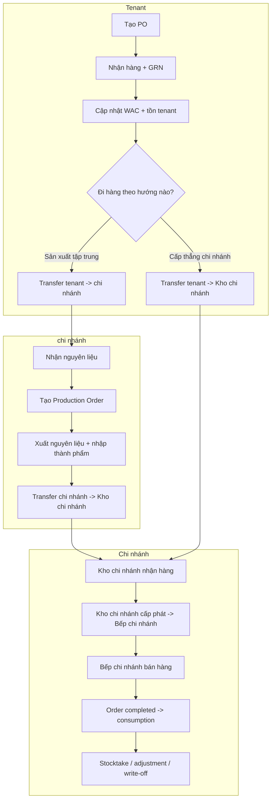
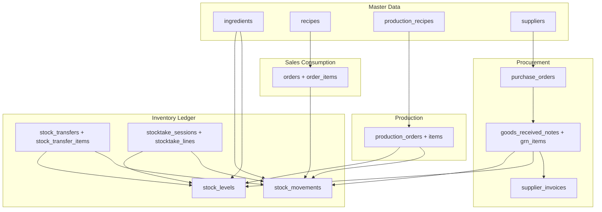
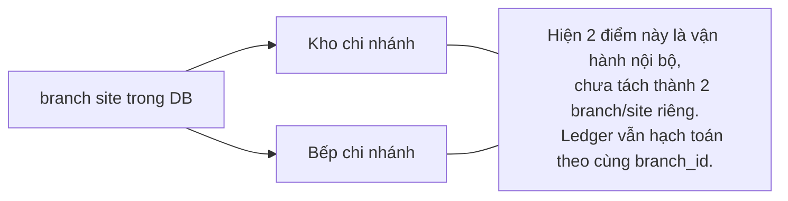

# Inventory Overview Diagrams

> Mục tiêu: cung cấp bộ sơ đồ tổng quát cho toàn bộ Inventory domain.
>
> Boundary hiện tại:
>
> - `tenant` có thể chuyển thẳng về `Kho chi nhánh`.
> - `chi nhánh` là một node sản xuất/phân phối hợp lệ, không phải hop bắt buộc.
> - `Kho chi nhánh` và `Bếp chi nhánh` là hai điểm vận hành trong cùng site `branch`, tách bằng `inventory_locations`; cấp bếp dùng intra-branch transfer.

---

## 1. Executive Overview

```mermaid
flowchart LR
    SUP["Nhà cung cấp"]
    tenant["Tenant"]
    chi nhánh["chi nhánh"]
    BW["Kho chi nhánh"]
    BK["Bếp chi nhánh"]
    POS["POS / Bán hàng"]
    CTRL["Kiểm soát: stocktake / alerts / reports"]

    SUP -->|"PO -> GRN -> Supplier Invoice"| tenant

    tenant -->|"Transfer trực tiếp"| BW
    tenant -->|"Transfer nguyên liệu"| chi nhánh

    chi nhánh -->|"Production Order"| chi nhánh
    chi nhánh -->|"Transfer thành phẩm"| BW

    BW -->|"Cấp phát nội bộ"| BK
    BK -->|"Tiêu hao theo order completed"| POS

    tenant --- CTRL
    chi nhánh --- CTRL
    BW --- CTRL
    BK --- CTRL
```

---

## 2. Ops SOP Swimlane



---

## 3. System/Data Architecture



---

## 4. Branch Boundary



---

## 5. Cách Dùng

- Dùng sơ đồ `Executive Overview` khi cần giải thích flow business cho stakeholder.
- Dùng sơ đồ `Ops SOP Swimlane` khi training vận hành tenant, chi nhánh, và chi nhánh.
- Dùng sơ đồ `System/Data Architecture` khi review tác động code, migrations, hoặc reporting.
- Dùng sơ đồ `Branch Boundary` để nhắc rằng `Kho chi nhánh` và `Bếp chi nhánh` hiện chưa tách thành node dữ liệu riêng.

## 6. Tài Liệu Liên Quan

- [inventory.md](../ref/inventory.md)
- [inventory-sop.md](../ref/inventory-sop.md)
- [inventory-role-handoff.md](../ref/inventory-role-handoff.md)
- [inventory-rbac-matrix.md](../ref/inventory-rbac-matrix.md)
- [architecture.md](architecture.md)
