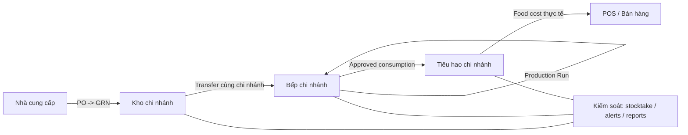
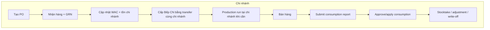
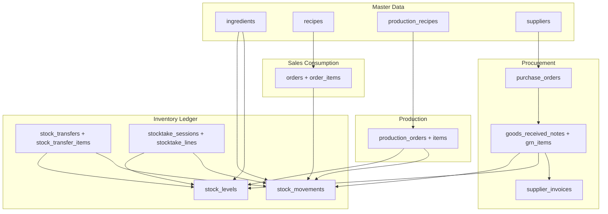
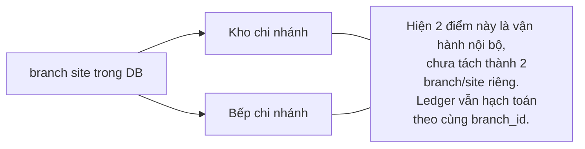

# Inventory Overview Diagrams

> Mục tiêu: cung cấp bộ sơ đồ tổng quát cho toàn bộ Inventory domain.
>
> Boundary hiện tại:
>
> - `branch` là site kind duy nhất đang active trên bảng `branches`.
> - `Kho chi nhánh` là stock-bearing location của chi nhánh.
> - `Bếp chi nhánh` (`branch` + `kitchen`) cũng là stock-bearing location; tiêu hao ghi nhận tại đây.

---

## 1. Executive Overview

---

## 2. Ops SOP Swimlane

---

## 3. System/Data Architecture

---

## 4. Branch Boundary

---

## 5. Cách Dùng

- Dùng sơ đồ `Executive Overview` khi cần giải thích flow business cho stakeholder.
- Dùng sơ đồ `Ops SOP Swimlane` khi training vận hành tenant và chi nhánh.
- Dùng sơ đồ `System/Data Architecture` khi review tác động code, migrations, hoặc reporting.
- Dùng sơ đồ `Branch Boundary` để nhắc rằng `Kho chi nhánh` và `Bếp chi nhánh` hiện chưa tách thành node dữ liệu riêng.

## 6. Tài Liệu Liên Quan

- [inventory.md](../ref/inventory.md)
- [inventory-sop.md](../ref/inventory-sop.md)
- [inventory-role-handoff.md](../ref/inventory-role-handoff.md)
- [inventory-rbac-matrix.md](../ref/inventory-rbac-matrix.md)
- [architecture.md](architecture.md)
