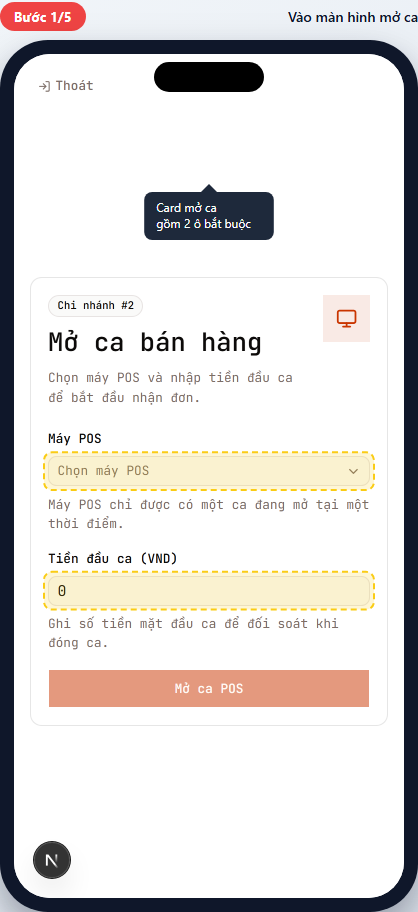
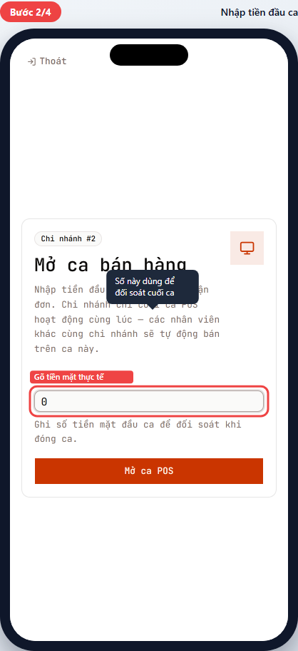
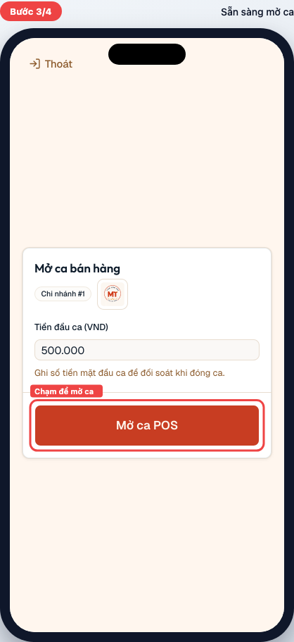
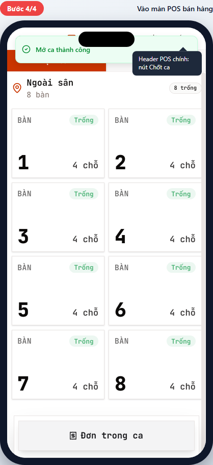

# POS-01 — Mở ca POS

> Hướng dẫn mở ca bán hàng đầu giờ trên màn hình POS.
> Dành cho **thu ngân (cashier)** và **quản lý chi nhánh (branch manager)**.

> 📌 **Per-branch model (D7, 2026-04-27):** Chi nhánh chỉ có **1 ca POS hoạt động cùng lúc**. Cashier mở ca → tất cả nhân viên cùng chi nhánh ride chung ca đó (waiter, chef đều thấy đơn). Không cần chọn máy POS cụ thể.

## Tóm tắt

| Trường | Giá trị |
| --- | --- |
| **Vai trò** | Thu ngân, Quản lý chi nhánh |
| **Quyền cần có** | `pos:open_cashbox` (mở két) |
| **Điều kiện trước** | Đã đăng nhập, đã được phân chi nhánh |
| **Kết quả đúng** | Hệ thống tạo ca POS mới (status `open`); UI chuyển sang màn POS chính (table picker / menu) |
| **Thời gian** | ~15 giây |

## Đường dẫn

URL: `/br/{branchId}/pos`
Ví dụ: `/br/1/pos`

## Các bước

### Bước 1 — Vào màn hình mở ca

**Bạn thấy:** Card "Mở ca bán hàng" với:

- Badge "Chi nhánh #N".
- Mô tả: "Nhập tiền đầu ca để bắt đầu nhận đơn. Chi nhánh chỉ có 1 ca POS hoạt động cùng lúc — các nhân viên khác cùng chi nhánh sẽ tự động bán trên ca này."
- Ô **Tiền đầu ca (VND)** (mặc định 0).
- Nút **Mở ca POS** (active ngay vì 0 cũng là số hợp lệ).

**Bạn chuẩn bị:** Đếm tiền mặt thực tế trong két ngay lúc này.

> 🛡️ Nếu thấy "Bạn không có quyền mở ca" → bạn KHÔNG phải thu ngân/quản lý. Báo họ mở giúp. Xem [Tình huống ngoại lệ](#không-có-quyền-mở-ca).

### Bước 2 — Nhập tiền đầu ca

**Bạn làm:** Chạm ô **Tiền đầu ca (VND)** → gõ số tiền mặt thực tế trong két.

**Ví dụ:** Két có sẵn 500.000đ → gõ `500000` (ô input tự format có dấu chấm khi mất focus).

> 💡 Số này dùng để đối soát khi đóng ca cuối ngày (POS-09). Nhập sai → cuối ca lệch tiền → phải giải trình. Đếm kỹ trước khi gõ.

### Bước 3 — Sẵn sàng mở ca

**Bạn thấy:** Số tiền đã nhập (ví dụ 500.000) hiện trong ô. Nút **Mở ca POS** sáng (đỏ).

**Bạn làm:** Chạm **Mở ca POS**.

### Bước 4 — Vào màn POS bán hàng

**Bạn thấy:**

- Toast xanh "Mở ca thành công" hiện ngắn (1-2s).
- Màn hình chuyển sang giao diện chính:
  - Header: "Thoát" + tên chi nhánh + nút **Chốt ca** (góc phải).
  - 2 tab "Tại bàn" / "Mang về" — default "Tại bàn".
  - Table grid theo zones.

✅ **Xong!** Bây giờ có thể nhận đơn. Tiếp tục với [POS-02 — Chọn bối cảnh bán hàng](pos-02-select-context.md).

---

## Tình huống ngoại lệ

### Không có quyền mở ca

> _Mockup chưa có (cần waiter test account để capture — sẽ bổ sung sau)_

**Khi nào gặp:** Vai trò phục vụ (waiter), bếp (chef) — không có quyền `pos:open_cashbox`.

**Bạn thấy:** Màn "Chờ mở ca" với hướng dẫn:

> Bạn không có quyền mở ca. Liên hệ thu ngân hoặc quản lý chi nhánh để mở ca trước khi nhận đơn.

**Cách xử lý:** Báo thu ngân/quản lý chi nhánh mở ca. Sau khi họ mở xong, **tải lại trang** — bạn sẽ vào thẳng màn POS chính (ride chung ca thu ngân).

### Chi nhánh đã có ca đang mở

**Khi nào gặp:** Bạn vào POS sau khi đồng nghiệp đã mở ca trước.

**Bạn thấy:** **KHÔNG** thấy form "Mở ca bán hàng" — vào thẳng màn POS chính.

**Cách xử lý:** Không cần làm gì. Bán hàng bình thường trên ca đã có. Per-branch model = 1 ca cho cả chi nhánh.

> 💡 Khác với model cũ (per-terminal): không có picker "Chọn máy POS bạn đang dùng" nữa. Nếu thấy picker đó, hệ thống đang dùng version cũ — báo kỹ thuật.

### Lỗi mạng khi mở ca

**Bạn thấy:** Toast đỏ "Không thể mở ca. Vui lòng thử lại."

**Cách xử lý:**

1. Kiểm tra wifi/mạng → nếu rớt, đợi mạng có lại rồi nhấn "Mở ca POS" lần nữa.
2. Nếu mạng tốt mà vẫn lỗi → báo kỹ thuật. Đừng nhấn liên tục — có thể tạo ca trùng.

---

## Tham khảo nội bộ

> Phần này dành cho kỹ thuật và quản lý đào tạo, không cần đọc nếu bạn là nhân viên vận hành.

### Code path

- **UI:** [apps/web/app/(protected)/br/[branchId]/pos/session-gate.tsx](../../../../apps/web/app/(protected)/br/%5BbranchId%5D/pos/session-gate.tsx)
- **Server action:** [apps/web/app/(protected)/br/[branchId]/pos/session-actions.ts](../../../../apps/web/app/(protected)/br/%5BbranchId%5D/pos/session-actions.ts) — function `openPosSession`
- **Page-level orchestration:** [apps/web/app/(protected)/br/[branchId]/pos/page.tsx](../../../../apps/web/app/(protected)/br/%5BbranchId%5D/pos/page.tsx)

### Database (per-branch model D7)

- Insert vào `pos_sessions` với `terminal_id = NULL` (per-branch không bind terminal cụ thể).
- Constraint: `UNIQUE(branch_id) WHERE status = 'open'` — chống mở 2 ca cùng chi nhánh.
- Mã lỗi `23505` (duplicate) → trả thông báo "Chi nhánh đã có ca đang mở. Vui lòng dùng ca hiện tại."
- Realtime sync: subscribe channel `pos_sessions:branch_id=eq.{branchId}` để các tab khác auto-refresh khi ca đóng/mở.

### Permission

- Key: `pos:open_cashbox` (catalog: [packages/shared/src/auth/permissions.ts](../../../../packages/shared/src/auth/permissions.ts)).
- Server-side check: `getAuthContextWithPermission(POS_ROLES, PERMISSION_KEYS.POS_OPEN_CASHBOX, branchId)`.
- Page-level gate: `permFlags.canOpenShift` → render `PosStatusShell` thay vì `SessionGate` khi waiter vào.

### Tham chiếu thiết kế

- Per-branch session migration: commit `0ccb059 feat(pos): per-branch session model + realtime sync (D7)`
- Order lifecycle: [docs/archive/plan/m2-order-lifecycle.md](../../../archive/plan/m2-order-lifecycle.md)
- UI page contracts: [docs/archive/plan/ui-ux-page-contracts.md](../../../archive/plan/ui-ux-page-contracts.md)
- Design system: [docs/spec/design-system.md](../../../spec/design-system.md)

---

## Metadata mockup

| Trường | Giá trị |
| --- | --- |
| Viewport | 390×844 (iPhone mặc định) — đổi tại [paths.ts](../../../../apps/web/e2e/guides/_lib/paths.ts) |
| Capture script | [apps/web/e2e/guides/pos-01-open-session.guide.ts](../../../../apps/web/e2e/guides/pos-01-open-session.guide.ts) |
| Lệnh refresh | `pnpm --filter @comtammatu/web guides:capture --grep="POS-01"` |
| Cập nhật mockup gần nhất | 2026-04-27 |
| Model bám | per-branch (D7) — `0ccb059` |
| Người maintain | _TBD_ |
