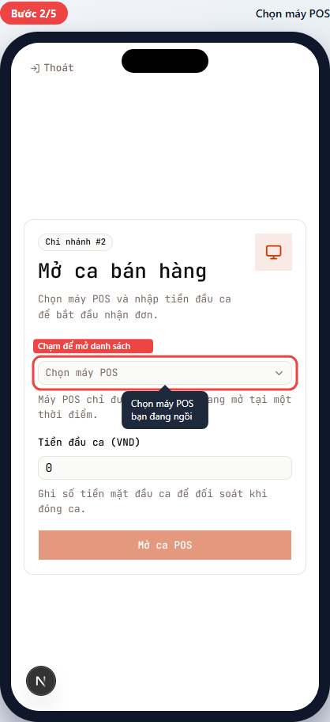
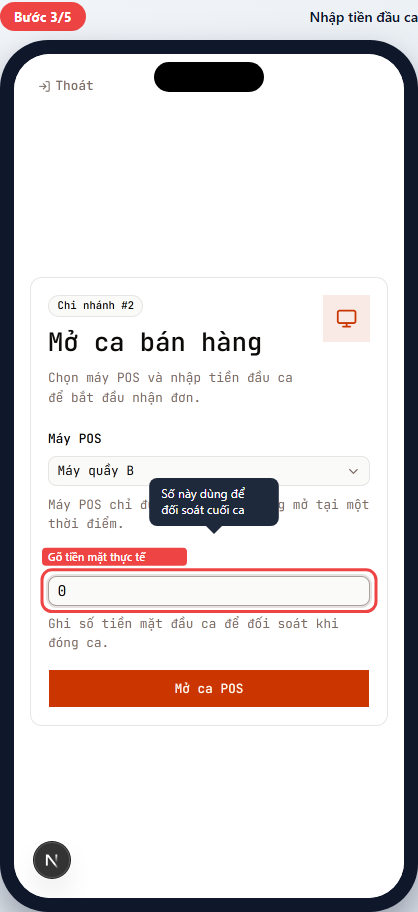
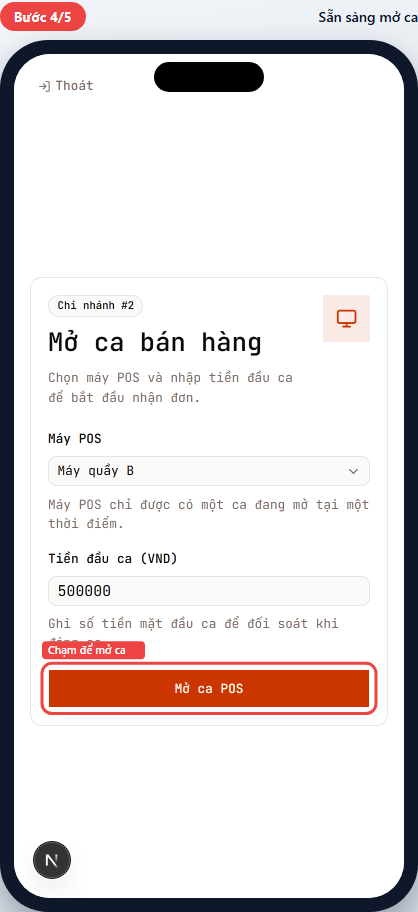
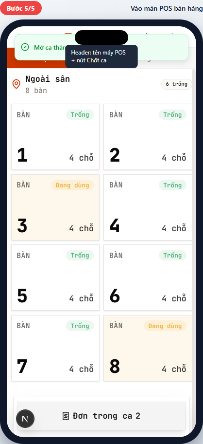
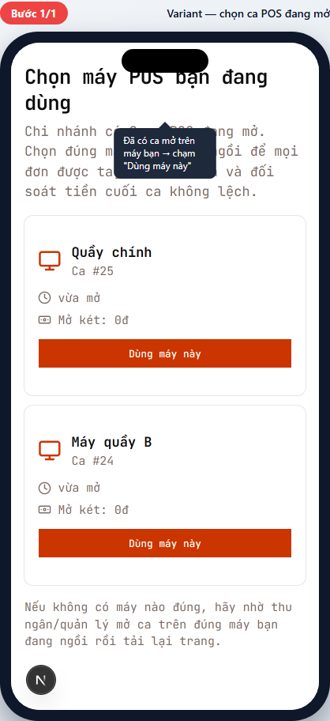

# POS-01 — Mở ca POS

> Hướng dẫn mở ca bán hàng đầu giờ trên màn hình POS.
> Dành cho **thu ngân (cashier)** và **quản lý chi nhánh (branch manager)**.

## Tóm tắt

| Trường | Giá trị |
| --- | --- |
| **Vai trò** | Thu ngân, Quản lý chi nhánh |
| **Quyền cần có** | `pos:open_cashbox` (mở két) |
| **Điều kiện trước** | Đã đăng nhập, đã được phân chi nhánh, chi nhánh có ít nhất 1 máy POS đang hoạt động |
| **Kết quả đúng** | Hệ thống tạo ca POS mới (status `open`); UI chuyển sang màn POS chính (menu + danh sách bàn) |
| **Thời gian** | ~30 giây |

## Đường dẫn

URL: `/br/{branchId}/pos`
Ví dụ: `/br/1/pos`

## Các bước

### Bước 1 — Vào màn hình mở ca

**Bạn thấy:** Thẻ "Mở ca bán hàng" hiện tên chi nhánh, ô chọn máy POS, ô nhập tiền đầu ca.

**Bạn làm:** Chuẩn bị 2 thông tin trước khi gõ:

1. Máy POS bạn đang ngồi tên gì (ví dụ "Máy quầy A").
2. Số tiền mặt thực tế trong két ngay lúc này.

> 🛡️ Nếu thấy "Bạn không có quyền mở ca" → bạn KHÔNG phải thu ngân. Báo thu ngân/quản lý mở giúp. Xem [Tình huống ngoại lệ](#không-có-quyền-mở-ca) bên dưới.

### Bước 2 — Chọn máy POS

**Bạn làm:** Chạm ô "Chọn máy POS" → danh sách máy POS hiện ra → chạm máy đúng vị trí bạn đang ngồi.

> ⚠️ Quan trọng: máy nào hiện chữ "đang có ca mở" thì KHÔNG chọn được — đã có người mở ca trên máy đó. Chọn máy khác hoặc nhờ người đó chốt ca trước.

### Bước 3 — Nhập tiền đầu ca

**Bạn làm:** Đếm tiền mặt thực tế trong két, gõ số đó vào ô **Tiền đầu ca (VND)**.

**Ví dụ:** Két có sẵn 500.000đ → gõ `500000` (không gõ dấu chấm).

> 💡 Số này dùng để đối soát khi đóng ca cuối ngày. Nhập sai → cuối ca lệch tiền → phải giải trình. Đếm kỹ trước khi gõ.

### Bước 4 — Sẵn sàng mở ca

**Bạn thấy:** Nút **Mở ca POS** sáng lên (đổi từ xám sang màu chính).

**Bạn làm:** Chạm **Mở ca POS**.

### Bước 5 — Vào màn POS bán hàng

**Bạn thấy:**

- Toast "Mở ca thành công" hiện ngắn rồi tự đóng.
- Màn hình chuyển sang giao diện chính: tên máy POS hiện trên header, có nút "Chốt ca" góc phải, danh sách bàn / menu sẵn sàng nhận đơn.

✅ **Xong!** Bây giờ có thể nhận đơn. Tiếp tục với [POS-02 — Chọn bối cảnh bán hàng](../flow-index.md).

---

## Tình huống ngoại lệ

### Không có quyền mở ca

> _Mockup chưa có (cần waiter test account để capture — sẽ bổ sung sau)_

**Khi nào gặp:** Vai trò phục vụ (waiter) — không có quyền `pos:open_cashbox`.

**Bạn thấy:** Màn "Chờ mở ca" với hướng dẫn liên hệ thu ngân:

> Bạn không có quyền mở ca. Liên hệ thu ngân hoặc quản lý chi nhánh để mở ca trước khi nhận đơn.

**Cách xử lý:** Báo thu ngân/quản lý chi nhánh mở ca. Sau khi họ mở xong, tải lại trang — bạn sẽ vào thẳng màn POS chính (ride chung ca thu ngân).

### Có ca đang mở trên máy bạn dùng

**Khi nào gặp:** Chi nhánh đã có 1 hoặc nhiều ca POS đang mở (ví dụ thu ngân ca trước chưa chốt, hoặc đồng nghiệp đã mở rồi).

**Bạn thấy:** Màn "Chọn máy POS bạn đang dùng" hiện danh sách ca đang mở (mỗi card là một máy POS + thời gian mở + tiền mở két).

**Cách xử lý:**

1. Tìm thẻ máy POS bạn đang ngồi → chạm "Dùng máy này" → vào thẳng màn POS chính (ride chung ca có sẵn).
2. Nếu không thấy máy bạn ngồi trong danh sách → nhờ thu ngân/quản lý mở ca trên máy đó trước, rồi tải lại trang.

> 💡 Quan trọng: chọn ĐÚNG máy bạn đang ngồi. Chọn nhầm → đơn bị tag vào ca máy khác → cuối ca đối soát tiền lệch.

### Chi nhánh chưa có máy POS

> _Mockup chưa có (capture destructive — phải xóa toàn bộ máy POS, ảnh hưởng các test khác)_

**Khi nào gặp:** Quản lý chưa thiết lập máy POS nào trên chi nhánh.

**Bạn thấy:** Trong Card "Mở ca bán hàng", thay vì ô chọn máy POS sẽ là alert vàng:

> ⚠️ Chưa có máy POS. Liên hệ quản lý để thiết lập máy POS trước khi mở ca.

**Cách xử lý:** Báo quản lý vào `Quản lý → Cấu hình → Máy POS` để tạo máy trước. Không thể bán hàng cho đến khi có máy.

### Lỗi mạng khi mở ca

**Bạn thấy:** Toast đỏ "Không thể mở ca. Vui lòng thử lại."

**Cách xử lý:**

1. Kiểm tra wifi/mạng → nếu rớt, đợi mạng có lại rồi nhấn "Mở ca POS" lần nữa.
2. Nếu mạng tốt mà vẫn lỗi → báo kỹ thuật. Đừng nhấn liên tục — có thể tạo ra ca trùng.

---

## Tham khảo nội bộ

> Phần này dành cho kỹ thuật và quản lý đào tạo, không cần đọc nếu bạn là nhân viên vận hành.

### Code path

- **UI:** [apps/web/app/br/[branchId]/pos/session-gate.tsx](../../../../apps/web/app/br/%5BbranchId%5D/pos/session-gate.tsx)
- **Server action:** [apps/web/app/br/[branchId]/pos/session-actions.ts](../../../../apps/web/app/br/%5BbranchId%5D/pos/session-actions.ts) — function `openPosSession`
- **Page-level orchestration:** [apps/web/app/br/[branchId]/pos/page.tsx](../../../../apps/web/app/br/%5BbranchId%5D/pos/page.tsx)

### Database

- Insert vào bảng `pos_sessions`.
- Constraint: `UNIQUE(terminal_id) WHERE status = 'open'` — chống mở 2 ca trên cùng máy.
- Mã lỗi `23505` (duplicate) → trả thông báo "Máy POS này đã có ca đang mở".

### Permission

- Key: `pos:open_cashbox` (catalog: [packages/shared/src/auth/permissions.ts](../../../../packages/shared/src/auth/permissions.ts)).
- Server-side check: `getAuthContextWithPermission(POS_ROLES, PERMISSION_KEYS.POS_OPEN_CASHBOX, branchId)`.
- Page-level gate: `permFlags.canOpenShift` → render `PosStatusShell` thay vì `SessionGate` khi waiter vào.

### Tham chiếu thiết kế

- Order lifecycle: [docs/plan/m2-order-lifecycle.md](../../../plan/m2-order-lifecycle.md)
- UI page contracts: [docs/plan/ui-ux-page-contracts.md](../../../plan/ui-ux-page-contracts.md)
- Design system: [docs/spec/design-system.md](../../../spec/design-system.md)

---

## Metadata mockup

| Trường | Giá trị |
| --- | --- |
| Viewport | 390×844 (iPhone mặc định) — đổi tại [paths.ts](../../../../apps/web/e2e/guides/_lib/paths.ts) |
| Capture script | [apps/web/e2e/guides/pos-01-open-session.guide.ts](../../../../apps/web/e2e/guides/pos-01-open-session.guide.ts) |
| Lệnh refresh | `pnpm --filter @comtammatu/web guides:capture --grep="POS-01"` |
| Cập nhật mockup gần nhất | 2026-04-26 |
| Commit POS bám | `bb8ab4c` |
| Người maintain | _TBD_ |
