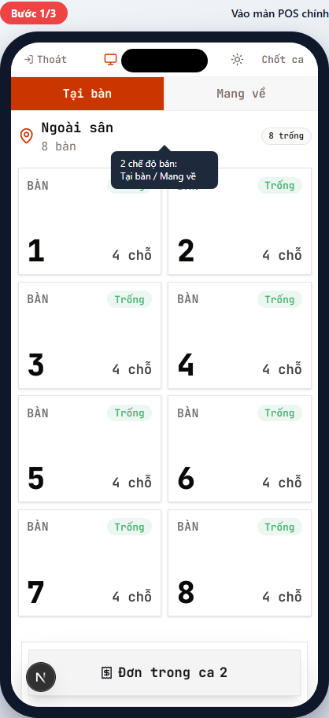
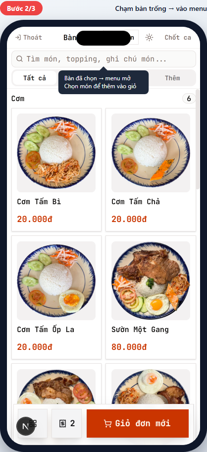
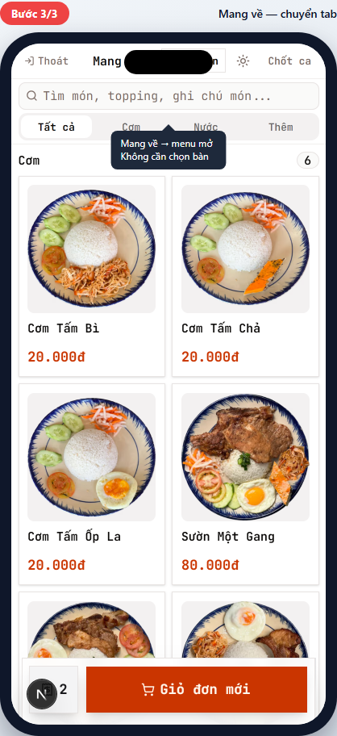
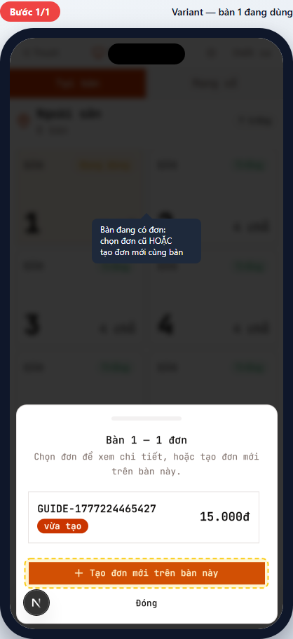

# POS-02 — Chọn bối cảnh bán hàng

> Hướng dẫn chọn **Tại bàn** hay **Mang về**, chọn bàn, và xử lý bàn đang có đơn.
> Dành cho **phục vụ (waiter)** và **thu ngân (cashier)**.

## Tóm tắt

| Trường | Giá trị |
| --- | --- |
| **Vai trò** | Phục vụ, Thu ngân, Quản lý chi nhánh |
| **Quyền cần có** | `pos:use` (mặc định mọi vai trò POS đều có) |
| **Điều kiện trước** | Ca POS đã mở (xem [POS-01](pos-01-open-session.md)) |
| **Kết quả đúng** | Vào màn menu với context đã chọn (Tại bàn N + dine_in, hoặc Mang về + takeaway) — sẵn sàng tạo đơn (POS-03) |
| **Thời gian** | ~10 giây |

## Đường dẫn

URL: `/br/{branchId}/pos` (sau khi ca đã mở, mặc định landing trên màn này)

## Các bước

### Bước 1 — Vào màn POS chính

**Bạn thấy:**

- Header: nút "Thoát" (về cổng nhân viên), tên máy POS, nút "Chốt ca".
- 2 tab "Tại bàn" / "Mang về" — mặc định **Tại bàn** đang chọn.
- Danh sách bàn theo khu vực (ví dụ "Ngoài sân"), badge `8 trống` ở góc phải zone.
- Mỗi bàn hiện: số bàn, sức chứa, badge trạng thái (`Trống` xanh / `Đang dùng` vàng / `Đã đặt` xám).

**Bạn quyết định:** khách ngồi tại bàn → giữ tab "Tại bàn"; khách lấy về → chuyển tab "Mang về" (xem Bước 3).

### Bước 2 — Khách tại bàn → chạm bàn trống

**Bạn làm:** Chạm bàn có badge `Trống` (ví dụ Bàn 1).

**Bạn thấy:** Màn chuyển sang **menu**:

- Header đổi: "Bàn 1" + nút "Đổi bàn" (nếu cần chuyển bàn khác).
- Ô tìm món + tabs danh mục (`Tất cả` / `Cơm` / `Nước` / `Thêm`).
- Lưới món với hình + giá.
- Bottom: nút **Giỏ đơn mới** (đỏ, lớn).

✅ Đã có context. Bước tiếp: chọn món (xem POS-03).

> 💡 Muốn đổi sang bàn khác? Chạm "Đổi bàn" ở header → quay lại màn chọn bàn.

### Bước 3 — Khách mang về → chạm tab "Mang về"

**Bạn làm:** Từ màn POS chính (Bước 1), chạm tab **Mang về** trên header.

**Bạn thấy:** Màn chuyển thẳng sang **menu** (không cần chọn bàn):

- Header: "Mang về" + tên máy POS.
- Cùng layout menu như Bước 2 (tìm món, tabs danh mục, lưới món, nút "Giỏ đơn mới").

✅ Đã có context Mang về. Bước tiếp: chọn món (xem POS-03).

> ⚠️ Đơn Mang về **không tag bàn** — không hiển thị trong danh sách bàn. Sau khi tạo, chỉ thấy trong "Đơn trong ca".

---

## Tình huống ngoại lệ

### Bàn đang dùng — có đơn cũ chưa chốt

**Khi nào gặp:** Chạm 1 bàn có badge `Đang dùng` (vàng) — bàn đó đã có ít nhất 1 đơn chưa thanh toán.

**Bạn thấy:** Drawer mở từ dưới lên với tiêu đề "Bàn N — X đơn":

- Danh sách đơn cũ (mỗi đơn hiện mã đơn + tổng tiền + trạng thái).
- Nút lớn **+ Tạo đơn mới trên bàn này** (cam, viền đứt).
- Nút "Đóng" để hủy.

**Bạn quyết định:**

1. **Bàn cũ gọi thêm món** → chạm 1 đơn trong danh sách → vào chi tiết đơn → thêm món (xem POS-04).
2. **Khách mới ngồi cùng bàn (chia hóa đơn)** → chạm "Tạo đơn mới trên bàn này" → vào menu → tạo đơn riêng (POS-03). Cùng bàn nhưng **2 đơn độc lập**, mỗi đơn thanh toán riêng.

> ⚠️ Quan trọng: chia hóa đơn ≠ chuyển bàn. Cùng 1 nhóm khách ngồi 1 bàn, mỗi người tự thanh toán → tạo đơn mới. Khách chuyển sang bàn khác → dùng "Chuyển bàn" trong chi tiết đơn (xem POS-07).

### Bàn đã đặt (Reserved)

**Khi nào gặp:** Bàn có badge `Đã đặt` (xám) — bàn đã được book trước nhưng chưa có khách ngồi.

**Bạn thấy khi chạm:** Toast nhắc "Bàn này chưa sẵn sàng để nhận order."

**Cách xử lý:** Chờ khách đến rồi quản lý đổi trạng thái bàn sang `Đang dùng`. Hoặc chọn bàn khác.

### Chưa có bàn nào (chỉ Mang về được)

**Khi nào gặp:** Chi nhánh chưa thiết lập bàn nào.

**Bạn thấy:** Chạm "Tại bàn" hiện thông báo "Chưa có bàn — Liên hệ quản lý để thiết lập bàn trước khi bán tại chỗ."

**Cách xử lý:** Báo quản lý vào `Quản lý → Cấu hình → Bàn` để tạo. Trong lúc chờ, chỉ bán Mang về được.

---

## Tham khảo nội bộ

> Phần này dành cho kỹ thuật và quản lý đào tạo.

### Code path

- **Page:** [apps/web/app/br/[branchId]/pos/page.tsx](../../../../apps/web/app/br/%5BbranchId%5D/pos/page.tsx) — orchestrator, default order_type = dine_in nếu có bàn, else takeaway.
- **Table picker UI:** [apps/web/app/br/[branchId]/pos/pos-table-gate.tsx](../../../../apps/web/app/br/%5BbranchId%5D/pos/pos-table-gate.tsx)
- **Order_type toggle (cart):** [apps/web/app/br/[branchId]/pos/_components/cart-pane.tsx](../../../../apps/web/app/br/%5BbranchId%5D/pos/_components/cart-pane.tsx) — `ToggleGroup` "Tại bàn" / "Mang về".
- **Multi-order picker:** [apps/web/app/br/[branchId]/pos/_components/multi-order-table-picker.tsx](../../../../apps/web/app/br/%5BbranchId%5D/pos/_components/multi-order-table-picker.tsx) — Drawer hiện khi tap bàn occupied.
- **Table tap handler:** `handleTableSelect` trong `pos-desktop-shell.tsx` — `available` → set selected, `occupied` → mở picker, khác → toast "chưa sẵn sàng".

### Database

- `tables.status`: `available` | `occupied` | `reserved` | `maintenance`. Chỉ `available` + `occupied` interact được.
- `orders.table_id`: nullable. Đơn `takeaway` không bind table.
- Multi-order: nhiều `orders` cùng `table_id` với `status IN ('pending','confirmed','ready','served')` được phép.

### Permission

- Key: `pos:use` (mặc định cho mọi vai trò POS).

### Tham chiếu thiết kế

- Order lifecycle: [docs/plan/m2-order-lifecycle.md](../../../plan/m2-order-lifecycle.md)
- UI page contracts: [docs/plan/ui-ux-page-contracts.md](../../../plan/ui-ux-page-contracts.md)

---

## Metadata mockup

| Trường | Giá trị |
| --- | --- |
| Viewport | 390×844 (iPhone mặc định) |
| Capture script | [apps/web/e2e/guides/pos-02-select-context.guide.ts](../../../../apps/web/e2e/guides/pos-02-select-context.guide.ts) |
| Lệnh refresh | `pnpm --filter @comtammatu/web guides:capture --grep="POS-02"` |
| Cập nhật mockup gần nhất | 2026-04-27 |
| Người maintain | _TBD_ |
