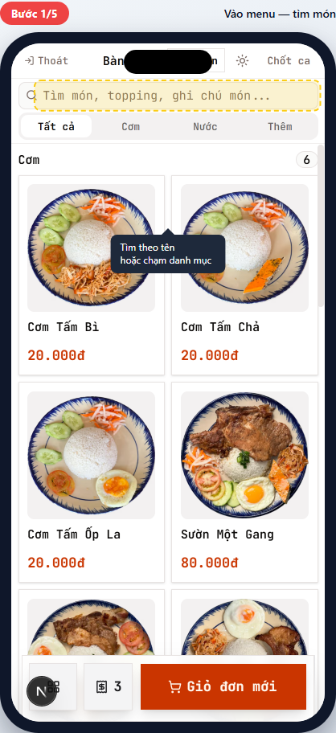
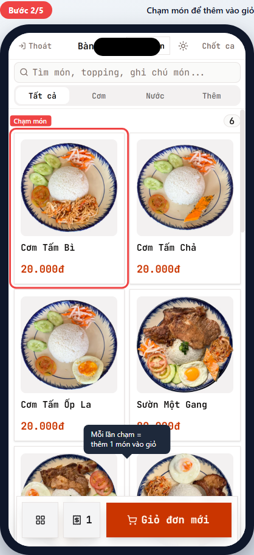
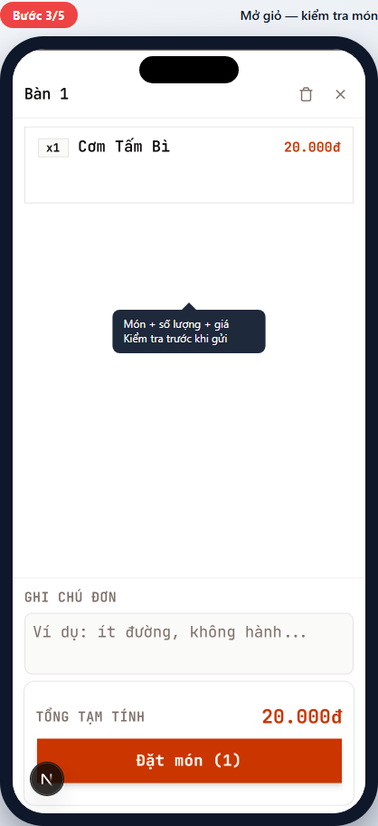
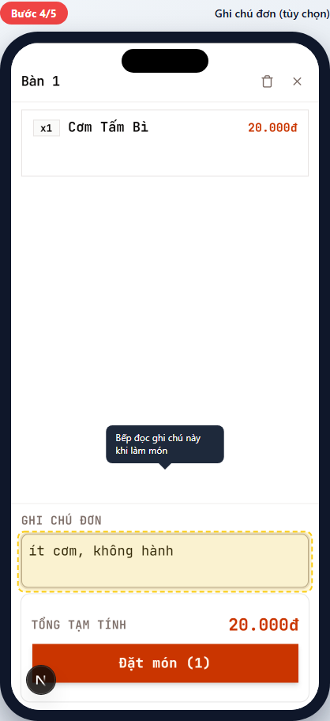
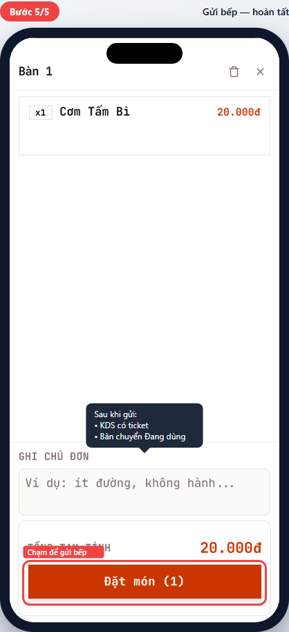
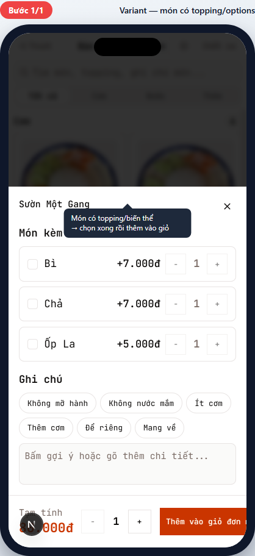

# POS-03 — Tạo đơn mới + gửi bếp

> Hướng dẫn chọn món, thêm vào giỏ, ghi chú và gửi bếp.
> Dành cho **phục vụ (waiter)** và **thu ngân (cashier)**.

## Tóm tắt

| Trường              | Giá trị                                                                                                                               |
| ------------------- | ------------------------------------------------------------------------------------------------------------------------------------- |
| **Vai trò**         | Phục vụ, Thu ngân                                                                                                                     |
| **Quyền cần có**    | `pos:use`                                                                                                                             |
| **Điều kiện trước** | Đã chọn bối cảnh bán hàng (Tại bàn N hoặc Mang về) — xem [POS-02](pos-02-select-context.md)                                           |
| **Kết quả đúng**    | Đơn `confirmed` được tạo trong DB; KDS có ticket; bàn chuyển sang `Đang dùng` (nếu dine_in); cashier về danh sách bàn / màn POS chính |
| **Thời gian**       | ~30 giây                                                                                                                              |

## Đường dẫn

URL: `/br/{branchId}/pos` (sau khi chọn bàn hoặc tab Mang về)

## Các bước

### Bước 1 — Vào menu — tìm món

**Bạn thấy:**

- Ô "Tìm món, topping, ghi chú món..." trên đầu — gõ tên món để lọc nhanh.
- Tabs danh mục: `Tất cả`, `Cơm`, `Nước`, `Thêm`...
- Lưới món: hình + tên + giá.

**Bạn làm:** Tìm món bằng cách:

1. **Gõ ô tìm món** (nhanh nhất khi nhớ tên), HOẶC
2. **Chạm danh mục** (lướt theo nhóm khi khách chưa quyết định).

### Bước 2 — Chạm món để thêm vào giỏ

**Bạn làm:** Chạm món (ví dụ "Cơm Tấm Bì 20.000đ").

**Bạn thấy:**

- Món vào giỏ ngay (nút "Giỏ đơn mới" góc dưới hiện số lượng).
- Nếu món **không có topping/biến thể** → vào giỏ thẳng (mỗi lần chạm = +1).
- Nếu món **có topping** (ví dụ Sườn Một Gang có Bì/Chả/Ốp La) → mở customizer (xem [Tình huống ngoại lệ](#món-có-topping--biến-thể)).

> 💡 Mẹo: chạm 1 món nhiều lần = thêm nhiều phần. Cần điều chỉnh số lượng cụ thể? Mở giỏ (Bước 3) rồi chỉnh.

### Bước 3 — Mở giỏ — kiểm tra món

**Bạn làm:** Chạm nút **Giỏ đơn mới** (đỏ, góc dưới phải).

**Bạn thấy:** Drawer giỏ đơn mở từ dưới lên, hiển thị:

- Tiêu đề "Bàn N" hoặc "Mang về".
- Danh sách món: số lượng (`x1`) + tên + giá.
- Ô "GHI CHÚ ĐƠN" (trống).
- "TỔNG TẠM TÍNH" + nút lớn **Đặt món (N)**.

**Bạn kiểm tra:** đúng món, đúng số lượng, đúng giá. Nếu sai → vuốt món sang trái để xóa, hoặc đóng giỏ và quay lại menu thêm.

### Bước 4 — Ghi chú đơn (tùy chọn)

**Bạn làm:** Chạm ô "GHI CHÚ ĐƠN" → gõ chú thích cho cả đơn.

**Ví dụ:** `ít cơm, không hành`, `khách dị ứng đậu phộng`, `để riêng nước chấm`.

> 💡 Ghi chú **đơn** áp dụng cho cả đơn. Ghi chú **món** (ví dụ "không hành" cho riêng món Cơm Tấm) → mở customizer của món đó (xem ngoại lệ).

### Bước 5 — Gửi bếp

**Bạn làm:** Chạm nút lớn **Đặt món (N)** ở dưới cùng.

**Bạn thấy ngay sau:**

- Toast "Đặt món thành công" hiện ngắn.
- Drawer giỏ đóng lại.
- Bạn quay về màn POS chính (table picker hoặc menu).
- Trên KDS (bếp): ticket mới hiện, bếp bắt đầu làm món.

✅ **Xong!** Đơn đã ở status `confirmed`. Tiếp tục:

- Khách gọi thêm món sau → POS-04 (Thêm món vào đơn đang phục vụ).
- Khách thanh toán → POS-05 (Thanh toán).

> ⚠️ Quan trọng: chạm "Đặt món" 1 lần thôi. Đợi toast hiện rồi mới làm tiếp — chạm liên tục có thể tạo đơn trùng nếu mạng yếu.

---

## Tình huống ngoại lệ

### Món có topping / biến thể

**Khi nào gặp:** Chạm món có topping (ví dụ Sườn Một Gang có thể thêm Bì/Chả/Ốp La) hoặc món có biến thể (size, độ ngọt, v.v.).

**Bạn thấy:** Customizer drawer mở từ dưới lên:

- Tên món + giá gốc.
- Section "Món kèm" — checkbox topping với giá phụ (ví dụ Bì +7.000đ, Chả +7.000đ).
- Section "Ghi chú" — chips gợi ý nhanh (Không mỡ hành / Không nước mắm / Ít cơm / Thêm cơm / Để riêng / Mang về).
- Textarea cho ghi chú tự do.
- Số lượng + nút **Thêm vào giỏ đơn**.

**Bạn làm:**

1. Tích các topping khách muốn → giá tự cộng.
2. Chạm chip ghi chú nhanh hoặc gõ ghi chú riêng cho món này.
3. Chỉnh số lượng nếu khách lấy nhiều phần cùng cấu hình.
4. Chạm **Thêm vào giỏ đơn** → quay về menu, món vào giỏ với cấu hình đã chọn.

> 💡 Cùng món Sườn Một Gang, khách A có "Bì + ít cơm", khách B có "Chả + để riêng" → tạo 2 dòng riêng trong giỏ (chạm món 2 lần, mỗi lần customize khác).

### Mạng yếu — gửi bếp lâu

**Bạn thấy:** Spinner "Đang gửi..." xoay >5 giây.

**Cách xử lý:**

1. **Đợi đến 30 giây** — hệ thống tự retry nếu mạng chập chờn.
2. Nếu vẫn không xong → đóng app, kiểm tra wifi, mở lại — đơn nháp **tự khôi phục** trong giỏ (không mất món).
3. Vẫn lỗi → báo kỹ thuật. Đừng tạo đơn lại trên máy khác — sẽ trùng.

### Hết món / sai giá

**Bạn thấy:** Sau khi chạm "Đặt món" → toast lỗi "Một số món đã bị tắt..." hoặc "Giá đã thay đổi...".

**Cách xử lý:** Mở giỏ, xem món nào bị highlight đỏ → bỏ ra hoặc thay món khác → gửi lại.

---

## Tham khảo nội bộ

> Phần này dành cho kỹ thuật và quản lý đào tạo.

### Code path

- **Menu pane:** [apps/web/app/(protected)/br/[branchId]/pos/\_components/menu-pane.tsx](<../../../../apps/web/app/(protected)/br/%5BbranchId%5D/pos/_components/menu-pane.tsx>)
- **Item customizer:** [apps/web/app/(protected)/br/[branchId]/pos/item-customizer.tsx](<../../../../apps/web/app/(protected)/br/%5BbranchId%5D/pos/item-customizer.tsx>) — Drawer khi item có modifier/sides.
- **Cart pane (drawer mobile):** [apps/web/app/(protected)/br/[branchId]/pos/\_components/cart-pane.tsx](<../../../../apps/web/app/(protected)/br/%5BbranchId%5D/pos/_components/cart-pane.tsx>)
- **Submit handler:** `submitPosOrderWithRetry` trong [apps/web/app/(protected)/br/[branchId]/pos/\_utils/submit-with-retry.ts](<../../../../apps/web/app/(protected)/br/%5BbranchId%5D/pos/_utils/submit-with-retry.ts>) — retry với exponential backoff khi mạng yếu.
- **Server action:** `submitOrder` trong [apps/web/app/(protected)/br/[branchId]/pos/order-actions.ts](<../../../../apps/web/app/(protected)/br/%5BbranchId%5D/pos/order-actions.ts>) — Postgres RPC atomic insert order + items + KDS tickets.

### Database

- Insert atomic vào: `orders`, `order_items`, `kds_tickets` qua RPC.
- `orders.status` khởi tạo `confirmed` (không qua `pending` — POS bypass review).
- `orders.payment_status` = `unpaid`.
- `tables.status` chuyển sang `occupied` (nếu dine_in).
- `kds_tickets.status` = `pending` cho mỗi món, route theo `kds_stations` của menu_item.

### Permission

- `pos:use` — tạo đơn mới (mặc định mọi vai trò POS).

### Tham chiếu thiết kế

- Current POS scope: [tasks/todo.md](../../../../tasks/todo.md)
- KDS routing: runtime route theo `kds_stations`; xem route/runtime contract trong [docs/modules/web-app.md](../../../modules/web-app.md).

---

## Metadata mockup

| Trường                   | Giá trị                                                                                                          |
| ------------------------ | ---------------------------------------------------------------------------------------------------------------- |
| Viewport                 | 390×844 (iPhone mặc định)                                                                                        |
| Capture script           | [apps/web/e2e/guides/pos-03-create-order.guide.ts](../../../../apps/web/e2e/guides/pos-03-create-order.guide.ts) |
| Lệnh refresh             | `pnpm --filter @comtammatu/web guides:capture --grep="POS-03"`                                                   |
| Cập nhật mockup gần nhất | 2026-04-27                                                                                                       |
| Người maintain           | _TBD_                                                                                                            |
