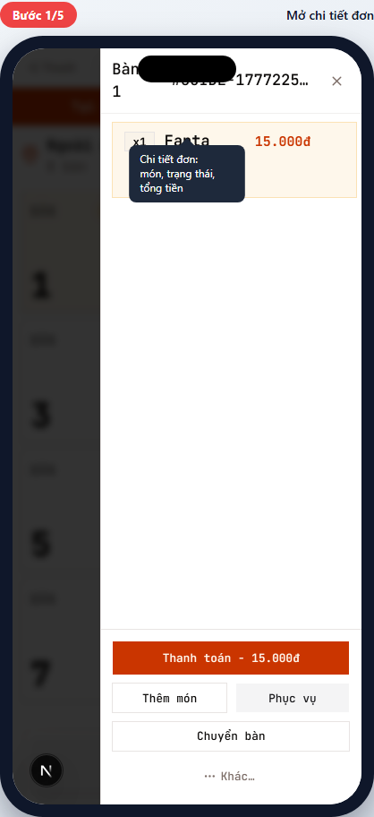
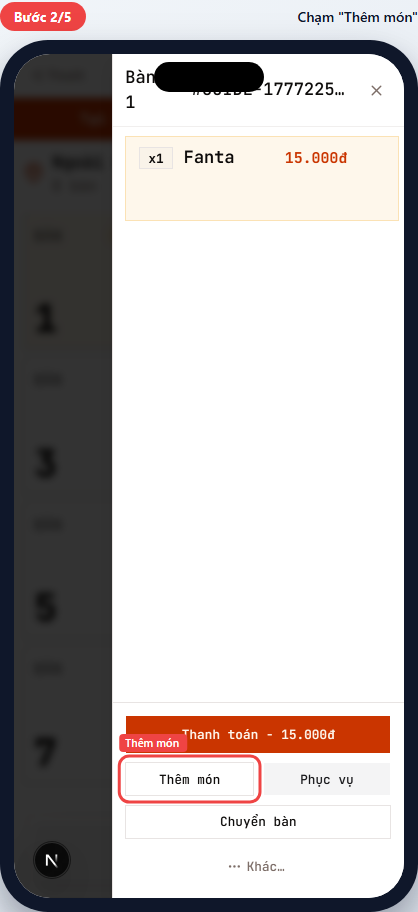
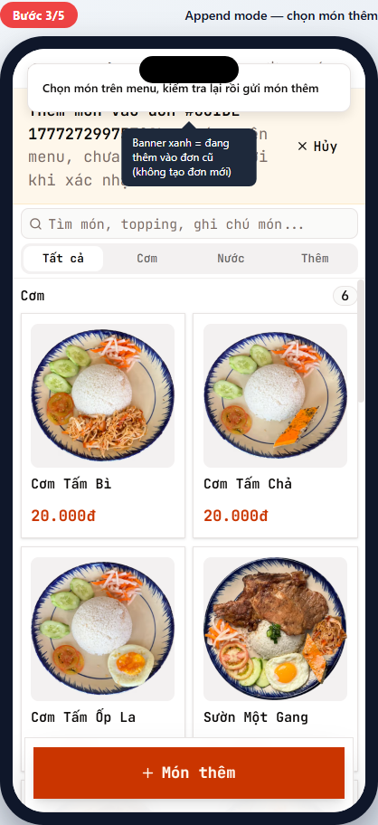
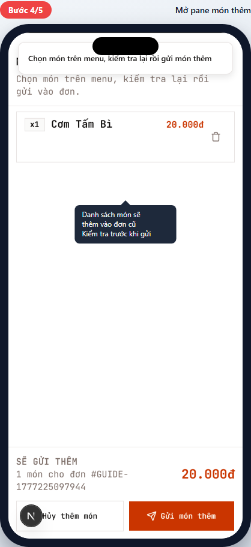
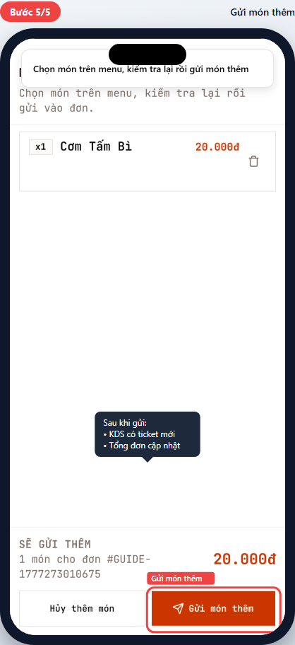
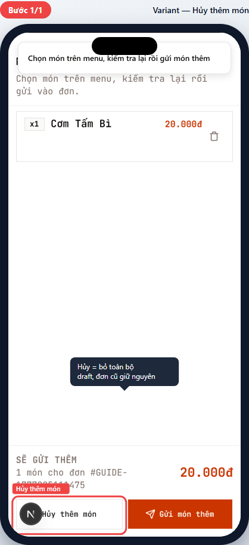

# POS-04 — Thêm món vào đơn đang phục vụ

> Hướng dẫn thêm món vào đơn đã gửi bếp (khách gọi thêm).
> Dành cho **phục vụ (waiter)** và **thu ngân (cashier)**.

## Tóm tắt

| Trường | Giá trị |
| --- | --- |
| **Vai trò** | Phục vụ, Thu ngân |
| **Quyền cần có** | `pos:use` |
| **Điều kiện trước** | Đơn đã ở `confirmed` (chưa thanh toán) — xem [POS-03](pos-03-create-order.md) |
| **Kết quả đúng** | `order_items` mới insert vào đơn cũ; KDS có ticket cho món thêm; tổng đơn cập nhật |
| **Thời gian** | ~20 giây |

## Đường dẫn

URL: `/br/{branchId}/pos` (qua bàn occupied → đơn cũ)

## Các bước

### Bước 1 — Mở chi tiết đơn

**Bạn làm:**

1. Trên màn POS chính, chạm bàn có badge `Đang dùng` (vàng).
2. Multi-order picker drawer mở → chạm đơn cần thêm món (thường là đơn duy nhất nếu bàn chỉ có 1 đơn).

**Bạn thấy:** Sheet chi tiết đơn trượt vào từ phải:

- Header: Bàn N + mã đơn (`#001D-...`).
- Danh sách món trong đơn (mỗi món có số lượng + tên + giá).
- Bottom có 4 nút: **Thanh toán**, **Thêm món**, **Phục vụ**, **Chuyển bàn**, **Khác...**

> 💡 Cũng có thể vào chi tiết đơn từ "Đơn trong ca" (nút bên phải action bar).

### Bước 2 — Chạm "Thêm món"

**Bạn làm:** Chạm nút **Thêm món** (góc trái dưới, kế bên "Phục vụ").

**Bạn thấy:** Sheet đóng lại, màn chuyển sang **Append mode** (xem Bước 3).

> ⚠️ Phân biệt:
> - **Thêm món** = thêm vào đơn HIỆN TẠI (cùng mã TC, cộng dồn tổng tiền).
> - **Tạo đơn mới trên bàn này** (trong multi-order picker) = đơn ĐỘC LẬP, thanh toán riêng.

### Bước 3 — Append mode — chọn món thêm

**Bạn thấy:**

- **Banner xanh nhạt** trên đầu: `"Chọn món trên menu, kiểm tra lại rồi gửi món thêm"` + nút "× Hủy" + mã đơn đang thêm.
- Menu hiện như Bước 1 của [POS-03](pos-03-create-order.md): tìm món, danh mục, lưới món.
- Action bar bottom: nút lớn **+ Món thêm** (đỏ với icon dấu cộng) — KHÁC với "Giỏ đơn mới" của đơn mới.

**Bạn làm:** Chạm món khách gọi thêm (giống Bước 2 POS-03). Mỗi lần chạm = +1 vào "draft thêm".

> 🛡️ Chú ý banner xanh để biết bạn đang **thêm vào đơn cũ**, không tạo đơn mới. Banner mất = đã thoát append mode.

### Bước 4 — Mở pane món thêm — kiểm tra

**Bạn làm:** Chạm nút **+ Món thêm** ở action bar bottom (sau khi đã chọn ít nhất 1 món).

**Bạn thấy:** Pane "Món sẽ gửi thêm" mở:

- Tiêu đề "Chọn món trên menu, kiểm tra lại rồi gửi vào đơn".
- Danh sách món draft: số lượng + tên + giá + nút thùng rác (xóa).
- Footer: `"SẼ GỬI THÊM — N món cho đơn #GUIDE-..."` + tổng tiền.
- 2 nút bottom: **Hủy thêm món** (trái) + **Gửi món thêm** (đỏ, phải).

**Bạn kiểm tra:** đúng món, đúng số lượng. Sai → chạm thùng rác để bỏ, hoặc chạm "Hủy thêm món" để bỏ tất cả (xem variant).

### Bước 5 — Gửi món thêm

**Bạn làm:** Chạm nút **Gửi món thêm** (đỏ, có icon máy bay giấy).

**Bạn thấy ngay sau:**

- Toast "Thêm món thành công" (hoặc tương tự).
- Pane đóng, banner append biến mất.
- Quay về màn POS chính HOẶC tự mở chi tiết đơn để bạn check tổng mới.
- Trên KDS (bếp): món thêm nhập vào PB đang mở nếu PB trước chưa hoàn tất; nếu PB trước đã hoàn tất thì hệ thống tạo PB mới cho lần gọi thêm.

✅ **Xong!** Tổng đơn đã cập nhật. Khách gọi tiếp → lặp lại từ Bước 1. Khách thanh toán → POS-05.

> ⚠️ "Gửi món thêm" không tạo đơn TC mới. PB chỉ tách mới khi PB trước của đơn đó đã hoàn tất; nếu PB trước còn đang làm, món thêm nằm chung trên PB đó để bếp xử lý một lần.

---

## Tình huống ngoại lệ

### Hủy thêm — đổi ý

**Khi nào gặp:** Khách đổi ý không thêm món nữa, hoặc chọn nhầm.

**Bạn làm:** Trong pane "Món sẽ gửi thêm" (Bước 4), chạm **Hủy thêm món** (góc trái dưới).

**Bạn thấy:**

- Toàn bộ draft xóa.
- Banner append biến mất.
- Đơn cũ **giữ nguyên** — không tạo gì mới.

> 💡 Cũng có thể hủy bằng nút "× Hủy" trên banner xanh (Bước 3) — kết quả tương tự.

### Đơn đã chuyển sang "Chờ thanh toán"

**Bạn thấy:** Chi tiết đơn không có nút "Thêm món" hoặc nút bị mờ.

**Lý do:** Đơn đã thanh toán hoặc đã hủy → không cho thêm món.

**Cách xử lý:** Nếu khách thực sự muốn gọi thêm sau khi đơn cũ đã chốt → tạo đơn MỚI trên cùng bàn (qua multi-order picker — xem [POS-02](pos-02-select-context.md#bàn-đang-dùng--có-đơn-cũ-chưa-chốt)) thay vì append.

### Mất mạng giữa chừng

**Bạn thấy:** Spinner "Đang gửi..." kéo dài, sau đó toast lỗi.

**Cách xử lý:**

1. Đợi tự retry — draft KHÔNG mất.
2. Nếu vẫn lỗi → đóng và mở lại chi tiết đơn → thử lại từ Bước 4.
3. Vẫn lỗi → báo kỹ thuật, đừng gửi nhiều lần (dễ trùng món).

---

## Tham khảo nội bộ

> Phần này dành cho kỹ thuật và quản lý đào tạo.

### Code path

- **Order detail sheet:** [apps/web/app/(protected)/br/[branchId]/pos/order-detail-sheet.tsx](../../../../apps/web/app/(protected)/br/%5BbranchId%5D/pos/order-detail-sheet.tsx) — nút "Thêm món" tại line ~842.
- **Append draft pane:** [apps/web/app/(protected)/br/[branchId]/pos/_components/append-draft-pane.tsx](../../../../apps/web/app/(protected)/br/%5BbranchId%5D/pos/_components/append-draft-pane.tsx)
- **Append hook:** [apps/web/app/(protected)/br/[branchId]/pos/_hooks/use-pos-append.ts](../../../../apps/web/app/(protected)/br/%5BbranchId%5D/pos/_hooks/use-pos-append.ts) — state machine của append mode.
- **Server action:** `appendOrderItems` trong [apps/web/app/(protected)/br/[branchId]/pos/order-actions.ts](../../../../apps/web/app/(protected)/br/%5BbranchId%5D/pos/order-actions.ts) — Postgres RPC atomic insert items + KDS tickets.

### Database

- Insert vào `order_items` với `order_id` của đơn cũ.
- KDS tickets mới insert qua `kds_tickets` (route theo station của menu_item) và gắn vào PB đang mở nếu đơn còn PB `pending`/`preparing`.
- Trigger update `orders.subtotal` + `orders.total_amount` (atomic recompute từ `order_items` SUM).
- KHÔNG update `orders.status` — vẫn `confirmed`.

### Permission

- `pos:use` — append đơn (mặc định mọi vai trò POS).

### Tham chiếu thiết kế

- Order lifecycle: [docs/archive/plan/m2-order-lifecycle.md](../../../archive/plan/m2-order-lifecycle.md)

---

## Metadata mockup

| Trường | Giá trị |
| --- | --- |
| Viewport | 390×844 (iPhone mặc định) |
| Capture script | [apps/web/e2e/guides/pos-04-append-items.guide.ts](../../../../apps/web/e2e/guides/pos-04-append-items.guide.ts) |
| Lệnh refresh | `pnpm --filter @comtammatu/web guides:capture --grep="POS-04"` |
| Cập nhật mockup gần nhất | 2026-04-27 |
| Người maintain | _TBD_ |
