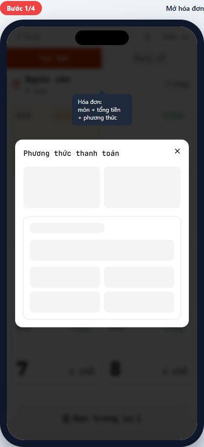
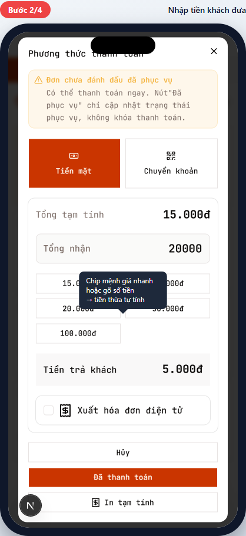
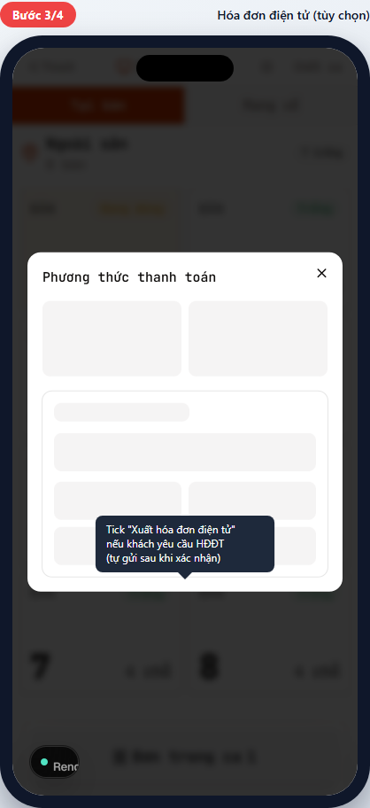
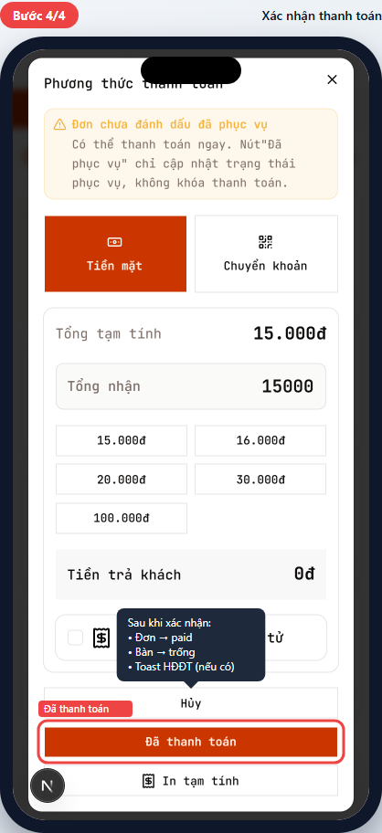
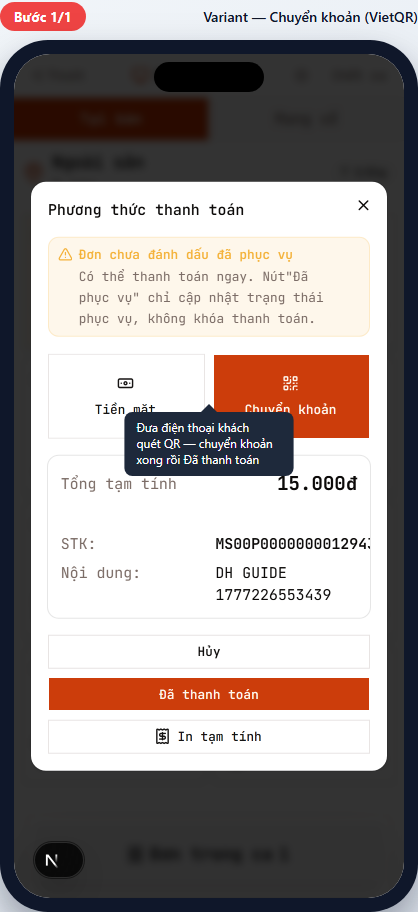

# POS-05 — Thanh toán đơn

> Hướng dẫn thu tiền: tiền mặt hoặc chuyển khoản, có thể xuất HĐĐT.
> Dành cho **thu ngân (cashier)** — phục vụ KHÔNG có quyền confirm tiền mặt.

## Tóm tắt

| Trường              | Giá trị                                                                                                                         |
| ------------------- | ------------------------------------------------------------------------------------------------------------------------------- |
| **Vai trò**         | Thu ngân, Quản lý chi nhánh                                                                                                     |
| **Quyền cần có**    | `pos:confirm_payment` (xác nhận tiền mặt). Phục vụ vẫn thấy bill nhưng KHÔNG xác nhận được tiền mặt — chỉ chuyển khoản          |
| **Điều kiện trước** | Đơn ở `confirmed` (chưa thanh toán)                                                                                             |
| **Kết quả đúng**    | `orders.payment_status` = `paid`; bàn chuyển sang `available`; HĐĐT gửi (nếu tick); toast "Đã thanh toán" (kèm trạng thái HĐĐT) |
| **Thời gian**       | ~30 giây                                                                                                                        |

## Đường dẫn

URL: `/br/{branchId}/pos` (qua bàn occupied → đơn → "Thanh toán")

## Các bước

### Bước 1 — Mở hóa đơn

**Bạn làm:**

1. Vào chi tiết đơn (qua bàn occupied → multi-order picker → đơn).
2. Chạm nút lớn **Thanh toán - {tổng tiền}đ** (đỏ ở dưới).

**Bạn thấy:** Sheet "Phương thức thanh toán" mở từ phải:

- Phương thức thanh toán: **Tiền mặt** (mặc định chọn nếu thu ngân có quyền) + các ví điện tử/chuyển khoản đang bật trong cấu hình (VietQR…). Danh sách lấy từ cấu hình tenant, không cố định.
- "Tổng tạm tính: {tổng}đ".
- Ô "Tổng nhận" (mặc định = tổng tiền — tức khách trả đúng).
- Tối đa 6 chip mệnh giá nhanh tự tính theo tổng (tờ tiền chẵn gần nhất ≥ tổng).
- "Tiền trả khách": 0đ (tự cộng nếu khách đưa thừa).
- Checkbox "Người mua không lấy hóa đơn" (mặc định TICK — không nhập thông tin người mua).
- 3 nút bottom: **Hủy**, **Đã thanh toán** (đỏ, lớn), **In tạm tính**.

### Bước 2 — Nhập tiền khách đưa (cho tiền mặt)

**Bạn làm:** 1 trong 2:

1. **Nhanh nhất**: Chạm chip mệnh giá khách đưa (ví dụ khách đưa tờ 20.000đ → chạm chip "20.000đ").
2. **Tự gõ**: Chạm ô "Tổng nhận", gõ số tiền cụ thể.

**Bạn thấy:** Ô "Tiền trả khách" cập nhật ngay (= Tổng nhận - Tổng tạm tính).

**Ví dụ:**

- Tổng tạm tính 15.000đ, khách đưa tờ 20.000đ → chạm chip 20.000đ → "Tiền trả khách: 5.000đ" → trả khách 5.000đ.
- Khách đưa đúng 15.000đ → giữ "Tổng nhận" mặc định → "Tiền trả khách: 0đ".

> 💡 Khách đưa nhỏ hơn tổng (ví dụ thiếu 1.000đ) — nút **Đã thanh toán** bị khóa, hiện lý do "Khách chưa thanh toán đủ tổng đơn". Phải nhập đủ "Tổng nhận" ≥ tổng tạm tính mới xác nhận được.

### Bước 3 — Thông tin người mua

**Bạn làm:** Hỏi khách có lấy hóa đơn ghi thông tin/MST không. Nếu không lấy → giữ tick **Người mua không lấy hóa đơn**. Nếu khách cần ghi thông tin → bỏ tick và nhập tên người mua / công ty / mã số thuế.

**Bạn thấy (khi bỏ tick):** Form thông tin người mua mở rộng — nhập tên người mua / công ty / mã số thuế / địa chỉ.

> 💡 Dù khách không lấy hóa đơn, hệ thống vẫn phát hành HĐĐT với tên người mua là "Bán cho người tiêu dùng" (theo NĐ 254/2026, hiệu lực 01/07/2026).

### Bước 4 — Xác nhận thanh toán

**Bạn làm:** Chạm nút **Đã thanh toán** (đỏ, lớn).

**Bạn thấy ngay sau:**

- Toast xác nhận hiện (happy path: **"Đã thanh toán & xuất HĐĐT"** ✅). Chi tiết 3 trạng thái toast HĐĐT xem [POS-08 — Xử lý ngoại lệ](./pos-08-exceptions.md).
- Sheet đóng.
- Đơn chuyển sang `paid`, bàn về `available` (nếu dine_in).
- Giấy in (nếu có máy in nhiệt được setup).

✅ **Xong!** Khách rời quán. Bàn sẵn sàng cho khách mới.

> ⚠️ Quan trọng: chạm "Đã thanh toán" 1 lần thôi. Đợi toast hiện rồi mới làm tiếp — nhiều lần có thể tạo payment trùng.

---

## Tình huống ngoại lệ

### Khách thanh toán chuyển khoản (VietQR)

**Bạn làm:** Chạm phương thức **Chuyển khoản** (icon QR góc phải).

**Bạn thấy:** Mã QR (VietQR) hiện kèm thông tin tài khoản nhận.

**Bạn làm tiếp:**

1. Đưa máy POS hoặc điện thoại có QR cho khách.
2. Khách quét và chuyển khoản.
3. **Đợi xác nhận chuyển khoản** (xem app ngân hàng / SMS).
4. Sau khi xác nhận tiền vào → chạm **Đã thanh toán**.

> 🛡️ KHÔNG bao giờ chạm "Đã thanh toán" trước khi xác nhận tiền vào tài khoản. Nếu khách scam (báo đã chuyển nhưng chưa) → mất tiền không truy được.

### In tạm tính (đưa khách check trước thu)

**Bạn làm:** Trong bill sheet, chạm nút **In tạm tính** (góc dưới cùng).

**Bạn thấy:** Máy in nhiệt in tờ tạm tính (món + giá + tổng) — KHÔNG phải hóa đơn chính thức.

**Khi nào dùng:** Khách yêu cầu xem chi tiết món + tổng trước khi quyết định trả bằng gì. Hoặc check chia tiền với bạn.

> 💡 Tờ tạm tính có ghi "TẠM TÍNH" và KHÔNG hợp lệ làm chứng từ thuế. HĐĐT chỉ xuất sau khi xác nhận thanh toán.

### Nhân viên phục vụ mở bill này

**Bạn thấy:** Sheet vẫn mở, NHƯNG nút "Tiền mặt" bị mờ / không bấm được.

**Lý do:** Waiter không có quyền `pos:confirm_payment` → không cho confirm tiền mặt (cash chạm két vật lý).

**Cách xử lý:** Waiter chỉ có thể chọn "Chuyển khoản" + xác nhận khi khách đã chuyển. Nếu khách trả tiền mặt → gọi thu ngân ra confirm.

### Mất mạng / máy in lỗi / HĐĐT chưa xuất được

Các tình huống ngoại lệ khi vận hành (banner mất kết nối, máy in offline, 3 trạng thái toast HĐĐT sau thanh toán) được mô tả đầy đủ ở [POS-08 — Xử lý ngoại lệ](./pos-08-exceptions.md).

---

## Tham khảo nội bộ

> Phần này dành cho kỹ thuật và quản lý đào tạo.

### Code path

- **Bill sheet (mobile drawer / desktop side):** [apps/web/app/(protected)/br/[branchId]/pos/\_components/bill/bill-receipt-sheet.tsx](<../../../../apps/web/app/(protected)/br/%5BbranchId%5D/pos/_components/bill/bill-receipt-sheet.tsx>)
- **Cash tendered logic:** trong `bill-receipt-sheet.tsx` (không có dialog riêng — tất cả trong 1 sheet)
- **Invoice form:** [apps/web/app/(protected)/br/[branchId]/pos/\_components/bill/invoice-form-section.tsx](<../../../../apps/web/app/(protected)/br/%5BbranchId%5D/pos/_components/bill/invoice-form-section.tsx>)
- **Server actions:** [apps/web/app/(protected)/br/[branchId]/pos/payment-actions.ts](<../../../../apps/web/app/(protected)/br/%5BbranchId%5D/pos/payment-actions.ts>)
- **Print actions:** [apps/web/app/(protected)/br/[branchId]/pos/print-actions.ts](<../../../../apps/web/app/(protected)/br/%5BbranchId%5D/pos/print-actions.ts>)

### Database

- Insert vào `payments` (atomic với update `orders`).
- `orders.payment_status` chuyển từ `unpaid` → `paid`.
- `orders.status` chuyển sang `paid` (hoặc tương đương).
- `tables.status` reset về `available` (nếu bàn không còn đơn nào active khác).
- HĐĐT: trigger gọi VAT provider qua queue, nếu thành công insert vào `einvoices`.

### Permission

- `pos:confirm_payment` — chỉ thu ngân và branch_manager. Waiter có thể thấy bill và chọn Chuyển khoản nhưng KHÔNG xác nhận tiền mặt.

### Regression rules quan trọng

- **HDDT-PAYMENT-FIRST-FAILSOFT-ORPHAN:** payment phải insert TRƯỚC HĐĐT call. Nếu HĐĐT lỗi → tiền vẫn vào, HĐĐT retry sau (không rollback payment).
- **HDDT-FORM-PAYLOAD-FREEZE-AT-CLICK:** payload HĐĐT phải freeze ngay tại moment click "Đã thanh toán" — chống race condition khi user sửa form trong lúc đang submit.
- **POS-PAYMENT-REUSE-UNIQUE-SLOT:** retry payment phải reuse slot cũ (idempotency key), không tạo bản ghi trùng.

### Tham chiếu thiết kế

- Current POS scope: [tasks/todo.md](../../../../tasks/todo.md)
- HĐĐT: [docs/ref/einvoice-tax.md](../../../ref/einvoice-tax.md)
- Regression rules: [tasks/regressions.md](../../../../tasks/regressions.md)

---

## Metadata mockup

| Trường                   | Giá trị                                                                                                |
| ------------------------ | ------------------------------------------------------------------------------------------------------ |
| Viewport                 | 390×844 (iPhone mặc định)                                                                              |
| Capture script           | [apps/web/e2e/guides/pos-05-payment.guide.ts](../../../../apps/web/e2e/guides/pos-05-payment.guide.ts) |
| Lệnh refresh             | `pnpm --filter @comtammatu/web guides:capture --grep="POS-05"`                                         |
| Cập nhật mockup gần nhất | 2026-04-27                                                                                             |
