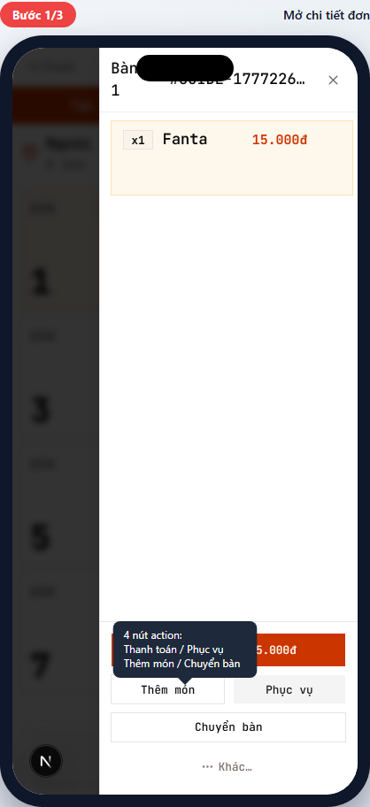
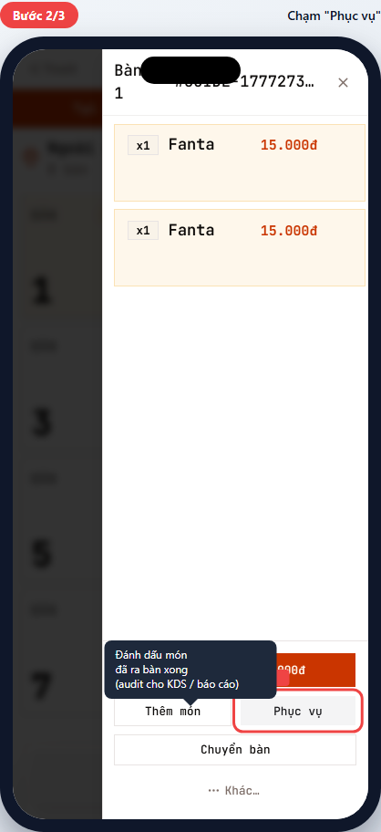
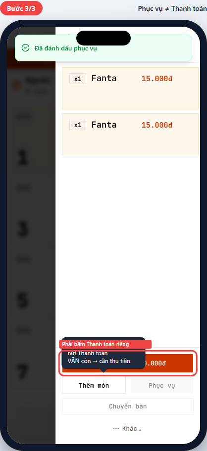
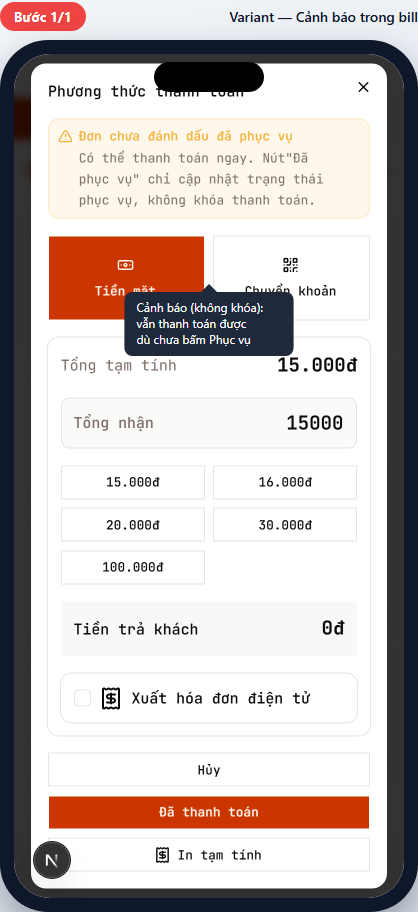

# POS-06 — Đánh dấu đã phục vụ

> Hướng dẫn dùng nút **Phục vụ** và làm rõ: đánh dấu phục vụ ≠ thanh toán ≠ trả bàn.
> Dành cho **phục vụ (waiter)** và **thu ngân (cashier)**.

## Tóm tắt

| Trường | Giá trị |
| --- | --- |
| **Vai trò** | Phục vụ, Thu ngân |
| **Quyền cần có** | `pos:use` |
| **Điều kiện trước** | Đơn ở `confirmed` (món đã gửi bếp) |
| **Kết quả đúng** | `order_items.status` của các món chuyển sang `served`; toast "Đã đánh dấu phục vụ" |
| **Điều KHÔNG xảy ra** | Đơn KHÔNG chuyển sang `paid`; bàn KHÔNG về `available`; vẫn cần POS-05 để thu tiền |
| **Thời gian** | ~5 giây |

## Khi nào dùng

- **Bếp đã đưa hết món ra bàn** → waiter báo cashier "đơn này phục vụ xong" qua việc đánh dấu trong app.
- **KDS bị lệch** → đánh dấu thủ công để báo cáo cuối ngày khớp.
- **Khách yêu cầu in tạm tính** → cashier tick phục vụ trước khi in cho khách check.

## Đường dẫn

URL: `/br/{branchId}/pos` → bàn occupied → đơn

## Các bước

### Bước 1 — Mở chi tiết đơn

**Bạn làm:** Vào chi tiết đơn (qua bàn occupied → multi-order picker → đơn).

**Bạn thấy:** Sheet chi tiết với 4 nút action ở dưới:

- **Thanh toán - {tổng}đ** (đỏ, lớn) — kết thúc giao dịch.
- **Thêm món** — append (POS-04).
- **Phục vụ** — chính là nút này.
- **Chuyển bàn** — di chuyển đơn sang bàn khác.
- **Khác...** — các action ít dùng (hủy đơn, in lại, v.v.).

### Bước 2 — Chạm "Phục vụ"

**Bạn làm:** Chạm nút **Phục vụ**.

**Bạn thấy ngay sau:**

- Toast xanh `"Đã đánh dấu phục vụ"` hiện trên đầu.
- Nút "Phục vụ" mờ đi (disabled — đã đánh dấu rồi không bấm lại được).

> 💡 Nếu chỉ muốn đánh dấu **1 món** (không phải cả đơn) → vuốt món sang trái trong danh sách → 2 nút hiện: "Phục vụ" + "Hủy". Chạm "Phục vụ" → chỉ món đó chuyển trạng thái.

### Bước 3 — "Phục vụ" KHÔNG phải "Thanh toán"

**Bạn quan sát kỹ:** Sau khi đánh dấu phục vụ:

- **Đơn KHÔNG tự đóng.**
- **Nút Thanh toán VẪN còn** (đỏ, lớn).
- **Bàn VẪN ở `Đang dùng`** — chưa giải phóng cho khách mới.

✅ Để hoàn tất giao dịch → **bắt buộc** chạm **Thanh toán** → POS-05.

> ⚠️ Quan trọng: rất nhiều phục vụ mới hiểu nhầm "Phục vụ = đơn xong = trả bàn cho khách mới". KHÔNG. `served` chỉ là audit. Khách phải trả tiền (POS-05) thì bàn mới về trống.

---

## Tình huống ngoại lệ

### Vào thanh toán mà chưa đánh dấu phục vụ

**Khi nào gặp:** Mở bill (POS-05) khi món chưa được đánh dấu `served`.

**Bạn thấy:** Alert vàng trong bill sheet:

> ⚠️ Đơn chưa đánh dấu đã phục vụ. Có thể thanh toán ngay. Nút "Đã phục vụ" chỉ cập nhật trạng thái phục vụ, không khóa thanh toán.

**Cách xử lý:** Đây chỉ là **nhắc nhở**. Có 2 lựa chọn:

1. **Bỏ qua** → bấm "Đã thanh toán" luôn. Hệ thống tự đặt món sang `served` khi thu tiền (cleanup tự động).
2. **Quay lại đánh dấu** → đóng bill → bấm "Phục vụ" → mở bill lại.

> 💡 Recommended: nếu bạn dùng KDS đầy đủ, bấm "Phục vụ" trước thanh toán giúp **báo cáo end-of-shift sạch hơn** (tách rõ "thời điểm phục vụ" vs "thời điểm thu tiền").

### Khách trả lại món (báo lỗi sau khi đã phục vụ)

**Cách xử lý:** Không có nút "Bỏ phục vụ". Cần:

1. Vào "Khác..." → "Hủy món" cụ thể (POS-07).
2. Hệ thống tự cập nhật trạng thái + recompute tổng.

---

## Tham khảo nội bộ

> Phần này dành cho kỹ thuật và quản lý đào tạo.

### Code path

- **Nút "Phục vụ" (order-level):** [apps/web/app/(protected)/br/[branchId]/pos/order-detail-sheet.tsx](../../../../apps/web/app/(protected)/br/%5BbranchId%5D/pos/order-detail-sheet.tsx) line ~853.
- **Swipe per-item "Phục vụ":** cùng file, swipe handler reveals 2-button action row (Phục vụ + Hủy) ~80px wide each.
- **Server action:** `markOrderItemServed` trong [apps/web/app/(protected)/br/[branchId]/pos/order-actions.ts](../../../../apps/web/app/(protected)/br/%5BbranchId%5D/pos/order-actions.ts).

### Database

- Update `order_items.status` từ `pending` → `served` (hoặc `confirmed` → `served`).
- KHÔNG update `orders.payment_status`.
- KHÔNG update `tables.status`.
- Audit ghi vào `order_status_history`.

### Permission

- `pos:use` — đánh dấu phục vụ (mặc định mọi vai trò POS).
- KHÔNG cần `pos:confirm_payment` — đây là audit-only.

### Lifecycle ràng buộc

- `served` không phải terminal status — vẫn có thể append, void, transfer.
- Chỉ `paid` hoặc `cancelled` mới khóa thao tác sửa đơn.
- `tables.status` chỉ về `available` khi: `orders.payment_status = 'paid'` AND không còn đơn active nào khác trên bàn.

### Tham chiếu thiết kế

- Order lifecycle: [docs/archive/plan/m2-order-lifecycle.md](../../../archive/plan/m2-order-lifecycle.md)

---

## Metadata mockup

| Trường | Giá trị |
| --- | --- |
| Viewport | 390×844 (iPhone mặc định) |
| Capture script | [apps/web/e2e/guides/pos-06-mark-served.guide.ts](../../../../apps/web/e2e/guides/pos-06-mark-served.guide.ts) |
| Lệnh refresh | `pnpm --filter @comtammatu/web guides:capture --grep="POS-06"` |
| Cập nhật mockup gần nhất | 2026-04-27 |
| Người maintain | _TBD_ |
