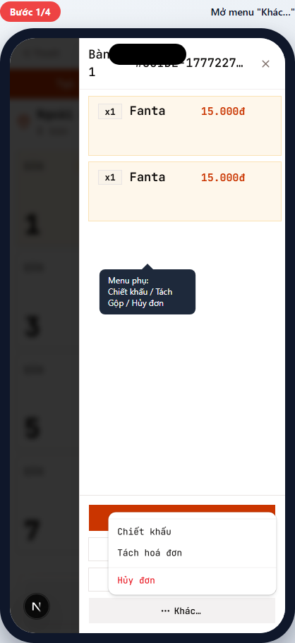
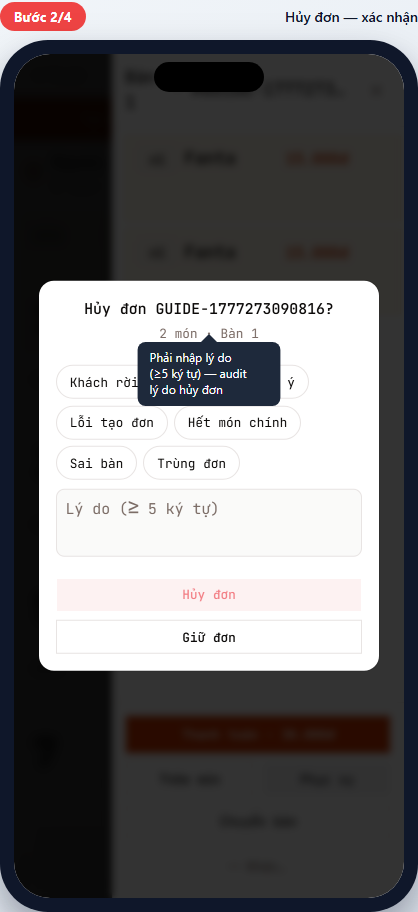
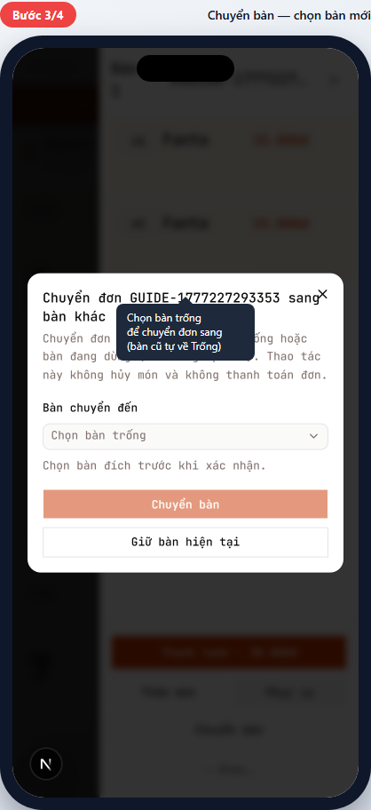
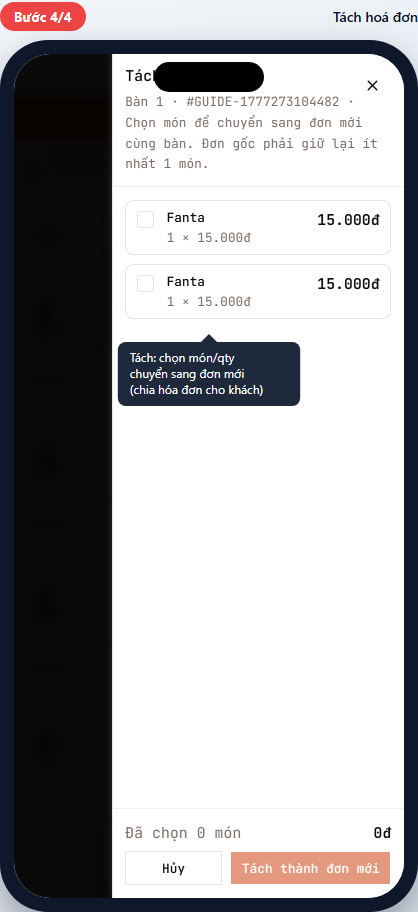
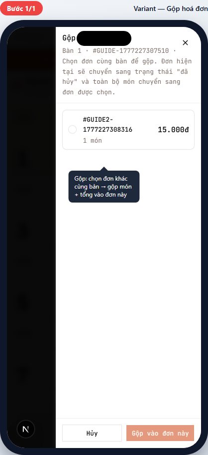

# POS-07 — Sửa đơn (chuyển bàn / hủy / tách / gộp)

> Hướng dẫn các thao tác chỉnh sửa đơn đã gửi: di chuyển sang bàn khác, hủy món/đơn, tách hóa đơn (chia bill), gộp hóa đơn.
> Dành cho **thu ngân (cashier)** — phục vụ làm được hầu hết NHƯNG không hủy đơn được.

## Tóm tắt

| Trường | Giá trị |
| --- | --- |
| **Vai trò** | Thu ngân, Quản lý chi nhánh |
| **Quyền cần có** | `pos:use` cho hủy món / chuyển bàn / tách / gộp; `pos:cancel_order` cho hủy đơn |
| **Điều kiện trước** | Đơn ở `confirmed` (chưa thanh toán) |
| **Hệ quả chung** | Mọi thao tác đều **đảo ngược KDS ticket** + recompute tổng + audit vào `order_status_history` |

## 5 thao tác trong POS-07

| Thao tác | Khi nào dùng | Yêu cầu | Kết quả |
| --- | --- | --- | --- |
| **Hủy món** | Khách đổi ý / món hết / nhập sai | swipe món sang trái | Món `cancelled`, KDS ticket cancel |
| **Hủy đơn** | Khách bỏ về / đơn nhập nhầm hoàn toàn | có quyền `pos:cancel_order` | Toàn đơn `cancelled`, bàn về trống |
| **Chuyển bàn** | Khách dời chỗ ngồi | bàn đích `available` | Đơn bind sang bàn mới, bàn cũ về trống |
| **Tách hóa đơn** | 1 nhóm khách chia bill | đơn `dine_in` + ≥2 món | Tạo đơn mới cùng bàn, chuyển 1 phần món qua |
| **Gộp hóa đơn** | 2 đơn cùng bàn → gộp 1 (1 người trả hết) | bàn có ≥2 đơn `dine_in` active | Đơn được chọn nhận hết món, đơn nguồn `cancelled` |

## Đường dẫn

URL: `/br/{branchId}/pos` → bàn occupied → đơn

## Các bước

### Bước 1 — Mở menu "Khác…"

**Bạn làm:** Trong chi tiết đơn, scroll xuống cùng → chạm nút **… Khác…** (góc dưới cùng).

**Bạn thấy:** Dropdown menu hiện các option (số lượng option phụ thuộc trạng thái đơn):

- **Hóa đơn** — mở bill (POS-05).
- **Tạo đơn mới từ đơn này** — clone đơn cho khách reorder.
- **Chiết khấu / Sửa chiết khấu** — discount giảm giá.
- **Tách hoá đơn** — chia bill (xem Bước 4).
- **Gộp hoá đơn** — gộp đơn cùng bàn (xem Variant).
- **Hủy đơn** — hủy toàn đơn (đỏ — destructive, xem Bước 2).

> 💡 Menu chỉ hiện các option khả dụng cho trạng thái hiện tại. Ví dụ: "Tách" chỉ hiện khi đơn có ≥2 món; "Gộp" chỉ hiện khi bàn có ≥2 đơn.

### Bước 2 — Hủy đơn (cần lý do)

**Bạn làm:** Từ menu Khác… → chạm **Hủy đơn**.

**Bạn thấy:** Alert dialog xác nhận:

- Tiêu đề: "Hủy đơn #{mã đơn}?"
- Textarea: "Lý do (≥ 5 ký tự)" — **bắt buộc** nhập, dùng cho audit.
- 2 nút: "Hủy" (đóng dialog không làm gì) + "Hủy đơn" (đỏ).

**Bạn nhập:** Lý do cụ thể (ví dụ "Khách đổi ý không ăn nữa", "Nhập nhầm bàn", "Hết món chính").

**Sau khi confirm:**

- Toàn bộ `order_items` chuyển `cancelled`, KDS tickets cancel.
- `orders.status` → `cancelled`.
- Bàn về `available` (nếu không còn đơn active khác).
- Sheet đóng, quay về POS chính.

> ⚠️ KHÔNG có "undo" sau khi hủy. Lý do hủy lưu vĩnh viễn trong audit log — quản lý có thể xem để check abuse.

### Bước 3 — Chuyển bàn

**Bạn làm:** Trong chi tiết đơn → chạm **Chuyển bàn** (nút full width dưới Phục vụ/Thêm món).

**Bạn thấy:** Dialog "Chuyển đơn {mã} sang bàn khác":

- Mô tả: "Chuyển đơn sang một bàn trống hoặc bàn đang dùng. Thao tác này không hủy món và không thanh toán đơn."
- Select **"Bàn chuyển đến"** — chỉ hiện bàn `available`.
- 2 nút: "Chuyển bàn" (đỏ) + "Giữ bàn hiện tại" (cancel).

**Sau khi confirm:**

- Đơn bind sang bàn mới (`orders.table_id` updated).
- Bàn cũ → `available` (nếu không còn đơn).
- Bàn mới → `occupied`.
- Món + KDS ticket KHÔNG bị ảnh hưởng (vẫn đang nấu/đã ra).

> 💡 Cùng bàn có thể chuyển nhiều lần. Ví dụ khách dời từ Bàn 1 → Bàn 5 → Bàn 8 đều OK.

### Bước 4 — Tách hoá đơn (chia bill)

**Khi nào dùng:** Một nhóm khách ngồi cùng bàn nhưng muốn **chia tiền** — mỗi người tự trả phần của mình.

**Bạn làm:** Menu Khác… → chạm **Tách hoá đơn**.

**Bạn thấy:** Sheet "Tách #{mã đơn}":

- Mô tả: "Bàn {N} · #{mã đơn} · Chọn món để chuyển sang đơn mới cùng bàn. **Đơn gốc phải giữ lại ít nhất 1 món.**"
- Danh sách món với checkbox + qty selector.
- Footer: "Đã chọn N món - {tổng}đ" + "Hủy" + **Tách thành đơn mới**.

**Bạn làm:**

1. Tick các món sẽ chuyển sang đơn mới (1 người ăn).
2. Chỉnh qty nếu chia 1 phần (ví dụ tổng 2 Cơm Tấm, chuyển 1 sang đơn mới).
3. Chạm **Tách thành đơn mới** → tạo đơn 2 cùng bàn, chuyển món qua, đơn gốc giữ phần còn lại.

**Kết quả:** Bàn N có 2 đơn → mỗi đơn thanh toán riêng (POS-05). Multi-order picker (POS-02 variant) hiện cả 2.

> 💡 Có thể tách nhiều lần. Tách → tách tiếp → tách tiếp.

> ⚠️ Đơn gốc phải giữ ít nhất 1 món — không tách hết được. Nếu cần "ai cũng chia đều", chia nhiều bước.

---

## Tình huống ngoại lệ

### Gộp hoá đơn (1 người trả hết cho cả nhóm)

**Khi nào dùng:** Bàn có 2+ đơn (do tách trước, hoặc khách lẻ ngồi cùng đặt riêng) → 1 khách "trả tất" → gộp về 1 hóa đơn duy nhất.

**Bạn làm:**

1. Mở chi tiết của **đơn nhận** (đơn này sẽ giữ tổng cộng dồn).
2. Menu Khác… → chạm **Gộp hoá đơn**.
3. Sheet "Gộp #{mã đơn}" mở — danh sách đơn KHÁC cùng bàn + checkbox.
4. Tick đơn(s) muốn gộp vào.
5. Chạm **Gộp vào đơn này** (đỏ).

**Sau khi gộp:**

- Mọi món của đơn nguồn chuyển sang đơn nhận.
- Đơn nguồn → `cancelled` (đánh dấu đã gộp).
- Tổng đơn nhận = tổng cũ + tổng đơn nguồn.
- Toast: `"Đã gộp đơn. Vui lòng in lại tạm tính của đơn nhận nếu cần."`

> 💡 Khác biệt với Tách: Tách = 1 → 2; Gộp = 2 → 1. Tách dùng khi chia bill, Gộp dùng khi 1 người chịu chi.

> ⚠️ Chỉ gộp được đơn `dine_in` cùng bàn. Đơn `takeaway` không gộp được (mỗi đơn mang về độc lập).

### Hủy 1 món (không hủy cả đơn)

**Bạn làm:** Vuốt món sang trái trong danh sách chi tiết đơn.

**Bạn thấy:** 2 nút trồi ra (Phục vụ + Hủy).

**Bạn làm tiếp:** Chạm **Hủy** → dialog yêu cầu lý do (≥5 ký tự) → confirm.

**Kết quả:**

- Món đó → `cancelled`, KDS ticket cancel.
- Tổng đơn recompute (trừ đi giá món hủy).
- Đơn vẫn `confirmed` — các món còn lại tiếp tục.

> 💡 Per-item void giữ đơn alive, khác với "Hủy đơn" (Bước 2) đóng toàn bộ.

### Phục vụ (waiter) muốn hủy đơn

**Bạn thấy:** Menu Khác… không có option "Hủy đơn".

**Lý do:** Waiter không có quyền `pos:cancel_order` — chỉ thu ngân/quản lý mới hủy được.

**Cách xử lý:** Báo thu ngân ra hủy. Hoặc waiter tự hủy từng món rồi gọi cashier confirm tổng (nếu thực sự cần).

### Chuyển bàn nhưng không có bàn trống

**Bạn thấy:** Select "Bàn chuyển đến" disabled / empty.

**Cách xử lý:**

1. Đợi bàn khác chốt → khách rời → bàn về trống.
2. Hoặc gộp 2 đơn vào 1 bàn (xem variant Gộp).
3. Hoặc giữ nguyên bàn cũ.

---

## Tham khảo nội bộ

> Phần này dành cho kỹ thuật và quản lý đào tạo.

### Code path

- **Order detail sheet:** [apps/web/app/br/[branchId]/pos/order-detail-sheet.tsx](../../../../apps/web/app/br/%5BbranchId%5D/pos/order-detail-sheet.tsx) — orchestrator các action.
- **Cancel dialog:** [apps/web/app/br/[branchId]/pos/_components/order-detail/cancel-order-dialog.tsx](../../../../apps/web/app/br/%5BbranchId%5D/pos/_components/order-detail/cancel-order-dialog.tsx) — `AlertDialog` (không phải Dialog).
- **Server actions:**
  - `voidOrderItem` — hủy 1 món
  - `cancelOrder` — hủy cả đơn
  - `transferOrderTable` — chuyển bàn
  - `splitOrder` — tách (trong [discount-actions.ts](../../../../apps/web/app/br/%5BbranchId%5D/pos/discount-actions.ts))
  - `mergeOrders` — gộp (cùng file)

### Database

- Tất cả thao tác **atomic** qua Postgres RPC (không multi-step client-side).
- `order_status_history` audit mọi thay đổi state + lý do (cho cancel/void).
- KDS tickets cancel/move song song với order_items.
- `tables.status` recompute via trigger (về `available` khi không còn order active).

### Permission matrix

| Action | `pos:use` | `pos:cancel_order` |
| --- | --- | --- |
| Hủy món (per-item) | ✅ | — |
| Hủy đơn (toàn bộ) | — | ✅ (chỉ cashier+) |
| Chuyển bàn | ✅ | — |
| Tách hoá đơn | ✅ | — |
| Gộp hoá đơn | ✅ | — |

### Tham chiếu thiết kế

- Order lifecycle: [docs/archive/plan/m2-order-lifecycle.md](../../../archive/plan/m2-order-lifecycle.md)
- Multi-order pattern: [docs/archive/plan/ui-ux-page-contracts.md](../../../archive/plan/ui-ux-page-contracts.md)

---

## Metadata mockup

| Trường | Giá trị |
| --- | --- |
| Viewport | 390×844 (iPhone mặc định) |
| Capture script | [apps/web/e2e/guides/pos-07-modify-order.guide.ts](../../../../apps/web/e2e/guides/pos-07-modify-order.guide.ts) |
| Lệnh refresh | `pnpm --filter @comtammatu/web guides:capture --grep="POS-07"` |
| Cập nhật mockup gần nhất | 2026-04-27 |
| Người maintain | _TBD_ |
