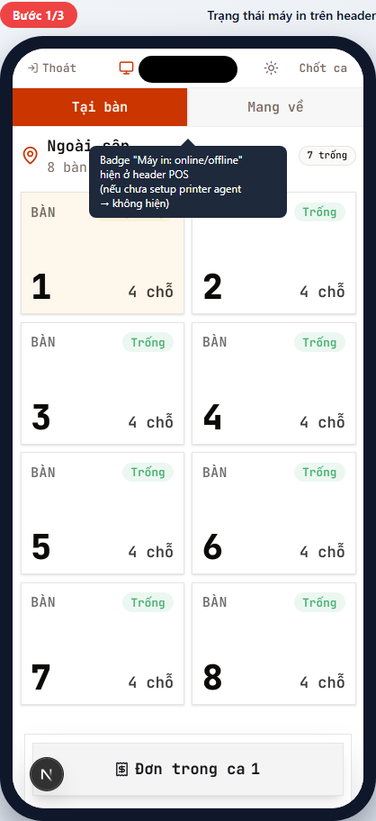
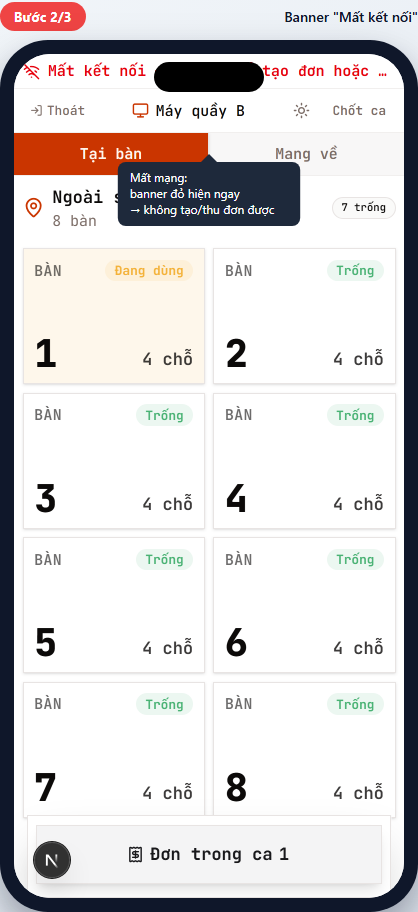
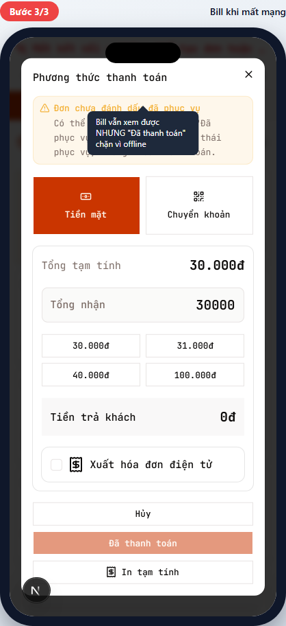
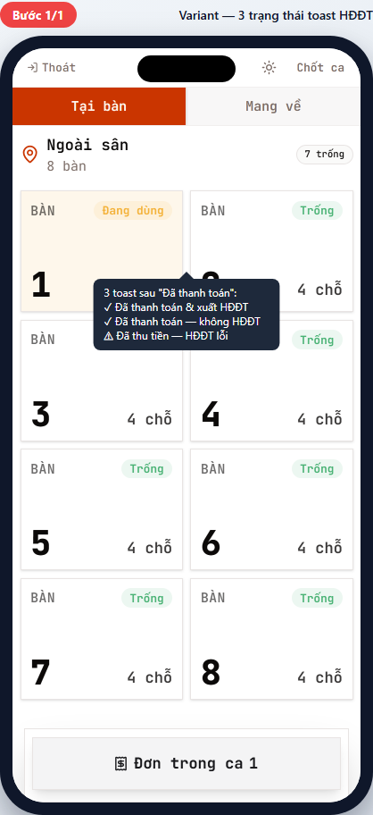

# POS-08 — Xử lý ngoại lệ (mất mạng / máy in / HĐĐT lỗi)

> Hướng dẫn nhận biết và xử lý các tình huống ngoại lệ thường gặp khi vận hành POS.
> Dành cho **mọi vai trò** — phục vụ, thu ngân, quản lý.

## Tóm tắt

| Trường           | Giá trị                                                     |
| ---------------- | ----------------------------------------------------------- |
| **Vai trò**      | Tất cả                                                      |
| **Quyền cần có** | — (chỉ là cách nhận biết, không phải tính năng)             |
| **Mục đích**     | Phân biệt các trạng thái lỗi, biết khi nào cần báo kỹ thuật |

## Các loại ngoại lệ

| Loại               | Triệu chứng                                                   | Mức độ                              | Ai xử lý                          |
| ------------------ | ------------------------------------------------------------- | ----------------------------------- | --------------------------------- |
| **Mất mạng**       | Banner đỏ "Mất kết nối" trên đầu                              | Cao — chặn tạo đơn / thu tiền       | Cashier kiểm tra wifi → kỹ thuật  |
| **Máy in offline** | Badge "Máy in: offline" trên header                           | Trung — vẫn bán được, không in giấy | Báo kỹ thuật / quản lý            |
| **HĐĐT lỗi**       | Toast vàng "Đã thu tiền — HĐĐT chưa xuất được" sau thanh toán | Thấp — tiền vẫn vào, HĐĐT retry sau | Cashier ghi chú, quản lý theo dõi |

## Các tình huống

### 1. Trạng thái máy in trên header

**Bạn thấy ở đâu:** Header POS, kế bên tên máy POS.

**Các trạng thái:**

- **Không hiện badge** → chi nhánh chưa setup printer agent. Bán hàng được nhưng KHÔNG in được giấy. Báo quản lý.
- **Badge xanh "Máy in: online"** → printer agent đang kết nối, in được bình thường.
- **Badge đỏ "Máy in: offline"** → printer agent down (mất điện, mất mạng cục bộ, hết giấy, etc.).

**Khi máy in offline mà phải bán hàng:**

1. Vẫn xác nhận thanh toán bình thường — tiền/hóa đơn lưu trong DB.
2. Báo kỹ thuật fix máy in.
3. Khi máy in lên, vào chi tiết đơn → "Khác..." → "In lại" để in giấy đã quá.

### 2. Mất kết nối mạng — banner đỏ

**Bạn thấy:** Banner đỏ trên cùng màn hình:

> 📡 ⚠️ Mất kết nối - không thể cập nhật đơn/thanh toán.

**Hệ quả:**

- Tạo đơn mới → block.
- Append món → block.
- Xác nhận thanh toán → block.
- Chỉ XEM được trạng thái đơn / bill (cached).

**Cách xử lý:**

1. **Kiểm tra wifi:**
   - Mở Settings điện thoại → Wifi → check signal.
   - Khởi động lại router quán nếu cần.
2. **Đợi 30 giây** sau khi mạng có lại — banner tự biến mất khi connection restore.
3. **KHÔNG bán bằng giấy/sổ tay** trừ khi mất mạng kéo dài (>10 phút) và quản lý chấp thuận.

### 3. Bill khi offline — nút thanh toán bị chặn

**Bạn thấy:** Nếu mở bill TRƯỚC khi mất mạng:

- Bill vẫn hiển thị đầy đủ (món, tổng, payment picker).
- Nút **"Đã thanh toán"** chuyển sang màu mờ (disabled).
- Phương thức "Tiền mặt" nút mờ.

**Cách xử lý:**

1. **Đợi mạng có lại** — đừng đóng bill, không cần bắt khách quẹt thẻ ở máy POS bị mất mạng.
2. Nếu khách gấp → hướng dẫn khách thanh toán **chuyển khoản ngân hàng trực tiếp** (chuyển vào số tài khoản quán) → ghi sổ → confirm bill khi mạng có lại.

> 🛡️ KHÔNG cho khách rời quán khi chưa confirm bill nếu mất mạng > 5 phút. Có rủi ro mất tiền nếu confirm thất bại.

---

## Tình huống ngoại lệ — HĐĐT

### 3 trạng thái toast sau "Đã thanh toán"

Sau khi cashier chạm "Đã thanh toán" (POS-05), toast hiện trong **1 trong 3 trạng thái**:

#### ✅ "Đã thanh toán & xuất HĐĐT" (xanh)

**Ý nghĩa:** Happy path. Tiền vào DB + HĐĐT xuất thành công + gửi email khách (nếu có).

**Bạn làm:** Không cần làm gì.

#### ✅ "Đã thanh toán — không xuất HĐĐT" (xanh)

**Ý nghĩa:** Khách KHÔNG yêu cầu ghi thông tin người mua (giữ tick "Người mua không lấy hóa đơn"). Tiền vào DB.

**Bạn làm:** Không cần làm gì. Bình thường.

#### ⚠️ "Đã thu tiền — HĐĐT chưa xuất được" (vàng)

**Ý nghĩa:** Cashier đã tick HĐĐT, NHƯNG phía VAT provider hoặc CMS lỗi. **Tiền VẪN VÀO** (không rollback). HĐĐT sẽ retry tự động sau.

**Bạn làm:**

1. **KHÔNG xác nhận thanh toán lại** — tiền đã thu, retry chỉ tạo trùng payment.
2. Ghi mã đơn vào sổ tay (đề phòng cần đối soát sau).
3. Báo quản lý — cuối ca check báo cáo "HĐĐT pending" để theo dõi.
4. Khách hỏi HĐĐT? Trả lời: "Em đã thu tiền và đang xuất HĐĐT, sẽ gửi email anh/chị trong 5-10 phút."

> 🛡️ **HDDT-PAYMENT-FIRST-FAILSOFT-ORPHAN** (regression rule): Tiền vào TRƯỚC HĐĐT call. Nếu HĐĐT lỗi, tiền KHÔNG bị rollback. Đây là intentional — không bao giờ mất tiền vì lỗi HĐĐT.

---

## Các ngoại lệ khác (mention only)

### Mạng yếu — gửi đơn lâu

**Triệu chứng:** Spinner "Đang gửi..." kéo dài >5 giây sau khi chạm "Đặt món" / "Gửi món thêm" / "Đã thanh toán".

**Xử lý:** Đợi đến 30s — hệ thống có cơ chế auto-retry exponential backoff. Đừng chạm lại.

### Lỗi load chunk (dev mode only)

**Triệu chứng:** Màn đỏ "Failed to load chunk".

**Xử lý:** F5 reload. Đây là dev artifact, không xảy ra trong production (PWA cache chunks).

### Khóa bằng quyền (`pos:confirm_payment`)

**Triệu chứng:** Phục vụ bấm "Tiền mặt" trong bill → nút mờ.

**Lý do:** Phục vụ KHÔNG có quyền `pos:confirm_payment`. Đây không phải lỗi — đây là quyền hạn.

**Xử lý:** Báo thu ngân ra confirm tiền mặt.

---

## Tham khảo nội bộ

> Phần này dành cho kỹ thuật và quản lý đào tạo.

### Code path

- **Online status provider:** [apps/web/app/components/pwa-runtime.tsx](../../../../apps/web/app/components/pwa-runtime.tsx) — listen `online`/`offline` events trên `navigator` (`useIsOnline`).
- **PWA toolbar (offline banner):** [apps/web/app/(protected)/br/[branchId]/\_components/operational-pwa/toolbar.tsx](<../../../../apps/web/app/(protected)/br/%5BbranchId%5D/_components/operational-pwa/toolbar.tsx>).
- **Printer status badge:** [apps/web/app/(protected)/br/[branchId]/pos/printer-status-badge.tsx](<../../../../apps/web/app/(protected)/br/%5BbranchId%5D/pos/printer-status-badge.tsx>) — Realtime subscribe `printer_agents` table, badge re-render khi status đổi.
- **HĐĐT toast logic:** trong [apps/web/app/(protected)/br/[branchId]/pos/\_components/bill/bill-receipt-sheet.tsx](<../../../../apps/web/app/(protected)/br/%5BbranchId%5D/pos/_components/bill/bill-receipt-sheet.tsx>) ~line 545-560.

### Regression rules quan trọng

- **HDDT-PAYMENT-FIRST-FAILSOFT-ORPHAN**: payment insert TRƯỚC HĐĐT call. HĐĐT lỗi → tiền KHÔNG rollback.
- **HDDT-FORM-PAYLOAD-FREEZE-AT-CLICK**: payload freeze khi click submit, không re-read DOM (chống race condition).
- **POS-PAYMENT-REUSE-UNIQUE-SLOT**: idempotency key — retry không tạo bản ghi trùng.

### Service Worker / PWA

- App PWA dùng `serwist` để cache chunks → production offline mode KHÔNG bị "Failed to load chunk" như dev.
- Submit retry: [apps/web/app/(protected)/br/[branchId]/pos/\_utils/submit-with-retry.ts](<../../../../apps/web/app/(protected)/br/%5BbranchId%5D/pos/_utils/submit-with-retry.ts>) — 3 lần thử, backoff 0ms/400ms/1000ms (tổng wall-budget ~1,4s).

### Tham chiếu thiết kế

- Regression rules: [tasks/regressions.md](../../../../tasks/regressions.md)
- HĐĐT: [docs/ref/einvoice-tax.md](../../../ref/einvoice-tax.md)
- Print agent: [docs/modules/infrastructure.md](../../../modules/infrastructure.md)

---

## Metadata mockup

| Trường                   | Giá trị                                                                                                      |
| ------------------------ | ------------------------------------------------------------------------------------------------------------ |
| Viewport                 | 390×844 (iPhone mặc định)                                                                                    |
| Capture script           | [apps/web/e2e/guides/pos-08-exceptions.guide.ts](../../../../apps/web/e2e/guides/pos-08-exceptions.guide.ts) |
| Lệnh refresh             | `pnpm --filter @comtammatu/web guides:capture --grep="POS-08"`                                               |
| Cập nhật mockup gần nhất | 2026-04-27                                                                                                   |
