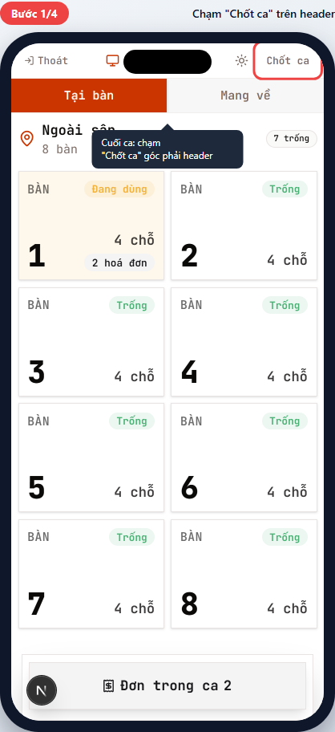
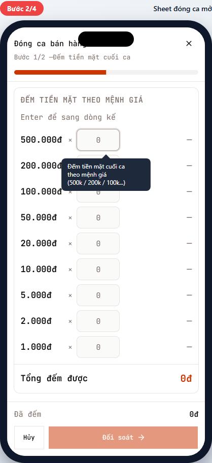
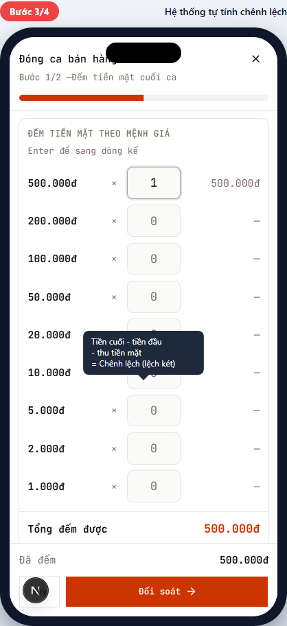
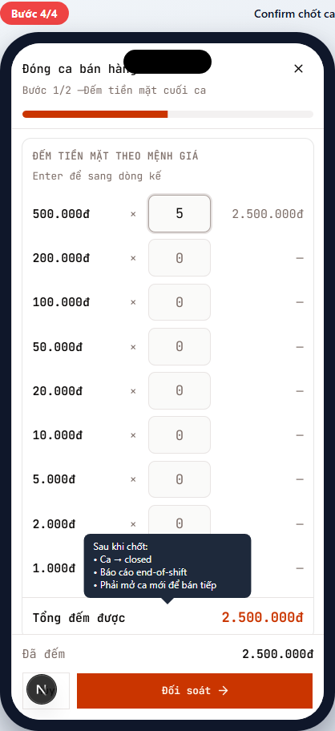
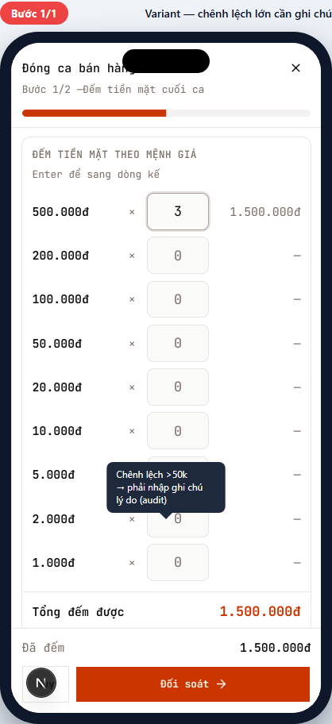

# POS-09 — Đóng ca POS (chốt ca cuối ngày)

> Hướng dẫn cuối ca: đếm tiền mặt theo mệnh giá → đối soát chênh lệch két → chốt ca.
> Dành cho **thu ngân (cashier)** và **quản lý chi nhánh**.

## Tóm tắt

| Trường | Giá trị |
| --- | --- |
| **Vai trò** | Thu ngân, Quản lý chi nhánh |
| **Quyền cần có** | `pos:close_shift` |
| **Điều kiện trước** | Đã thanh toán hết các đơn `confirmed` (không còn đơn active) — khuyến nghị, không bắt buộc |
| **Kết quả đúng** | `pos_sessions.status` = `closed`; `closing_cash` lưu số tiền mặt cuối ca; chênh lệch ghi vào audit; báo cáo end-of-shift sẵn sàng |
| **Thời gian** | ~3-5 phút (tùy số lượng tiền mặt phải đếm) |

## Khi nào dùng

- **Cuối ca làm việc** (sáng/trưa/tối) — chốt sổ tiền mặt cho ca tiếp theo bắt đầu.
- **Cuối ngày** — quản lý báo cáo doanh thu.
- **Bàn giao ca** — cashier đổi người, người mới mở ca riêng.

## Đường dẫn

URL: `/br/{branchId}/pos` (đang trong ca POS)

## Các bước

### Bước 1 — Chạm "Chốt ca" trên header

**Bạn làm:** Trên màn POS chính, chạm nút **Chốt ca** (góc phải trên header, kế icon mặt trời/mặt trăng).

> 💡 Nút Chốt ca chỉ hiện cho vai trò có quyền `pos:close_shift` (thu ngân/quản lý). Phục vụ KHÔNG thấy nút này — phải nhờ thu ngân chốt.

### Bước 2 — Sheet "Đóng ca bán hàng" mở

**Bạn thấy:** Sheet trượt từ phải (full-height trên mobile):

- Tiêu đề: "Đóng ca bán hàng".
- Progress bar đỏ ở đầu (Bước 1/2 — Đếm tiền mặt cuối ca).
- Section "ĐẾM TIỀN MẶT THEO MỆNH GIÁ" — hint "Enter để sang dòng kế".
- 9 dòng input cho mệnh giá VND: 500.000đ, 200.000đ, 100.000đ, 50.000đ, 20.000đ, 10.000đ, 5.000đ, 2.000đ, 1.000đ.
- Mỗi dòng: `{mệnh giá} × [số tờ] = {tổng}`.
- Footer: "Tổng đếm được" + "Đã đếm" + nút **Đối soát →** (cam, lớn).

### Bước 3 — Đếm tiền mặt theo mệnh giá

**Bạn làm:**

1. **Đếm thực tế** tiền trong két theo từng mệnh giá.
2. Gõ số tờ vào ô input của mệnh giá đó.
3. Cột bên phải tự cộng `mệnh giá × số tờ`.
4. Nhấn `Enter` để sang dòng tiếp (gõ nhanh hơn).

**Ví dụ:**
- Két có 1 tờ 500k + 3 tờ 100k + 5 tờ 20k → gõ `1` cho 500.000đ, `3` cho 100.000đ, `5` cho 20.000đ.
- Tổng đếm được: 500.000 + 300.000 + 100.000 = **900.000đ**.

> 💡 Đếm 2 lần nếu nghi ngờ. Sai số đếm = sai chênh lệch = phải giải trình.

**Sau khi đếm xong:** Chạm **Đối soát →** chuyển sang Bước 2/2 (đối soát + chốt).

### Bước 4 — Đối soát chênh lệch + chốt

> 📌 Ảnh minh họa Bước 1/2. Bước 2/2 (chưa chụp) hiện:
> - **Tiền đầu ca** (do bạn nhập khi mở ca, POS-01).
> - **+ Tiền mặt thu trong ca** (tổng các đơn paid bằng tiền mặt).
> - **= Tiền mặt dự kiến** (theo hệ thống).
> - **vs Tiền mặt thực đếm** (Bước 3).
> - **Chênh lệch** = thực - dự kiến (âm = thiếu, dương = thừa).

**Bạn làm:**

1. Đối chiếu chênh lệch.
2. **Nếu chênh lệch nhỏ (≤50k):** ghi chú nhanh ("trả tiền dư khách bàn 5...") rồi chạm **Chốt ca với chênh lệch X**.
3. **Nếu chênh lệch lớn (>50k):** xem Variant.

**Sau khi chốt:**

- Toast "Đóng ca thành công".
- Sheet đóng.
- `pos_sessions.status` chuyển `open` → `closed`, ghi `closing_cash`, `closed_at`, `closed_by`, `note`.
- Bạn quay về màn `/employee` (cổng nhân viên).
- **Phải mở ca mới (POS-01) để bán tiếp** — máy POS không nhận đơn cho đến khi có ca mới.

> ⚠️ Quan trọng: Sau khi chốt, KHÔNG mở lại ca cũ. Mọi đơn mới phải vào ca mới. Báo cáo doanh thu chia theo từng ca.

---

## Tình huống ngoại lệ

### Chênh lệch lớn (>50k) — cần ghi chú lý do

**Khi nào gặp:** Tiền thực đếm khác tiền dự kiến >50.000đ (lệch két lớn).

**Bạn thấy:**

- Cảnh báo trong sheet: `"Chênh lệch lớn (>50.000đ). Đã ghi chú chưa?"`
- Textarea ghi chú **bắt buộc** nhập (placeholder: `"Ví dụ: két lệch 80k do trả tiền dư khách bàn 5..."`).

**Cách xử lý:**

1. **Đếm lại** tiền mặt — chắc chắn không nhầm.
2. **Tìm nguyên nhân:**
   - Tiền dư trả khách thiếu / thừa.
   - Đổi tờ rách cho khách.
   - Quên insert tiền vào két sau khi nhận từ khách.
3. **Ghi chú chi tiết** vào textarea (audit log lưu vĩnh viễn).
4. Chạm **Chốt ca với chênh lệch X** → sheet đóng + log gửi cho quản lý chi nhánh.

> 🛡️ Quản lý chi nhánh sẽ review các ca có chênh lệch lớn cuối ngày. Lệch nhiều lần liên tiếp → có thể đào tạo lại hoặc điều tra.

### Chênh lệch RẤT lớn (>200k) — cần manager duyệt

**Bạn thấy:** Toast cảnh báo `"Chênh lệch vượt ngưỡng — cần quản lý chi nhánh đăng nhập để duyệt."`

**Cách xử lý:** Gọi quản lý chi nhánh ra:

1. Đếm lại trước mặt manager.
2. Manager đăng nhập trên cùng máy → bypass khóa chốt.
3. Hoặc manager mở app trên máy của họ → chốt thay.

### Chốt ca khi còn đơn active

**Khuyến nghị:** Thanh toán hết các đơn `confirmed` trước khi chốt.

**Nếu vẫn chốt:** Đơn active sẽ tự chuyển vào ca tiếp theo (khi mở ca mới). Doanh thu của các đơn đó tính vào ca thu được tiền, không phải ca tạo đơn.

### Mở ca mới ngay sau khi chốt

Sau khi chốt → màn `/employee` → tap "Bán hàng POS" → mở ca mới (POS-01) → tiếp tục.

> 💡 Nếu là cùng cashier mở ca mới, "Tiền đầu ca" mới = "Tiền mặt thực đếm" của ca vừa chốt (bàn giao). Đỡ phải đếm lại.

---

## Tham khảo nội bộ

> Phần này dành cho kỹ thuật và quản lý đào tạo.

### Code path

- **Header button "Chốt ca":** [apps/web/app/br/[branchId]/pos/pos-session-header.tsx](../../../../apps/web/app/br/%5BbranchId%5D/pos/pos-session-header.tsx) — gated bởi `canCloseShift` (`pos:close_shift`).
- **Close session sheet:** [apps/web/app/br/[branchId]/pos/close-session-sheet.tsx](../../../../apps/web/app/br/%5BbranchId%5D/pos/close-session-sheet.tsx) — lazy-loaded vì rare action (1-2 lần/ngày).
- **Denomination input:** [apps/web/app/br/[branchId]/pos/_components/close-session/denomination-input.tsx](../../../../apps/web/app/br/%5BbranchId%5D/pos/_components/close-session/denomination-input.tsx).
- **Server action:** `closePosSession` trong [apps/web/app/br/[branchId]/pos/session-actions.ts](../../../../apps/web/app/br/%5BbranchId%5D/pos/session-actions.ts) → calls Postgres RPC `close_pos_session`.

### Database

- Update `pos_sessions`: `status='closed'`, `closing_cash`, `closed_at=now()`, `closed_by=user.id`, `note`.
- RPC `close_pos_session` ghi audit + không cho re-open ca đã closed (UNIQUE constraint trên `(terminal_id) WHERE status='open'` đảm bảo).
- Tổng tiền mặt dự kiến = `opening_cash + SUM(payments WHERE method='cash' AND pos_session_id=this)`.
- Chênh lệch = `closing_cash - expected_cash`.

### Permission

- `pos:close_shift` — chỉ thu ngân và branch_manager. Waiter chỉ ride session, không chốt được.

### Threshold cấu hình

- Chênh lệch nhỏ: ≤50.000đ — chỉ confirm, ghi chú optional.
- Chênh lệch trung bình: >50.000đ — ghi chú bắt buộc.
- Chênh lệch vượt ngưỡng (default >200.000đ): cần manager duyệt.

### Tham chiếu thiết kế

- Order lifecycle: [docs/archive/plan/m2-order-lifecycle.md](../../../archive/plan/m2-order-lifecycle.md)
- POS-01 (mở ca, đối ngược): [pos-01-open-session.md](pos-01-open-session.md)

---

## Metadata mockup

| Trường | Giá trị |
| --- | --- |
| Viewport | 390×844 (iPhone mặc định) |
| Capture script | [apps/web/e2e/guides/pos-09-close-session.guide.ts](../../../../apps/web/e2e/guides/pos-09-close-session.guide.ts) |
| Lệnh refresh | `pnpm --filter @comtammatu/web guides:capture --grep="POS-09"` |
| Cập nhật mockup gần nhất | 2026-04-27 |
| Người maintain | _TBD_ |
