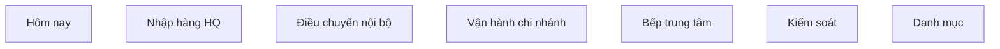

# Inventory UX Contract

Updated: 2026-04-16

## Mục tiêu

Tài liệu này chốt các quyết định UX/IA nền tảng cho Inventory pilot trước khi sửa UI.

- Dùng làm contract giữa docs, navigation, dashboard, và role-based surfaces.
- Ưu tiên giảm rối mental model hơn là thêm bề mặt mới.
- Mọi refactor Inventory UI sau đây nên bám theo các quyết định trong tài liệu này.

## Phạm vi

Contract này chỉ áp dụng cho Inventory pilot hiện tại với boundary:

- `HQ / Trụ sở`
- `Bếp trung tâm`
- `Kho chi nhánh`
- `Bếp chi nhánh`

Không mở thêm role mới, không đổi ACL business boundary, không mở ERP workflow nhiều bước.

## Quyết định đã chốt

### 1. `Receiving` là HQ procurement hub

Quyết định:

- `Receiving` chỉ đại diện cho luồng `PO -> GRN` tại HQ trong Inventory pilot. `supplier_invoice` là Finance P1/handoff, không nằm trong daily operator path.
- Không dùng `Receiving` như nhãn generic cho mọi thao tác nhận hàng.

Hệ quả UI:

- Branch manager không nên được dẫn vào `/inventory/receiving` như tác vụ chính.
- Nhận hàng nội bộ tại chi nhánh phải sống trong flow `Điều chuyển` hoặc `Vận hành chi nhánh`.
- Copy/UI của `Receiving` phải nhấn mạnh đây là hub procurement của HQ.

### 2. `Kho chi nhánh -> Bếp chi nhánh` đổi nhãn thành `Cấp bếp`

Quyết định:

- Backend document hiện tại là intra-branch `stock_transfer`, commit một bước từ location kho chi nhánh sang location bếp chi nhánh/default consumption.
- Đổi lớp nhãn và mental model ở UI từ generic `Điều chuyển` sang `Cấp bếp` cho flow này.

Hệ quả UI:

- `stock_issue(issue_type = kitchen_use)` đã retired và không được dùng trong contract ship.
- Nếu vẫn giữ module `Issues`, module đó chỉ nên nghiêng về consumption/write-off/other, hao hụt, hoặc xuất bất thường.
- Sau khi chi nhánh `received` transfer, UI nên gợi bước tiếp theo là `Cấp bếp`.

### 3. `Ingredients / Suppliers / Recipes` chỉ sống ở `Danh mục`

Quyết định:

- Master data chỉ có một cửa vào chính trong navigation: `Danh mục`.
- Không lặp lại cùng nội dung ở cả menu chính và `Settings`.

Hệ quả UI:

- `Ingredients`, `Suppliers`, `Recipes` thuộc `Danh mục`.
- `Settings` chỉ giữ những thứ là cấu hình hành vi, policy, hoặc defaults.
- Nếu route cũ vẫn còn để tương thích, navigation không nên render trùng entry point.

### 4. `Production` bị ẩn hoàn toàn với non-`super_manager`

Quyết định:

- Navigation phải phản ánh đúng quyền thực tế.
- Người không có quyền không nên thấy entry nav của `Production`.

Hệ quả UI:

- `Production` chỉ hiện cho `super_manager` trong pilot hiện tại.
- Không dùng pattern “hiện menu rồi chặn khi vào trang” cho flow này.
- Khi có role riêng cho bếp trung tâm trong tương lai, mở lại theo ACL mới.

### 5. `branch_manager` không tạo inter-site transfer

Quyết định:

- `branch_manager` trong pilot hiện tại chỉ:
  - xác nhận nhận transfer,
  - tạo intra-branch transfer `Cấp bếp`,
  - kiểm kê,
  - adjustment/write-off theo scope chi nhánh.
- `branch_manager` không tạo inter-site transfer outbound/inbound workflow mới.

Hệ quả UI:

- CTA `Tạo phiếu điều chuyển` không nên là action mặc định cho branch manager.
- Nếu cần mở rộng sau này, hướng đúng là `Yêu cầu cấp hàng`, không phải mở thẳng full transfer creation.
- Hub chi nhánh nên tập trung vào `Nhận hàng`, `Cấp bếp`, `Kiểm kê`, `Xử lý cảnh báo`.

### 6. Dashboard chuyển sang `task queue first`

Quyết định:

- Dashboard Inventory theo role ưu tiên `việc cần làm ngay`.
- KPI/overview cards chỉ là lớp phụ trợ.

Hệ quả UI:

- `HQ`: thấy queue kiểu `PO chờ gửi`, `GRN chờ confirm`, `invoice chờ match`, `transfer chờ xuất`.
- `Bếp trung tâm`: thấy `production order chờ confirm`, `thiếu BOM`, `transfer thành phẩm chờ xuất`.
- `Chi nhánh`: thấy `transfer đến chờ nhận`, `cấp bếp cần làm`, `stocktake đang mở`, `expiry cần xử lý`.
- Hero/dashboard summary chỉ nên giúp định hướng, không được thay thế hàng đợi tác vụ.

## Contract cho Information Architecture

### Nhóm điều hướng đề xuất

### Mapping bề mặt

- `Hôm nay`
  - dashboard theo role
- `Nhập hàng HQ`
  - receiving
  - purchase orders
  - grn
  - supplier invoices
- `Điều chuyển nội bộ`
  - transfers
- `Vận hành chi nhánh`
  - nhận hàng đến
  - cấp bếp
  - write-off / adjustment
  - stocktake trong ngày
- `Bếp trung tâm`
  - production order
  - production recipe
- `Kiểm soát`
  - expiry
  - reports
  - variances
- `Danh mục`
  - ingredients
  - suppliers
  - recipes

## Không làm trong contract này

- Không đổi schema hay ACL backend.
- Không đổi route ngay lập tức.
- Không mở workflow yêu cầu/phê duyệt nhiều bước.
- Không mở role mới cho central kitchen hoặc AP.

## Ưu tiên triển khai sau contract

1. Refactor navigation theo contract này.
2. Refactor dashboard thành `task queue first`.
3. Tách nhãn `Cấp bếp` khỏi `Issues` ở UI layer.
4. Gỡ duplicate entry points giữa `Danh mục` và `Settings`.
5. Rà lại CTA theo từng role để tránh drift giữa nav, dashboard, và page access.

## Tài liệu liên quan

- [inventory-ux-workflow-review.md](./inventory-ux-workflow-review.md)
- [inventory.md](../../ref/inventory.md)
- [inventory-sop.md](../../ref/inventory-sop.md)
- [inventory-rbac-matrix.md](../../ref/inventory-rbac-matrix.md)
