# Inventory UX Workflow Review

Updated: 2026-04-16

## Mục tiêu

Tài liệu này dùng để nhìn lại Inventory theo góc độ UX workflow, không chỉ theo schema hay chứng từ.

- Tách rõ `workflow nghiệp vụ thật` và `workflow màn hình hiện tại`.
- Chỉ ra các chỗ đang làm người dùng bị rối mental model.
- Đề xuất một cấu trúc review lại IA trước khi refactor UI.

## Nguồn đối chiếu

- Business flow:
  - [docs/ref/inventory.md](../../ref/inventory.md)
  - [docs/ref/inventory-sop.md](../../ref/inventory-sop.md)
  - [docs/ref/inventory-rbac-matrix.md](../../ref/inventory-rbac-matrix.md)
- UI structure:
  - [apps/web/app/(protected)/inventory/\_components/inventory-shell.tsx](<../../../apps/web/app/(protected)/inventory/_components/inventory-shell.tsx>)
  - [apps/web/app/(protected)/inventory/dashboard-client.tsx](<../../../apps/web/app/(protected)/inventory/dashboard-client.tsx>)
  - [apps/web/app/(protected)/inventory/receiving/receiving-client.tsx](<../../../apps/web/app/(protected)/inventory/receiving/receiving-client.tsx>)
  - [apps/web/app/(protected)/inventory/transfers/transfers-list-client.tsx](<../../../apps/web/app/(protected)/inventory/transfers/transfers-list-client.tsx>)
  - [apps/web/app/(protected)/inventory/issues/issues-client.tsx](<../../../apps/web/app/(protected)/inventory/issues/issues-client.tsx>)
  - [apps/web/app/(protected)/inventory/settings/settings-section-nav.tsx](<../../../apps/web/app/(protected)/inventory/settings/settings-section-nav.tsx>)

## Chẩn đoán nhanh

Inventory hiện chưa thiếu chức năng cốt lõi. Vấn đề chính là workflow bị tách theo `chứng từ / module dữ liệu` thay vì theo `nhiệm vụ vận hành`.

Các điểm rối lớn nhất:

1. Một luồng có nhiều cửa vào khác nhau.
2. Một vai trò nhìn thấy action không đúng quyền hoặc không đúng trách nhiệm.
3. Người dùng phải tự đoán bước kế tiếp thay vì UI dẫn họ đi tiếp.
4. Cùng một thực thể master data xuất hiện ở cả `menu chính` và `settings`.
5. `Kho chi nhánh -> Bếp chi nhánh` là bước vận hành quan trọng nhưng lại bị tách thành `issues`, khiến mental model đứt khỏi flow nhận hàng và bán hàng.

## 1. Workflow end-to-end của Inventory

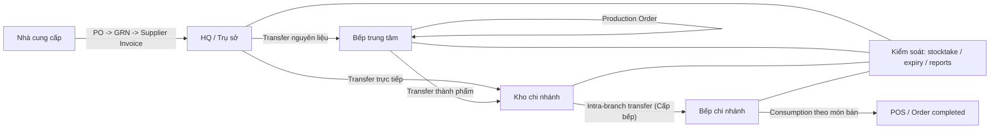

### Cách đọc

- `Procurement` chỉ nằm ở HQ.
- `Production` chỉ nằm ở bếp trung tâm.
- `Branch operations` bắt đầu từ lúc chi nhánh nhận hàng, cấp xuống bếp, bán, rồi kiểm kê.
- `Expiry`, `reports`, `stocktake` là lớp kiểm soát ngang, không phải bước chính trong chuỗi nhập-xuất.

## 2. Workflow nghiệp vụ chi tiết từng mục

### 2.1 Procurement tại HQ

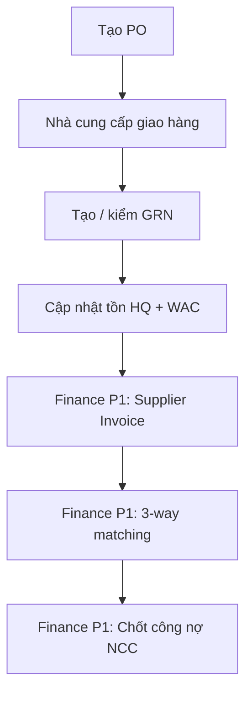

UX note:

- Đây là một luồng nối tiếp rõ ràng.
- Nhưng UI đang tách thành 4 điểm vào song song: `Receiving`, `PO`, `GRN`, `Supplier Invoices`.
- Vì vậy người dùng HQ phải tự hiểu rằng `Receiving` chỉ là hub, còn thao tác thật nằm ở các màn riêng.

### 2.2 Điều chuyển liên site

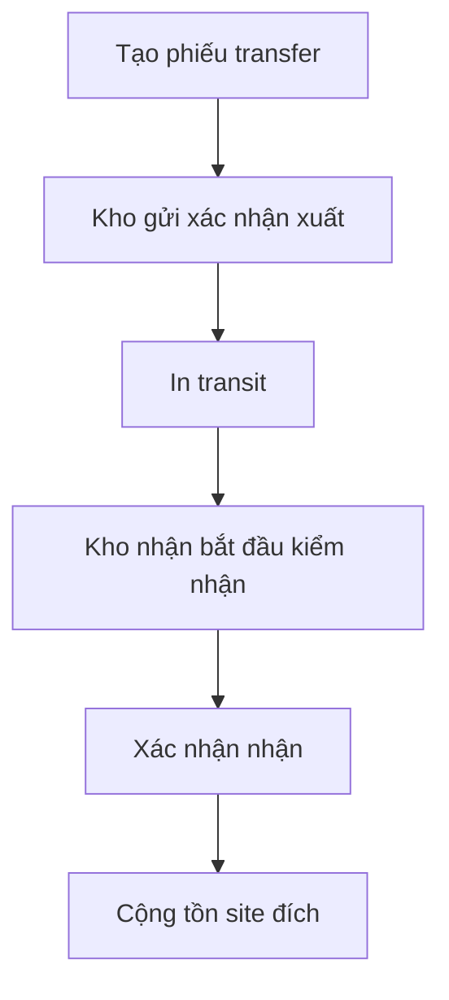

Các hướng hợp lệ trong pilot:

- `HQ -> Bếp trung tâm`
- `HQ -> Kho chi nhánh`
- `Bếp trung tâm -> Kho chi nhánh`

UX note:

- Đây là flow có state machine rõ nhất.
- Màn `transfers` khá gần với mental model này.
- Tuy nhiên action tạo phiếu hiện dễ bị hiểu là ai cũng làm được, trong khi RBAC docs nói outbound chủ yếu là vai trò HQ / central kitchen.

### 2.3 Sản xuất tại bếp trung tâm

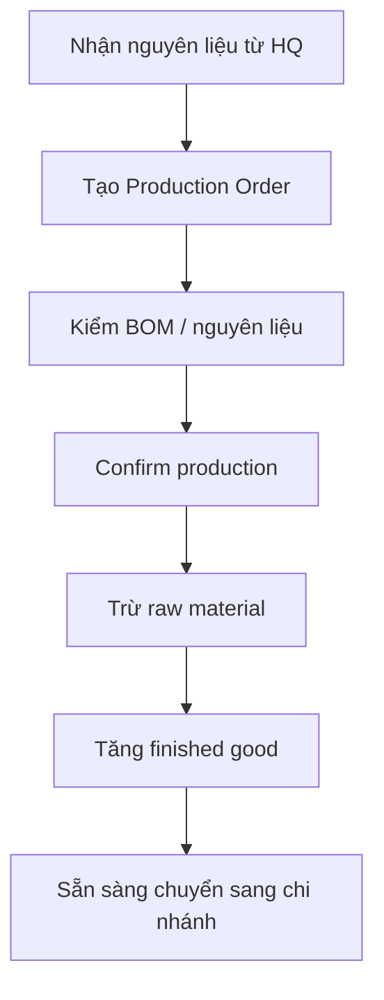

UX note:

- Đây là workflow chỉ dành cho `super_manager` theo route/page hiện tại.
- Nhưng navigation tổng thể vẫn làm `Bếp trung tâm` trông như một mục ngang hàng cho mọi inventory operator.
- Kết quả là user chi nhánh nhìn thấy flow không thuộc trách nhiệm của mình.

### 2.4 Chi nhánh nhận hàng và cấp xuống bếp

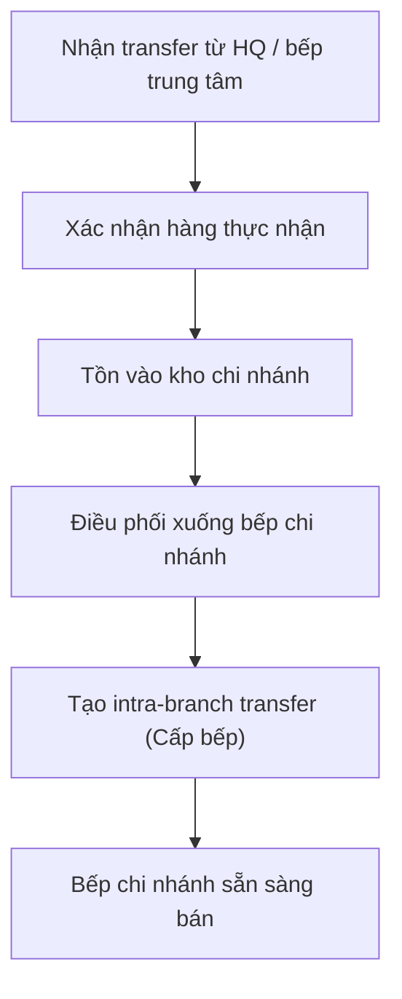

UX note:

- Đây là điểm rối nhất của Inventory branch flow.
- Trong nghiệp vụ, đây là một chuỗi liền nhau.
- Trong UI, phần `nhận hàng` nằm trong `transfers`, còn `cấp xuống bếp` lại nằm trong `issues`.
- User phải tự hiểu rằng intra-branch transfer `Cấp bếp` chính là bước tiếp theo sau `received`, nhưng hệ thống chưa dẫn sang bước này.

### 2.5 Tiêu hao bán hàng tại chi nhánh

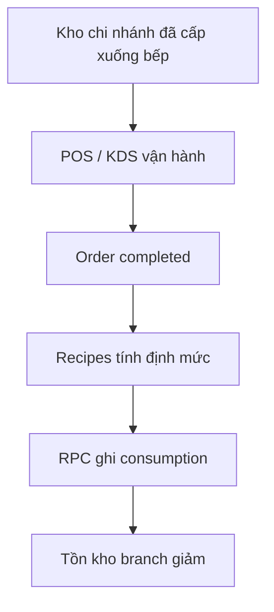

UX note:

- Đây là flow tự động ở backend nên người dùng ít thấy.
- Vì không có cầu nối UI rõ giữa `cấp bếp`, `POS completed`, và `consumption`, người dùng dễ nghĩ tồn kho bị giảm "bí ẩn".

### 2.6 Kiểm kê và điều chỉnh

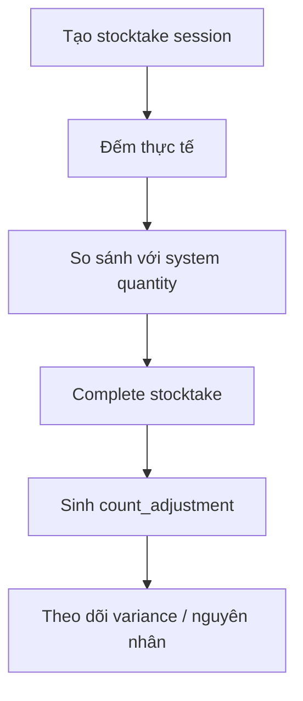

UX note:

- `stocktake` đang là workflow khá mạch lạc.
- Nhưng nó nên được đặt là "lớp kiểm soát cuối ngày" thay vì một module đứng ngang với nhập hàng, sản xuất, điều chuyển.

### 2.7 Hạn dùng và cảnh báo

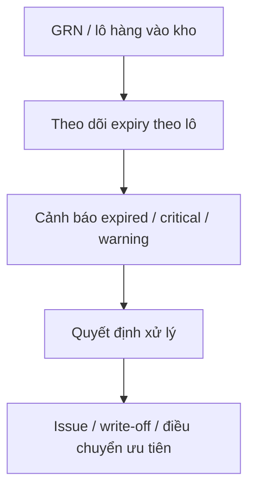

UX note:

- `expiry` là lớp cảnh báo quyết định hành động.
- Hiện nó đang đứng như một destination riêng, nhưng chưa chỉ rõ action tiếp theo là gì.
- Nút kiểu `Hủy tất cả hàng đã hết hạn` làm cảm giác hành động lớn hơn mức mô hình pilot hiện hỗ trợ.

## 3. Workflow màn hình hiện tại

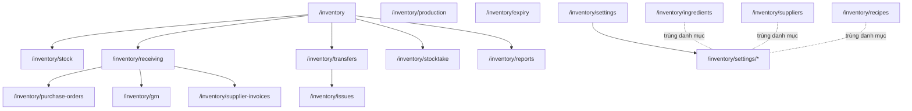

### Điểm vướng chính

#### A. Duplicate entry points

- `Receiving` là hub.
- `PO`, `GRN`, `Supplier Invoices` lại đồng thời là menu cấp 1.
- `Ingredients`, `Suppliers`, `Recipes` vừa là menu cấp 1 vừa xuất hiện trong `Settings`.

#### B. Workflow split by document

- User vận hành nghĩ theo câu hỏi:
  - "Tôi đang nhận hàng gì?"
  - "Tôi đang cấp bếp cho chi nhánh nào?"
  - "Tôi cần chốt gì trước khi đóng ngày?"
- UI hiện lại buộc họ nghĩ theo:
  - "Tôi đang ở module GRN hay transfer hay issue?"

#### C. Role drift

- Branch dashboard có quick action `Nhận hàng` dẫn vào `/inventory/receiving`, trong khi route này thuộc procurement scope.
- `Bếp trung tâm` vẫn hiện như nav item chung, nhưng page thật chỉ dành cho `super_manager`.
- Transfer tạo phiếu và branch receiving responsibility chưa được tách rõ bằng ngôn ngữ UI.

## 4. Những chỗ đang làm UX loạn nhất

### 4.1 `Receiving` đang là hub tốt nhưng chưa được quyết định vai trò

Hiện có hai khả năng mental model:

1. `Receiving = HQ procurement hub`
2. `Receiving = mọi loại nhận hàng`

Repo đang pha cả hai:

- Tài liệu business nói procurement chỉ ở HQ.
- Dashboard chi nhánh lại có CTA `Nhận hàng`.

Khi chưa chốt nghĩa của từ `Receiving`, UX sẽ luôn mơ hồ.

### 4.2 `Issues` đang gánh hai nghĩa

`Issues` hiện gom:

- tiêu hao,
- hủy hỏng,
- cấp phát bếp chi nhánh.

Nhưng với branch operator, `Cấp bếp` không phải "issue bất thường", mà là bước vận hành chuẩn hằng ngày bằng intra-branch transfer.

Vì vậy đặt nó dưới `Xuất kho` làm người dùng phải dịch lại trong đầu:

- nghiệp vụ thật: `Cấp xuống bếp`
- tên màn: `Issue`

### 4.3 `Settings` bị chồng với `Danh mục`

Hiện có hai lớp điều hướng cho cùng loại nội dung:

- menu trái: `Nguyên liệu`, `Nhà cung cấp`, `Công thức`
- trong `Settings`: cũng lại có `ingredients`, `recipes`, `suppliers`, `expiry`

Điều này tạo câu hỏi UX:

- Khi nào tôi vào `Nguyên liệu`?
- Khi nào tôi vào `Cài đặt > Nguyên liệu`?

Nếu hai màn không khác chức năng, đây là duplication.

### 4.4 Kiểm soát và tác nghiệp đang đứng ngang hàng

Những thứ như:

- `reports`
- `expiry`
- `stocktake`

nên là lớp `control / audit / end-of-day`.

Nhưng trong nav hiện tại, chúng đứng ngang với:

- `receiving`
- `transfers`
- `production`
- `issues`

Điều này làm sidebar trông như "danh sách module", không phải "đường làm việc".

## 5. Đề xuất IA để review lại

Mục tiêu ở đây chưa phải chốt UI mới, mà là chốt mental model trước.

### Đề xuất 1: điều hướng theo job-to-be-done

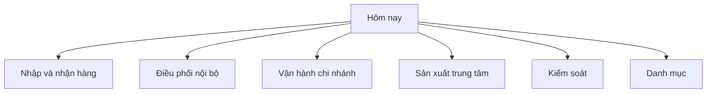

Mapping gợi ý:

- `Hôm nay`
  - dashboard
  - task queue theo role
- `Nhập và nhận hàng`
  - PO
  - GRN
  - Supplier invoice
- `Điều phối nội bộ`
  - transfers
- `Vận hành chi nhánh`
  - nhận hàng đến
  - cấp bếp
  - tiêu hao / write-off
  - stocktake trong ngày
- `Sản xuất trung tâm`
  - production orders
  - production recipes
- `Kiểm soát`
  - expiry
  - reports
  - variances
- `Danh mục`
  - ingredients
  - suppliers
  - recipes

### Đề xuất 2: tách rõ hub theo vai trò

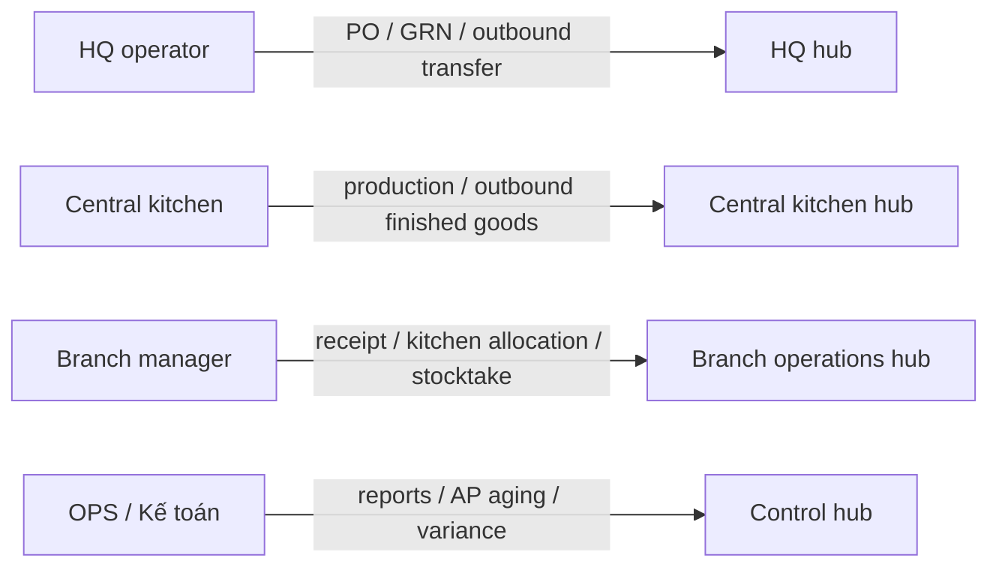

Ưu điểm:

- Mỗi vai trò thấy đúng "bảng điều khiển công việc" của mình.
- Không cần nhồi hết mọi chứng từ thành peer nav items.

## 6. Contract review nên chốt cùng nhau

Trước khi sửa UI, nên chốt 6 câu này:

1. `Receiving` là HQ procurement hub hay generic receiving hub?
2. `Kho chi nhánh -> Bếp chi nhánh` có tiếp tục đặt dưới `Issues` hay tách thành nhãn `Cấp bếp`?
3. `Ingredients / Suppliers / Recipes` có nên sống ở menu chính hay chỉ ở `Danh mục/Settings`?
4. `Production` có nên bị ẩn hoàn toàn với non-`super_manager` ngay từ nav?
5. Branch manager có quyền tạo transfer liên-site hay chỉ nhận inbound transfer và tạo intra-branch transfer `Cấp bếp`?
6. Dashboard mỗi role có nên đổi từ `overview cards` sang `task queue`?

## 7. Kết luận

Inventory đang rối không phải vì thiếu màn, mà vì:

- quá nhiều module ngang hàng,
- vai trò và điều hướng chưa khóa cùng một mental model,
- cùng một nghiệp vụ bị chia qua nhiều screen không có guided next step.

Nếu chỉ polish giao diện mà không chốt lại `IA theo vai trò + workflow`, cảm giác rối sẽ còn nguyên.
